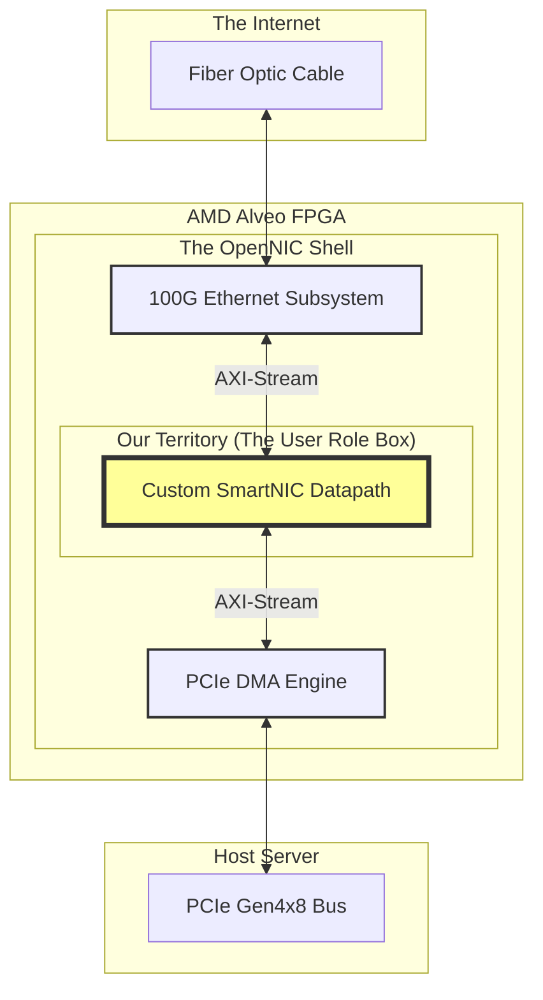

# 📡 Chunk 1: SmartNIC Foundations & The OpenNIC Shell

> [!NOTE]
> **Welcome to the Fast Path!** This guide is written for beginners and researchers alike. It explains exactly *why* we are building this hardware, the concepts of 5G Network Slicing, and how our custom Verilog logic integrates into the massive open-source ecosystem known as OpenNIC.

---

## 1. The Problem: CPUs are Too Slow for 5G 🐢

In traditional datacenter networking, a standard Network Interface Card (NIC) is quite "dumb." It receives electrical pulses from the fiber optic cable, turns them into an Ethernet frame, and immediately dumps that frame into the host server's CPU memory.

The CPU then has to run software (like Linux) to figure out:
* *"Is this an IP packet?"*
* *"What port is this going to?"*
* *"Should I drop this packet or prioritize it?"*

### The 100 Gbps Wall
At 100 Gigabits per second (100 Gbps), a server receives roughly **150 million packets every single second**. If the CPU has to inspect every single one of those packets in software, the server will spend 100% of its processing power just moving network traffic, leaving no power left to actually run your applications!

> [!TIP]
> **The Solution: SmartNICs** 🧠
> A SmartNIC takes that heavy packet processing workload *off* the CPU and puts it directly into dedicated hardware on the network card itself (typically an FPGA or ASIC). This is called **Hardware Offloading**.

---

## 2. The 5G QoS Challenge: URLLC vs. eMBB 🚦

5G networks are designed to support radically different types of devices on the exact same physical cell tower. To do this, 5G uses **Network Slicing**—cutting the network into isolated virtual lanes.

Our SmartNIC deals with two major slices:

| Network Slice | Stand for... | Traffic Profile | Examples |
| :--- | :--- | :--- | :--- |
| **URLLC** | Ultra-Reliable Low-Latency Communication | Very small packets, strictly requires near-zero latency. | 🚗 Autonomous Driving   🩺 Remote Robotic Surgery |
| **eMBB** | Enhanced Mobile Broadband | Massive packets, high bandwidth, but can tolerate some latency. | 📺 4K Netflix Streaming   🎮 Game Downloads |

### The "Traffic Jam" Problem
If an autonomous car sends a brake signal (URLLC), but it gets stuck in the SmartNIC's queue behind a gigabyte of Netflix video data (eMBB), the car crashes. 

> [!IMPORTANT]
> **The MVP Goal of this Project:**
> We must build a hardware datapath that can identify URLLC packets in real-time, instantly pull them out of the traffic jam, and send them first. This is called **Hardware Quality of Service (QoS)**.

---

## 3. How We Build It: The OpenNIC Shell 🐚

Building a 100 Gbps NIC from scratch is nearly impossible for a single researcher. You would have to write hundreds of thousands of lines of code just to talk to the PCIe bus or the physical Ethernet transceivers.

Instead, we use **OpenNIC**, an open-source FPGA shell developed by AMD/Xilinx.

### The "User Role" Box
OpenNIC handles all the messy, difficult hardware interfaces (PCIe and Ethernet) and provides us with a single, blank box in the middle of the FPGA called the **User Role**. 

All we have to do is write the Verilog logic for our SmartNIC QoS pipeline, place it inside that yellow box, and OpenNIC guarantees it will run at 100 Gbps!

### The AXI-Stream Handshake
To move data at 100 Gbps, OpenNIC requires us to use a massive **512-bit wide data bus** running at a 250 MHz clock speed.
* `100 Gbps / 250 MHz = 400 bits/cycle`
* Therefore, a 512-bit bus guarantees we never drop a packet!

---

> [!NOTE]  
> **Coming Up in Chunk 2:**
> Now that we know *why* we are building this and *where* it lives, Chunk 2 will dive deep into the very first module of our pipeline: **The Packet Parser**. We will learn how to slice 64 bytes of raw binary data in a single clock cycle!
