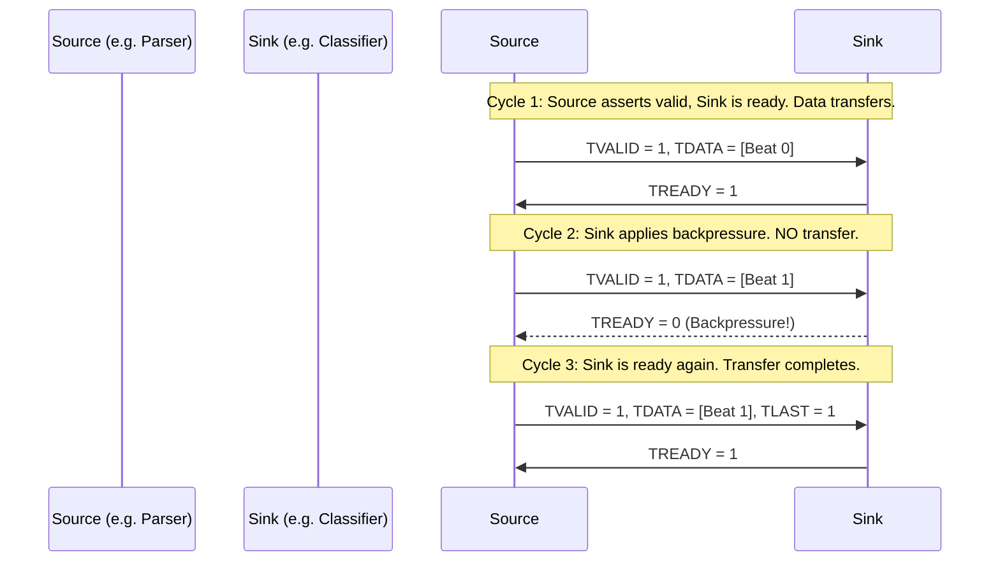

# 2. Datapath Interfaces & TUSER Metadata

## The 512-bit AXI4-Stream Interface

To process 100 Gigabits per second (Gbps) at a relatively slow FPGA clock speed of 250 MHz, the datapath bus must be extremely wide.

- **Formula:** `100 Gbps / 250 MHz = 400 bits per cycle.`
- **Design Choice:** We use a standard **512-bit wide bus**.

This means every single clock cycle, up to 64 bytes of packet data traverse the pipeline.

### AXI-Stream Signals

All internal modules communicate using the ARM AMBA AXI4-Stream standard. Data is only transferred when both `TVALID` (source has data) and `TREADY` (sink can accept data) are high simultaneously.

## Sideband Metadata (`TUSER`)

While `TDATA` carries the raw packet payload, downstream modules (like the Queue Manager) shouldn't waste cycles re-parsing the payload to figure out where the packet should go. 

Instead, the **Packet Parser** extracts all relevant information and places it on a parallel sideband signal called `TUSER`. This 128-bit vector travels alongside the packet through the entire pipeline.

### TUSER Bit-Field Layout

The `smartnic_pkg.vh` file defines the exact bits for the `TUSER` metadata structure:

| Bit Range | Field Name | Width | Set By | Description |
| :--- | :--- | :--- | :--- | :--- |
| `[0]` | `valid` | 1 | Parser | 1 if the packet is valid and parsed successfully. |
| `[1]` | `is_ipv4` | 1 | Parser | 1 if EtherType is `0x0800`. |
| `[2]` | `is_udp` | 1 | Parser | 1 if IP Protocol is `17` (`0x11`). |
| `[3]` | `is_tcp` | 1 | Parser | 1 if IP Protocol is `6` (`0x06`). |
| `[7:4]` | `slice_id` | 4 | **Classifier** | The destination Queue/Slice assigned to the packet. |
| `[15:8]` | `ip_protocol` | 8 | Parser | Raw IPv4 protocol byte. |
| `[31:16]` | `dst_port` | 16 | Parser | L4 Destination Port. |
| `[47:32]` | `src_port` | 16 | Parser | L4 Source Port. |
| `[79:48]` | `dst_ip` | 32 | Parser | L3 Destination IPv4 Address. |
| `[111:80]` | `src_ip` | 32 | Parser | L3 Source IPv4 Address. |
| `[127:112]` | *Reserved* | 16 | — | Reserved for future use (e.g., GTP-U TEID). |

> [!NOTE]
> The `TUSER` metadata is persistent across all beats of a single packet. Even if a packet is 1500 bytes long (requiring ~24 beats), the `TUSER` signal remains constant for all 24 beats.
