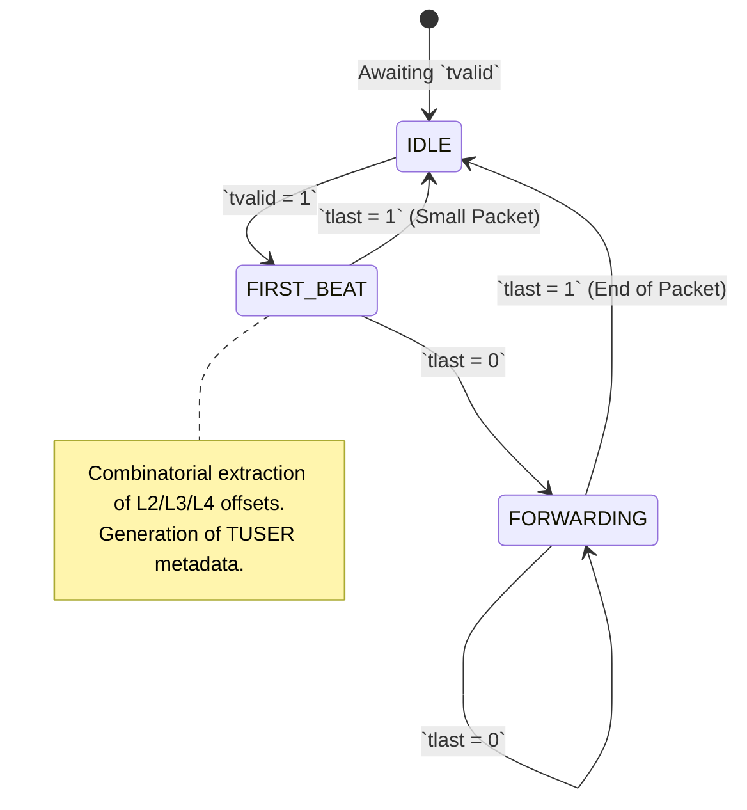

# Chapter 2: The Fast Path — Line-Rate Packet Parsing

## 2.1 Introduction to the "Fast Path" Paradigm
In contemporary 5G SmartNIC architectures, the network data plane is logically isolated from the control plane in adherence to Software Defined Networking (SDN) paradigms. The data plane, often referred to as the **"Fast Path,"** is synthesized entirely in hardware (Verilog/VHDL) directly on the FPGA fabric. It is responsible for parsing, classifying, and queuing network traffic autonomously, operating at extreme bandwidths (e.g., 100 Gbps) without relying on the host CPU for per-packet decision-making.

The foundational operation of the Fast Path is **Packet Parsing**: extracting layer 2 through layer 4 protocol headers (Ethernet, IPv4, UDP) from a high-speed data bus.

---

## 2.2 Line-Rate Processing Constraints
As established in Chapter 1, the OpenNIC shell orchestrates datapath transfers using a 512-bit wide AXI4-Stream interface running at 250 MHz to achieve 100 Gbps line rates. 

Software-based parsers (such as those running in Linux kernels or even optimized DPDK polling loops) parse packets sequentially, evaluating headers byte-by-byte. This iterative state machine methodology incurs multi-cycle latency overhead. 

Conversely, FPGA-based parsers must adhere to rigid timing constraints. As noted by Luinaud et al. in *Design Principles for Packet Deparsers on FPGAs*, modern programmable switch architectures (such as those utilizing the P4 language) abstract data plane functionality into three distinct hardware primitives: a packet parser, match-action tables, and a deparser. To achieve 100 Gbps throughput without dropping packets (i.e., **Line-Rate** processing), the parser must sustain a throughput of one beat (64 bytes) per clock cycle.

### 2.2.1 The Combinatorial Parsing Model
Because our AXI-Stream bus is 64 bytes wide, the entire canonical network header fits within the very first clock cycle of a packet transmission:
* **Ethernet II Header:** 14 Bytes
* **IPv4 Header (Minimum):** 20 Bytes
* **UDP Header:** 8 Bytes
* **Total Header Width:** 42 Bytes

This architectural alignment eliminates the necessity for deep, multi-cycle state machines. Instead of sequentially walking through the packet, the SmartNIC parser uses a highly optimized Combinatorial Parsing Model.

During the `FIRST_BEAT` state, the FPGA evaluates the 512-bit vector entirely in parallel logic gates. Physical wires extract data directly based on standardized bit offsets (e.g., bits `[239:208]` map statically to the Source IP address if the EtherType is `0x0800`).

---

## 2.3 The Sideband Metadata Architecture (TUSER)
Re-parsing the payload at every subsequent module in the pipeline (Classifier, Queue Manager, Scheduler) would result in unacceptable combinational logic depth and power consumption.

To solve this, the Packet Parser generates a localized **Metadata Vector** that travels synchronously alongside the payload bus. In AMBA AXI4-Stream, this is implemented via the `TUSER` sideband channel.

### 2.3.1 TUSER Bit-Field Allocation
For the scope of this 5G network slicing implementation, a custom 128-bit `TUSER` vector is established. This metadata acts as the internal control plane protocol for the fast path.

| Bit Range | Field Name | Width | Origin | Description |
| :--- | :--- | :--- | :--- | :--- |
| `[0]` | `valid` | 1 | Parser | Asserts if the IPv4 checksum and EtherType are structurally valid. |
| `[3:1]` | `protocol_flags` | 3 | Parser | One-hot encoded flags indicating IPv4, UDP, or TCP structures. |
| `[7:4]` | `slice_id` | 4 | **Classifier** | Blank at the parser stage. Populated downstream by the Match-Action table to assign the packet to a 5G QoS slice. |
| `[47:16]` | `ports` | 32 | Parser | Extracted UDP/TCP Source and Destination Ports. |
| `[111:48]` | `ip_addrs` | 64 | Parser | Extracted IPv4 Source and Destination Addresses. |

By decoupling the extraction logic (Parser) from the routing logic (Classifier), the SmartNIC architecture aligns with the principles of SDN and programmable data planes, allowing the subsequent Match-Action tables to execute solely upon the 128-bit `TUSER` metadata rather than the 512-bit high-capacitance payload bus.
