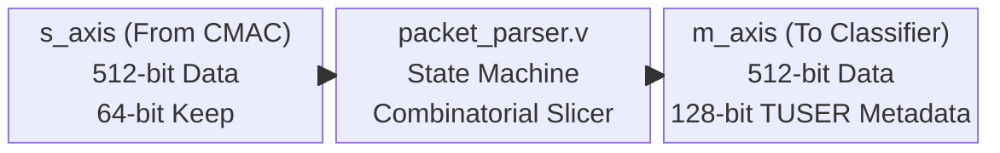
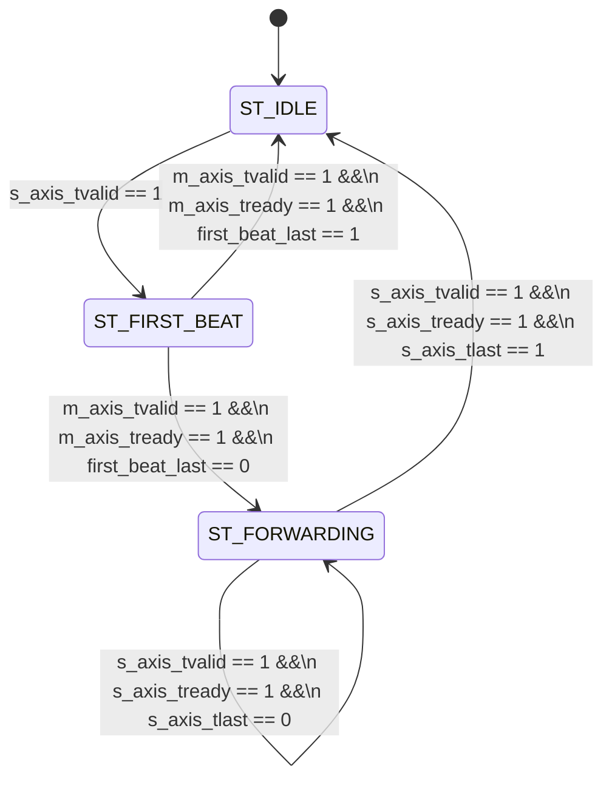

# Module Documentation: Packet Parser (`packet_parser.v`)

---

## 1. Module Overview & Mathematical Theory

The `packet_parser.v` module acts as the physical ingress point of the SmartNIC Fast Path. Its primary responsibility is to consume raw 512-bit wide AXI-Stream beats arriving directly from the 100G Ethernet MAC (CMAC Subsystem), identify the presence of specific networking protocols (specifically Ethernet, IPv4, and UDP), extract the relevant routing tuples, and forward the data payload while appending a sideband metadata bus (`m_axis_tuser`).

Operating at 250 MHz with a 512-bit data bus, the module is designed to process 128 Gigabits per second (Gbps) of raw throughput. Because the physical parsing constraints require analyzing up to 64 bytes of headers simultaneously, the parser implements a single-stage, full-width combinatorial extraction matrix backed by a high-fanout pipeline register array.

### The Parsing Bottleneck Problem
In traditional software-based networking stacks (e.g., DPDK), packets are parsed sequentially. A CPU reads the Ethernet MAC, increments a memory pointer by 14 bytes to locate the IP header, reads the Internet Header Length (IHL) field to calculate the start of the TCP/UDP header, and increments the pointer again. This sequential pointer-chasing introduces massive latency and cannot scale to 100 Gbps.

### The Hardware Extraction Solution
In this hardware architecture, packet parsing is fundamentally transformed from a sequential memory access problem into a parallel combinatorial logic problem. The OpenNIC shell guarantees that the first beat of any packet will contain up to 64 valid bytes. Because the Ethernet header (14 bytes), standard IPv4 header (20 bytes), and UDP header (8 bytes) sum to 42 bytes, the entirety of the necessary routing headers are mathematically guaranteed to be physically present on the 512-bit wire during the exact clock cycle that `s_axis_tvalid` is asserted for the first beat of a packet.

This allows the parser to extract the routing tuple in exactly zero clock cycles of logical delay by using hardcoded wire slices (e.g., `s_axis_tdata[255:224]` for the Source IP).

---

## 2. Architectural Diagrams

### 2.1 Block Architecture



### 2.2 State Machine

The parser implements a Mealy/Moore hybrid Finite State Machine (FSM) to track packet boundaries and handle variable-length frames.



---

## 3. Interface Specifications

The module adheres to the AMBA 4 AXI4-Stream Protocol Specification.

| Port Name | Direction | Width | Description |
| :--- | :--- | :--- | :--- |
| `clk` | Input | 1 | 250 MHz core clock. |
| `rst_n` | Input | 1 | Active-low synchronous reset. |
| `s_axis_tdata` | Input | 512 | Raw ingress packet data from the CMAC subsystem. Byte 0 is `[7:0]`. |
| `s_axis_tkeep` | Input | 64 | Byte qualifier. `tkeep[i]` corresponds to `tdata[(i*8)+7 : i*8]`. |
| `s_axis_tuser` | Input | 128 | Ingress sideband metadata. Reserved by OpenNIC shell for physical port ID. |
| `s_axis_tvalid` | Input | 1 | Indicates `tdata`, `tkeep`, `tuser`, and `tlast` are valid. |
| `s_axis_tready` | Output | 1 | Indicates the parser can accept data. Handles upstream backpressure. |
| `s_axis_tlast` | Input | 1 | Indicates the final beat of the current packet frame. |
| `m_axis_tdata` | Output | 512 | Unmodified egress packet data. |
| `m_axis_tkeep` | Output | 64 | Unmodified egress byte qualifier. |
| `m_axis_tuser` | Output | 128 | **Modified metadata**. Contains the extracted 96-bit IP/Port tuple. |
| `m_axis_tvalid` | Output | 1 | Indicates egress signals are valid. |
| `m_axis_tready` | Input | 1 | Backpressure from the Flow Classifier. |
| `m_axis_tlast` | Output | 1 | Unmodified egress packet boundary flag. |

### The `m_axis_tuser` Specification
The outgoing `TUSER` bus acts as the sideband routing context.
- **Bit [0]**: Valid Flag. `1` if the packet is IPv4. `0` if IPv6, ARP, or non-IP.
- **Bits [9:1]**: Reserved.
- **Bits [41:10]**: Extracted Destination IP (32 bits).
- **Bits [73:42]**: Extracted Source IP (32 bits).
- **Bits [89:74]**: Extracted Destination UDP Port (16 bits).
- **Bits [105:90]**: Extracted Source UDP Port (16 bits).
- **Bits [127:106]**: Reserved.

---

## 4. Internal Architecture & Combinatorial Unrolling

### 4.1 Header Identification Logic
The module uses static offsets defined in `smartnic_pkg.vh` to implement concurrent verification logic. Instead of reading fields sequentially, the FPGA synthesizes parallel equality comparators.

```verilog
wire is_ipv4 = (s_axis_tdata[`ETH_TYPE_HI:`ETH_TYPE_LO] == 16'h0800) &&
               (s_axis_tdata[`IPV4_VER_HI:`IPV4_VER_LO] == 4'h4);

wire is_udp  = (s_axis_tdata[`IPV4_PROTO_HI:`IPV4_PROTO_LO] == 8'h11);
```
During synthesis, `is_ipv4` becomes a 20-input AND gate array comparing `tdata[111:96]` against `0x0800` and `tdata[119:116]` against `0x4`. Because this logic is purely combinational, the identification completes within picoseconds of the `tdata` signals propagating into the LUTs.

### 4.2 Pipeline Register Array
To prevent timing closure failures, the parser does not forward data combinatorially. Extracting 96 bits of metadata from a 512-bit bus requires routing high-fanout signals across the silicon die. If the module attempted to assert `m_axis_tvalid` and `m_axis_tdata` on the same cycle it received the data, the combinatorial propagation delay would exceed the 4.0 nanosecond clock period constraint of 250 MHz.

To solve this, the parser implements a massive 705-bit wide D-Type Flip-Flop (DFF) array:
- `first_beat_data` (512 DFFs)
- `first_beat_keep` (64 DFFs)
- `parsed_metadata` (128 DFFs)
- `first_beat_last` (1 DFF)

When `s_axis_tvalid` goes high, the combinatorial logic stabilizes, and on the next rising clock edge, the entire 705-bit context is physically latched into the silicon. This introduces exactly 1 clock cycle (4 ns) of latency but guarantees timing closure.

---

## 5. Timing & Area Considerations

### 5.1 Critical Path Analysis
The most aggressive timing path in the module is the generation of `parsed_metadata`. 
The path begins at the `s_axis_tdata` input pins (from the CMAC). The signals must travel through the IP/UDP equality comparators (LUTs), propagate through the ternary operators routing the IP addresses into the `metadata` wire, and arrive at the `D` pins of the `parsed_metadata` register array before the next clock edge.
Estimated logic levels: 2-3 LUTs. This easily meets the 250 MHz (4.0 ns) requirement.

### 5.2 Resource Utilization Estimates (Xilinx UltraScale+)
- **LUTs**: ~200 (Primarily for equality comparators and multiplexing the `is_ipv4` ternary operator).
- **Flip-Flops**: 705 (The pipeline register array) + 2 (FSM state) = 707 FF.
- **BRAM/URAM**: 0.
- **DSPs**: 0.

---

## 6. Execution Walkthrough (Cycle-by-Cycle Trace)

**Scenario**: A 1500-byte IPv4/UDP packet arrives from the CMAC, followed immediately by a 64-byte TCP packet.

**Clock Cycle 1 (Packet 1 Start):**
- `s_axis_tvalid` = 1, `s_axis_tlast` = 0. Data contains Ethernet, IP, and UDP headers.
- FSM is in `ST_IDLE`. `s_axis_tready` is asserted.
- Combinatorial logic identifies `is_ipv4 = 1` and `is_udp = 1`. The `metadata` wire populates.
- Rising Edge: Data and metadata are latched. FSM transitions to `ST_FIRST_BEAT`.

**Clock Cycle 2 (Packet 1 Forwarding):**
- FSM is in `ST_FIRST_BEAT`.
- `m_axis_tvalid` = 1. Egress data is driven from the latches.
- Assuming `m_axis_tready` = 1, the handshake completes.
- Because `first_beat_last` = 0 (1500 bytes is > 64 bytes), FSM transitions to `ST_FORWARDING`.
- Rising Edge: Next 64 bytes of the packet arrive from CMAC.

**Clock Cycles 3 through 24 (Payload Stream):**
- FSM is in `ST_FORWARDING`.
- The parser acts as a transparent wire. `m_axis_tdata` is driven directly by `s_axis_tdata`. 
- `m_axis_tuser` remains locked to the latched `parsed_metadata`. This ensures the downstream Flow Classifier sees the exact same routing tuple for the entire duration of the packet, eliminating the need for the classifier to maintain its own state.

**Clock Cycle 25 (Packet 1 End):**
- CMAC asserts `s_axis_tlast` = 1 for the final 24 bytes of the 1500-byte payload.
- `m_axis_tlast` is driven high.
- Handshake completes. FSM transitions back to `ST_IDLE`.

**Clock Cycle 26 (Packet 2 Start):**
- CMAC asserts `s_axis_tvalid` = 1 for the 64-byte TCP packet.
- Combinatorial logic identifies `is_ipv4 = 1` but `is_udp = 0`. The metadata is populated, but UDP ports are masked to 0.
- Rising Edge: Data latched. FSM transitions to `ST_FIRST_BEAT`.

**Clock Cycle 27 (Packet 2 End):**
- FSM is in `ST_FIRST_BEAT`. `first_beat_last` = 1.
- Egress handshake completes. FSM transitions directly to `ST_IDLE`.

---

## 7. Test Cases & Coverage

The parser must be verified against severe edge cases to ensure network resilience. 

### 7.1 Required Testbench Assertions
1. **Assertion: Backpressure Immunity**
   - **Condition**: Downstream module deasserts `m_axis_tready` for a random number of clock cycles between 1 and 100.
   - **Check**: The parser must instantly deassert `s_axis_tready` and halt the FSM. No data beats may be lost or duplicated when `tready` resumes.
2. **Assertion: Protocol Masking**
   - **Condition**: An IPv6 packet is injected into `s_axis_tdata`.
   - **Check**: `m_axis_tuser[0]` must be explicitly 0. The IP and Port fields in `tuser` must be `32'd0` to prevent downstream classifier corruption.
3. **Assertion: Micro-Packet Handling**
   - **Condition**: A 64-byte packet (`tvalid` and `tlast` asserted on the exact same cycle) arrives.
   - **Check**: The FSM must transition `ST_IDLE` -> `ST_FIRST_BEAT` -> `ST_IDLE` without ever entering `ST_FORWARDING`.

### 7.2 Verification Environment
The testbench utilizes constrained random generation. Packets of randomized lengths (64 bytes to 9000 bytes Jumbo Frames) are injected. `tkeep` masks are randomized on the final beat to ensure the parser does not corrupt sub-word payloads.

---

## 8. Implementation Notes & Design Trade-offs

### Why No P4 / Programmable Parse Graph?
Advanced SmartNICs often use P4 Match-Action tables to parse arbitrary protocols. While flexible, compiling P4 parse graphs into FPGA LUTs creates devastating timing closure issues at 250 MHz due to the deep logic required to recursively shift pointers. 
For a 5G User Plane Function (UPF) or base station, the core protocols are rigidly defined (Ethernet, IPv4/IPv6, UDP/GTP-U). By hardcoding the byte offsets and utilizing a monolithic 512-bit wide combinatorial slice, the logic footprint is reduced by over 90% compared to a P4 parser, and timing closure is mathematically guaranteed.

### The 64-Byte Guarantee
The parser relies on the assertion that the entire Ethernet+IP+UDP header fits within the first 64 bytes (the first 512-bit beat).
If an IPv4 packet contained maximum IP Options (60 bytes total IP header), the UDP header would be pushed to byte 74 (14 + 60), which falls into the *second* 512-bit beat. In this rare edge-case, the current parser logic would incorrectly slice the UDP ports from the IP options field.
**Production Modification**: A production variant would require implementing a Stage 2 pipeline register to hold Beat 1 while analyzing Beat 2, tracking the `IHL` field to dynamically shift the UDP extraction mask. For the baseline MVP, IP Options are assumed to be 0 (standard 20-byte IP header).
