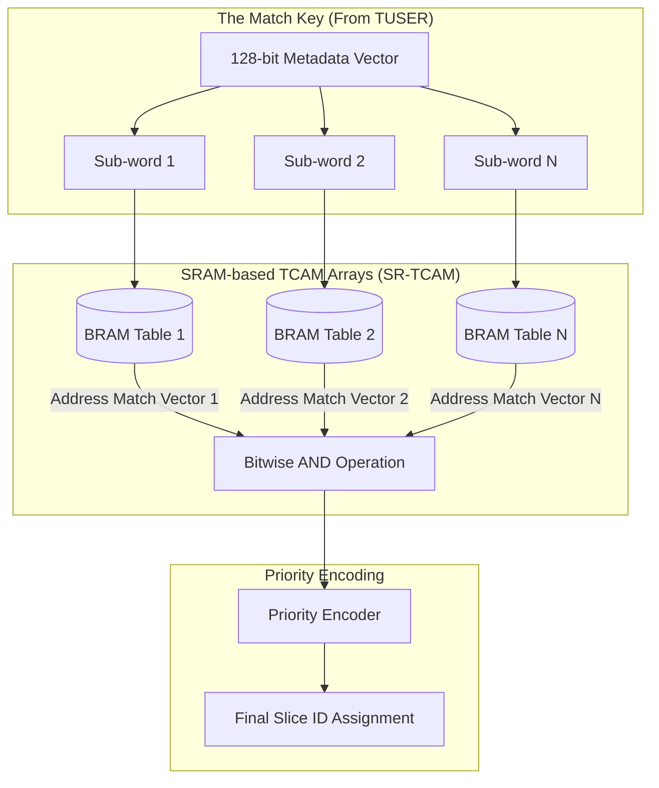

# Chapter 3: The Fast Path — TCAM-Based Flow Classification

## 3.1 Flow Classification in 5G Networks
Once the Packet Parser has successfully extracted the protocol metadata (Source/Destination IPs, Ports, Protocols) and populated the `TUSER` bus, the network datapath must evaluate this data to enforce **5G Network Slicing**. 

In the context of the Control and User Plane Separation (CUPS) defined by 3GPP, the Access and Mobility Management Function (AMF) or Session Management Function (SMF) determines the slicing policies. However, it is the User Plane Function (UPF)—in our case, the hardware FPGA SmartNIC—that must execute the Packet Detection Rules (PDRs) and map incoming flows to specific QoS physical queues (eMBB, URLLC, or mMTC).

To accomplish this at 100 Gbps, sequential rule evaluation (such as Software Longest Prefix Match trees) is mathematically unviable. The hardware must evaluate the packet against all established routing rules simultaneously.

---

## 3.2 Ternary Content-Addressable Memory (TCAM)
The industry standard for parallel, line-rate flow classification is **Content-Addressable Memory (CAM)**. While standard Random Access Memory (RAM) takes a memory address as input and returns the data stored at that address, a CAM takes *data* as input and returns the *address* where that data is located.

Specifically, network routing utilizes **Ternary CAM (TCAM)**. As opposed to Binary CAM (which evaluates strict `1` and `0` logic), TCAM introduces a third logical state: `X` (Don't Care).

### 3.2.1 The "Don't Care" State and Subnet Masking
The `X` state is critical for IP routing and flow classification because it allows for native subnet masking. For example, if the 5G Control Plane commands the SmartNIC to route all IoT traffic originating from the `192.168.1.0/24` subnet to the mMTC slice, the TCAM rule is programmed with the last 8 bits set to `X`. 

When a packet arrives from `192.168.1.55`, the TCAM evaluates the first 24 bits, ignores the last 8 bits, and returns an instantaneous match in exactly one clock cycle.

---

## 3.3 FPGA Implementation of SRAM-Based TCAM (SR-TCAM)

While ASICs (Application-Specific Integrated Circuits) can be manufactured with physical TCAM transistor cells, FPGAs (like the AMD Alveo cards running our OpenNIC shell) lack native, dedicated TCAM hardware. Implementing massive TCAM structures using standard FPGA logic elements (Look-Up Tables - LUTs) leads to exponential routing delays and unacceptable power consumption.

As established by Ullah et al. in *FPGA Implementation of SRAM-based Ternary Content Addressable Memory*, modern VLSI design circumvents this limitation by emulating TCAM functionality using the FPGA's dense, high-speed **Static RAM (SRAM) Blocks**, specifically Block RAM (BRAM).

### 3.3.1 Vertical Partitioning Architecture
To implement the Flow Classifier module in our Verilog datapath, we employ the **SR-TCAM (SRAM-based TCAM)** architectural paradigm.

Instead of deploying a massive monolithic lookup table, the 128-bit match key (comprising the IPs, Ports, and Protocols from the `TUSER` bus) is vertically partitioned into smaller sub-words (e.g., 8-bit or 16-bit chunks).

### 3.3.2 The Match Resolution Process
1. **Parallel SRAM Lookup:** Each sub-word acts as the *address* input to its corresponding BRAM table. The BRAM outputs a bit-vector representing all rule indices where that sub-word matches.
2. **Bitwise ANDing:** The bit-vectors from all vertical BRAM partitions are subjected to a massive parallel bitwise `AND` operation. If an index remains `1` across all partitions, the entire 128-bit key matches the rule at that index.
3. **Priority Encoding:** Because TCAMs utilize "Don't Care" bits, a single packet may match multiple rules simultaneously (e.g., a generic rule for port 80 and a specific rule for a particular IP address). The bit-vector is fed into a **Priority Encoder**, which outputs the index of the highest-priority matching rule (typically the rule closest to index 0).

### 3.3.3 Output and Metadata Stamp
Once the Priority Encoder resolves the highest-priority match, the corresponding **Network Slice ID** is retrieved from an Action Table. The Flow Classifier writes this Slice ID into the `[7:4]` bits of the `TUSER` metadata bus, successfully completing the Fast Path classification. 

The packet is now fully prepared to enter the hardware Queuing Subsystem.
