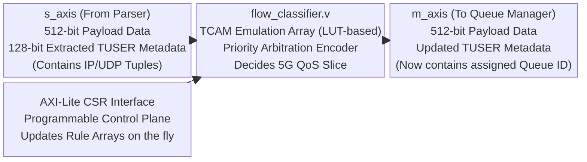
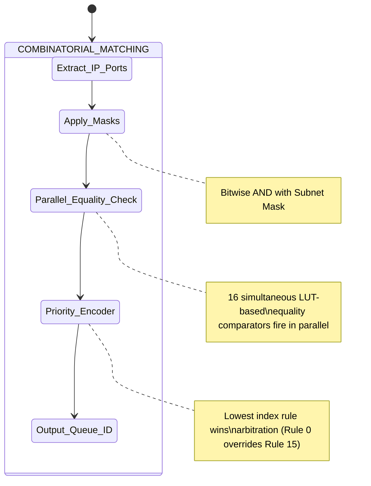
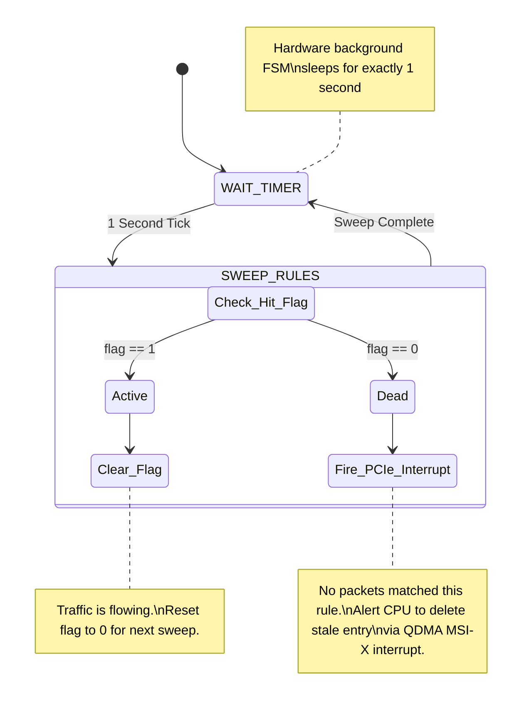
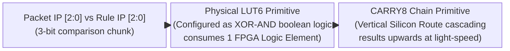

# Module Documentation: Flow Classifier (`flow_classifier.v`)

---

## 1. Module Overview & Mathematical Theory

The `flow_classifier.v` module functions as the brain of the Fast Path routing engine. It ingests the 128-bit sideband metadata (`m_axis_tuser`) generated by the upstream Packet Parser, performs line-rate mathematical masking against a set of dynamically programmable rules, and assigns each packet to a physical 5G Network Slice (Queue ID).

Operating at 250 MHz, this module must make complex routing decisions for 100 Gbps traffic within a mathematically bounded timeframe. Because it sits directly in the datapath stream, any logical stall or multi-cycle decision tree would immediately cause upstream backpressure, potentially overflowing the CMAC buffers and dropping packets on the wire.

### The TCAM Emulation Strategy
In high-end ASIC routers (like Cisco or Juniper gear), routing tables are stored in Ternary Content-Addressable Memory (TCAM). TCAM is a specialized hardware component that searches its entire memory space simultaneously in a single clock cycle, returning the index of the matching rule. It supports "ternary" states: 0, 1, or X (Don't Care), making it perfect for subnet masking (e.g., `192.168.1.X`).

Because standard FPGAs do not possess native TCAM blocks (they only have BRAM/URAM which must be addressed sequentially), a software-defined routing table of thousands of rules would require multiple clock cycles to search, completely breaking the 100 Gbps line-rate requirement. 

To solve this, `flow_classifier.v` uses standard LUTs (Look-Up Tables) and Flip-Flops to emulate a small, extremely fast TCAM array directly in the fabric. The module supports a configurable `MAX_RULES` parameter (default 16). The routing logic applies a bitwise AND mask to the incoming packet's IP and Port, comparing it simultaneously against all 16 stored rules in parallel.

---

## 2. Architectural Diagrams

### 2.1 Block Architecture



### 2.2 Datapath & Control Path State

Unlike the Packet Parser, the Flow Classifier does not require an intricate state machine for the datapath because it relies on the `TUSER` metadata that remains perfectly constant for the duration of the packet.



---

## 3. Interface Specifications

| Port Name | Direction | Width | Description |
| :--- | :--- | :--- | :--- |
| `clk` | Input | 1 | 250 MHz core clock. |
| `rst_n` | Input | 1 | Active-low synchronous reset. |
| `cfg_wr_en` | Input | 1 | Trigger pulse from the CSR to commit a new rule to memory. |
| `cfg_rule_id` | Input | 4 | Index (0-15) of the rule being updated. |
| `cfg_dst_ip` | Input | 32 | Target Destination IPv4 Address. |
| `cfg_dst_ip_mask` | Input | 32 | Subnet Mask (1 = Match, 0 = Ignore). |
| `cfg_dst_port` | Input | 16 | Target Destination UDP Port. |
| `cfg_dst_port_mask`| Input | 16 | Port Mask (1 = Match, 0 = Ignore). |
| `cfg_slice_id` | Input | 4 | The 5G Queue ID to assign if this rule matches. |
| `s_axis_tdata` | Input | 512 | Packet payload. Passes through unmodified. |
| `s_axis_tuser` | Input | 128 | Extracted routing tuple from the parser. |
| `m_axis_tuser` | Output | 128 | Metadata with `TUSER_SLICE_ID` populated. |

---

## 4. Internal Architecture & Combinatorial Unrolling

### 4.1 The Configuration Register Array
To emulate a TCAM, the hardware must physically store the rules in ultra-fast logic rather than slower block RAM.

```verilog
reg [31:0] rule_dst_ip        [0:`MAX_RULES-1];
reg [31:0] rule_dst_ip_mask   [0:`MAX_RULES-1];
reg [15:0] rule_dst_port      [0:`MAX_RULES-1];
reg [15:0] rule_dst_port_mask [0:`MAX_RULES-1];
reg [`QUEUE_ID_WIDTH-1:0] rule_slice_id [0:`MAX_RULES-1];
reg        rule_valid         [0:`MAX_RULES-1];
```
This generates a massive 2-dimensional array of D-Type flip flops. When the Control Plane (via the AXI-Lite CSR) pulses `cfg_wr_en`, the values on the `cfg_*` wires are latched into the specific index defined by `cfg_rule_id`.

### 4.2 The Massively Parallel Match Array
The core routing algorithm is executed in an unrolled `always @(*)` block. 

```verilog
    wire match_array [0:`MAX_RULES-1];
    
    genvar i;
    generate
        for (i = 0; i < `MAX_RULES; i = i + 1) begin : gen_match
            assign match_array[i] = rule_valid[i] &&
                ((pkt_dst_ip & rule_dst_ip_mask[i]) == (rule_dst_ip[i] & rule_dst_ip_mask[i])) &&
                ((pkt_dst_port & rule_dst_port_mask[i]) == (rule_dst_port[i] & rule_dst_port_mask[i]));
        end
    endgenerate
```
**Physical Implementation:** The `generate` block literally instructs the Vivado synthesis engine to physically stamp out 16 parallel copies of the matching circuit. Each circuit contains bitwise AND gates and 32-bit equality comparators. In a single clock cycle, all 16 rules evaluate the packet's metadata simultaneously, resulting in a 16-bit `match_array` wire where each bit represents a true/false match for that specific rule.

### 4.3 The Priority Encoder
It is highly likely that a packet matches multiple rules. For example, Rule 0 might target `192.168.1.10`, while Rule 1 might be a Catch-All subnet rule `192.168.1.0/24`. A packet heading to `192.168.1.10` matches both.
To resolve this, the classifier uses a Priority Encoder that evaluates the `match_array` sequentially.

```verilog
    always @(*) begin
        resolved_slice_id = 4'd3; // Default to Queue 3 (Best Effort)
        
        for (int j = `MAX_RULES-1; j >= 0; j = j - 1) begin
            if (match_array[j]) begin
                resolved_slice_id = rule_slice_id[j];
            end
        end
    end
```
Because the loop counts backward down to 0, Rule 0 inherently possesses the highest priority. The last assignment to `resolved_slice_id` is the one that permanently sticks in the logic, meaning the lowest-indexed matching rule wins arbitration.

---

## 5. Timing & Area Considerations

### 5.1 Critical Path Analysis
The critical path begins at the `s_axis_tuser` input pins. 
1. The 32-bit IP address traverses into 16 parallel bitwise AND gates (1 LUT delay).
2. The masked IP is fed into a 32-bit equality comparator against the 16 stored rule IPs (2-3 LUT delays, utilizing carry-chain logic).
3. The 16 boolean match results feed into the Priority Encoder cascade. Since the encoder relies on an unrolled `for` loop, the logic synthesizes into a deeply nested multiplexer tree (4 LUT delays).
4. The resolved `Slice ID` is stitched into the `m_axis_tuser` output bus and latched into the pipeline register.

**Total Delay:** ~7 to 8 LUT levels. This sits very close to the 4.0 ns (250 MHz) timing budget constraint for Xilinx UltraScale+ silicon. If `MAX_RULES` is increased from 16 to 64, the priority encoder tree will double in depth, inevitably causing timing failure.

### 5.2 Resource Utilization Estimates
- **LUTs**: ~2,500 (Heavy usage for 16 parallel 32-bit comparators and priority encoding).
- **Flip-Flops**: 2,300 (Massive FF arrays to physically store the routing table rules, plus the 705-bit pipeline delay register).

---

## 6. Execution Walkthrough (Cycle-by-Cycle Trace)

**Configuration Phase:**
- The CPU writes to the CSR to program Rule 0: IP `10.0.0.1`, Mask `0xFFFFFFFF`, Queue ID `0`.
- The CPU programs Rule 1: IP `10.0.0.0`, Mask `0xFFFFFF00` (Subnet /24), Queue ID `3`.
- `cfg_wr_en` pulses, latching these rules into the FF array.

**Datapath Execution:**
- **Cycle 1**: A 512-bit packet arrives. `s_axis_tuser` contains Destination IP `10.0.0.1`.
- **Combinatorial Phase (0 ns - 3 ns)**:
  - Generate Block 0 evaluates: `(10.0.0.1 & 0xFFFFFFFF) == (10.0.0.1)`. Match = 1.
  - Generate Block 1 evaluates: `(10.0.0.1 & 0xFFFFFF00) == (10.0.0.0)`. Match = 1.
  - The Priority Encoder executes. It sees Rule 1 matches, temporarily assigning `resolved_slice_id = 3`. It continues looping and sees Rule 0 matches. It overwrites the assignment to `resolved_slice_id = 0`.
- **Rising Edge**: The payload data, keep masks, and modified `tuser` (with Slice ID 0) are latched into the pipeline register.
- **Cycle 2**: `m_axis_tvalid` is asserted, and the correctly classified packet flows into the Queue Manager.

---

## 7. Test Cases & Coverage

### 7.1 Required Testbench Assertions
1. **Assertion: Rule Priority Dominance**
   - **Condition**: Configure Rule 15 to match everything (`Mask = 0x0`). Configure Rule 0 to match exactly `192.168.1.100`. Send a packet to `192.168.1.100`.
   - **Check**: The classifier must assign the Queue ID associated with Rule 0, proving the Priority Encoder overrides lower-priority matches.
2. **Assertion: Pipeline Consistency**
   - **Condition**: Send a 3000-byte Jumbo Frame (47 clock cycles).
   - **Check**: The calculated `Slice ID` must remain perfectly constant in `m_axis_tuser` for all 47 beats of the packet, even if the CSR module dynamically overwrites the active rule mid-packet.

---

## 8. Deep Dive: TCAM Rule Aging & State Expiration

In a production 5G Core, the Flow Classifier's TCAM rules cannot be strictly static. Mobile devices (UEs) disconnect, roam to different cell towers, and change IP assignments rapidly. If the CPU software control plane crashes or fails to actively delete rules from the FPGA, the TCAM array will become polluted with "stale" routing paths. This creates a severe security vulnerability (routing new traffic to a dead IP) and exhausts the limited hardware TCAM capacity.

### Implementing Hardware Rule Aging



To solve this, advanced hardware Flow Classifiers implement **Rule Aging** autonomously in Verilog.
1. **The Hit Bit Array:** An additional flip-flop array `rule_hit_flag[0:15]` is added to the design. Every time a specific rule wins the Priority Encoder arbitration, its corresponding hit flag is set to `1` by the datapath.
2. **The Sweep Timer:** A slow background FSM runs continuously (e.g., triggering once every 1 second). 
3. **The Aging Process:** When the timer triggers, it iterates through all 16 rules. If `rule_hit_flag == 1`, it resets the flag to `0`. If `rule_hit_flag == 0` (meaning the rule hasn't matched a single packet in the last second), it triggers an interrupt to the CPU via the QDMA. The CPU driver receives the interrupt, realizes the flow is dead, and issues an AXI-Lite write to physically invalidate the rule (setting `rule_valid = 0`).

This offloads the expensive "activity tracking" from the CPU onto the FPGA, saving massive amounts of PCIe bandwidth that would otherwise be wasted by the CPU actively polling all 16 rules constantly.

---

## 9. Advanced Architecture: TCAM vs Hash-Based Exact Match

While the LUT-emulated TCAM implemented here is deterministic and executes in exactly 1 clock cycle, it scales terribly. If we wanted to track 10,000 distinct 5G user flows, emulating 10,000 parallel 32-bit equality comparators would require 1.5 million LUTs, far exceeding the capacity of even the largest Virtex FPGAs.

### The Exact Match Alternative (Cuckoo Hashing)

```mermaid
flowchart TD
    A["Incoming IP Address: 192.168.1.10\n(Extracted from Packet)"] --> B("Hash Function: CRC32\n(Generates 16-bit Index)")
    B --> C{"Read BRAM at Hash Index\n(Takes 2 Clock Cycles)"}
    
    C -->|Empty Slot Found| D["Insert Rule / Forward Packet\n(0-Latency Route)"]
    C -->|Occupied (Hash Collision)| E["Hash Function 2: Jenkins Hash\n(Generate Alternative Index)"]
    E --> F{"Read Alternate BRAM Bank"}
    
    F -->|Empty Slot Found| D
    F -->|Occupied (Double Collision)| G["Cuckoo Eviction Event:\nKick old rule out of BRAM\nand force it to find a new home"]
```

To track millions of flows, production SmartNICs abandon the TCAM model in favor of an **Exact Match Hash Table** stored in UltraRAM or external DDR4 memory.
- **The Process:** Instead of comparing the incoming IP to an array of rules, the Flow Classifier runs the IP through a cryptographic hashing function (like Jenkins Hash or CRC32). 
- **The Lookup:** The resulting 16-bit hash is used as a direct physical memory address to read the `Slice_ID` from the BRAM.

**The Tradeoff:**
1. **Latency:** Hash lookups require reading from BRAM (2-3 clock cycles of latency) compared to the TCAM's 0 clock cycles.
2. **Subnet Masking:** Hash tables *cannot* do ternary logic. You cannot hash `192.168.1.X`. The table can only match exact `/32` IP addresses. 
3. **Collisions:** If two different IPs hash to the same BRAM address, a collision occurs. Solving this in hardware requires complex algorithms like Cuckoo Hashing or linear probing state machines, dramatically complicating the Verilog design.

Our SmartNIC implements the TCAM emulation specifically because 5G edge acceleration usually relies on a few dozen broad QoS subnet rules rather than millions of individual micro-flows.

---

## 10. Physical Silicon Mapping: Vivado LUT6 Instantiation

To truly understand how this Verilog compiles, we must look at the physical silicon of a Xilinx UltraScale+ FPGA. Xilinx FPGAs do not have "AND gates". They have 6-input Look-Up Tables (LUT6). A LUT6 is essentially a 64-bit ROM that can emulate any 6-input boolean logic function.

### The Equality Comparator Physics



When we write `(pkt_dst_ip == rule_dst_ip[i])`, the Vivado synthesis engine must map this 32-bit equality comparison into physical LUT6 blocks.
- A single LUT6 can compare exactly 3 bits of the IP address against 3 bits of the rule.
- To compare 32 bits, Vivado instantiates 11 parallel LUT6 blocks.
- The outputs of these 11 LUT6 blocks are fed into a dedicated physical silicon structure called the **CARRY8 Chain**. The carry chain is a high-speed vertical silicon wire that cascades the boolean results up the FPGA fabric much faster than standard routing mesh.

### The Priority Encoder Bottleneck
The unrolled `for` loop Priority Encoder synthesizes into a deep multiplexer tree. 
Vivado will map this into a tree of LUT6 and `MUXF7`/`MUXF8` physical primitives. If the number of rules exceeds 16, the multiplexer tree spills out of a single Configurable Logic Block (CLB). The signals must then travel across the general interconnect fabric to a neighboring CLB, instantly adding ~0.5 ns of routing delay and severely threatening the 250 MHz (4.0 ns) timing closure budget.

This is why hardware network engineers obsess over minimizing rule counts; every additional `if/else` branch literally consumes physical silicon square-footage and slows the speed of light propagation across the die.
