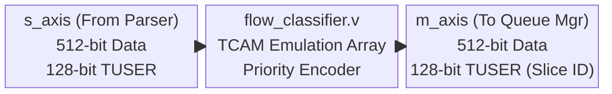
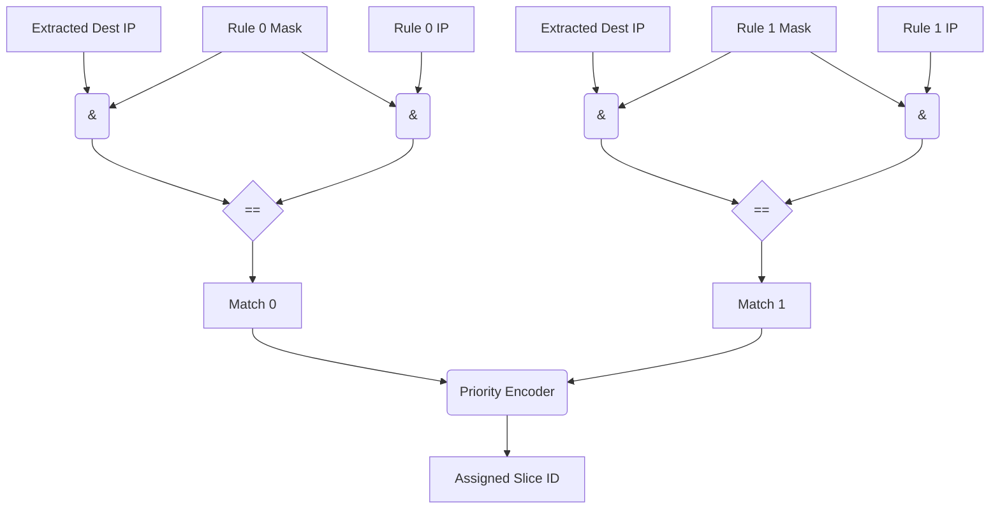

# Module Documentation: Flow Classifier (`flow_classifier.v`)

---

## 1. Module Overview & Mathematical Theory

The `flow_classifier.v` module represents the core routing brain of the SmartNIC Fast Path. Its primary responsibility is to analyze the 128-bit sideband metadata (`m_axis_tuser`) generated by the upstream Packet Parser, match the extracted IP addresses and UDP ports against a set of dynamically programmable routing rules, and assign the packet to a specific 5G Network Slice (represented internally as a hardware Queue ID).

Operating continuously at 250 MHz, this module must make complex, multi-variable routing decisions on 512-bit data beats at 128 Gbps line-rate. 

### The TCAM Emulation Problem
In standard enterprise routers and Data Center switches, routing tables are implemented using specialized silicon known as Ternary Content-Addressable Memory (TCAM). Unlike standard RAM (which takes a memory address and returns the data stored there), TCAM takes data (e.g., an IP address) and searches the entire memory array simultaneously to return the address where that data is stored. Furthermore, the "Ternary" aspect allows matching on `0`, `1`, or `X` (Don't Care), which is strictly required for Subnet/Wildcard routing (e.g., `192.168.1.0/24`).

Because standard FPGAs lack native, hard-silicon TCAM blocks, attempting to synthesize massive TCAMs out of standard LUTs leads to exponential area explosion and timing closure failures. 

### The Combinatorial Solution
This module solves the problem by implementing a highly constrained, massively parallel combinatorial logic array. Instead of searching a massive RAM block, the module synthesizes exactly `MAX_RULES` (default: 16) discrete equality comparator blocks. When a packet arrives, the hardware simultaneously compares the packet's IP and Port metadata against all 16 rules in exactly one clock cycle. The results are fed into a Priority Encoder to resolve conflicts, allowing deterministic, zero-latency (combinatorial) routing.

---

## 2. Architectural Diagrams

### 2.1 Block Architecture



### 2.2 Datapath Logic (Combinatorial Match Tree)



---

## 3. Interface Specifications

| Port Name | Direction | Width | Description |
| :--- | :--- | :--- | :--- |
| `clk` | Input | 1 | 250 MHz core clock. |
| `rst_n` | Input | 1 | Active-low synchronous reset. |
| **AXI-Stream Interfaces** | | | |
| `s_axis_tdata` | Input | 512 | Packet payload from the Parser. |
| `s_axis_tkeep` | Input | 64 | Valid byte mask. |
| `s_axis_tuser` | Input | 128 | Extracted metadata (IPs/Ports). |
| `s_axis_tvalid` | Input | 1 | Master valid signal. |
| `s_axis_tready` | Output | 1 | Slave ready (backpressure). |
| `s_axis_tlast` | Input | 1 | Packet boundary. |
| `m_axis_tdata` | Output | 512 | Unmodified packet payload. |
| `m_axis_tkeep` | Output | 64 | Unmodified byte mask. |
| `m_axis_tuser` | Output | 128 | **Modified Metadata**. Slices [12:11] contain the assigned Queue ID. |
| `m_axis_tvalid` | Output | 1 | Master valid signal. |
| `m_axis_tready` | Input | 1 | Slave ready from Queue Manager. |
| `m_axis_tlast` | Output | 1 | Unmodified packet boundary. |
| **Configuration Interface** | | | |
| `cfg_wr_en` | Input | 1 | One-cycle trigger pulse to commit a new rule. |
| `cfg_rule_id` | Input | 4 | The TCAM index (0 to 15) to program. |
| `cfg_dst_ip` | Input | 32 | The target Destination IPv4 address. |
| `cfg_dst_ip_mask` | Input | 32 | The Subnet mask (e.g., `0xFFFFFF00` for /24). |
| `cfg_dst_port` | Input | 16 | The target Destination UDP Port. |
| `cfg_dst_port_mask` | Input | 16 | Port mask (`0xFFFF` for exact match, `0x0000` for Any). |
| `cfg_protocol` | Input | 8 | IPv4 Protocol ID (e.g., `0x11` for UDP). |
| `cfg_protocol_mask` | Input | 8 | Protocol mask. |
| `cfg_slice_id` | Input | 2 | The 5G Network Slice (Queue ID: 0, 1, 2, or 3) to assign on match. |
| `cfg_rule_enable` | Input | 1 | Active flag for this specific rule index. |

---

## 4. Internal Architecture & Combinatorial Unrolling

### 4.1 The Control Plane (Rule Latches)
The module maintains an internal array of registers representing the programmable TCAM.
```verilog
    reg [31:0]                      rule_dst_ip        [0:`MAX_RULES-1];
    reg [31:0]                      rule_dst_ip_mask   [0:`MAX_RULES-1];
    // ...
```
When the `axilite_csr.v` asserts `cfg_wr_en`, the hardware uses `cfg_rule_id` as an index to write the incoming configuration into the register array. This operation occurs completely independent of the 512-bit datapath, allowing the host CPU to modify rules dynamically at runtime without stalling the 100 Gbps network stream.

### 4.2 The Ternary Logic (Wildcard Masking)
To emulate TCAM "Don't Care" states, the module relies on Bitwise AND masking.
```verilog
wire match_ip = (extracted_dst_ip & rule_dst_ip_mask[i]) == 
                (rule_dst_ip[i]   & rule_dst_ip_mask[i]);
```
- If the mask is `0xFFFFFFFF` (a `/32` host route), every bit of the incoming IP must perfectly match the rule IP.
- If the mask is `0xFFFFFF00` (a `/24` subnet route), the lowest 8 bits of both sides of the equality operator are forced to `0`, effectively erasing them from the comparison.

### 4.3 The Priority Encoder
If Rule 0 matches `192.168.1.0/24` (Subnet) and Rule 1 matches `192.168.1.50/32` (Specific Host), a packet destined for `.50` will technically trigger a `match_enable` on *both* rules simultaneously. The hardware must deterministically resolve this conflict.

The module implements a combinatorial Priority Encoder using a standard Verilog `for` loop inside an `always @(*)` block.
```verilog
    always @(*) begin
        matched_slice_id = `CATCH_ALL_QUEUE; // Default Route
        for (i = `MAX_RULES - 1; i >= 0; i = i - 1) begin
            if (rule_enable[i] && match_ip[i] && match_port[i] && match_proto[i]) begin
                matched_slice_id = rule_slice_id[i];
            end
        end
    end
```
**Synthesis Physics:** 
Because the loop counts *down* to `0`, Rule `0` is evaluated last. In combinatorial logic, the last assignment wins. Therefore, if Rule `15` and Rule `0` both evaluate to true, the multiplexer tree generated by the synthesizer will physically wire the output to select Rule `0`. Rule `0` holds the absolute highest priority.

---

## 5. Timing & Area Considerations

### 5.1 Critical Path Analysis
The critical path in this module is formidable. The data must:
1. Arrive at `s_axis_tuser`.
2. Split into 16 parallel Bitwise AND gates (Masking).
3. Propagate through 16 parallel 32-bit Equality Comparators (Matching).
4. Propagate through a 16-deep cascaded Multiplexer tree (Priority Encoder).
5. Arrive at the `D` pins of the egress pipeline registers.

At `MAX_RULES = 16`, this resolves to approximately 5-7 LUT levels of delay. On a Xilinx UltraScale+ FPGA (-2 speed grade), this will comfortably close timing at 250 MHz (4.0 ns). 
However, if `MAX_RULES` is increased to `64` or `128`, the Priority Encoder multiplexer tree becomes exceedingly deep. The logic delay would exceed 4.0 ns, resulting in violent setup time violations. Scaling this architecture requires either BRAM-based hashing (Exact Match) or a deeply pipelined Priority Encoder tree.

### 5.2 Resource Utilization Estimates (Xilinx UltraScale+)
- **Registers (Rules)**: `16 * (32+32+16+16+8+8+2+1) = 1,840` DFFs.
- **Registers (Pipeline)**: 705 DFFs.
- **LUTs**: ~800 (Dominated by the 16 sets of 32-bit equality comparators and the 16-1 multiplexer tree).
- **BRAMs/DSPs**: 0.

---

## 6. Execution Walkthrough (Cycle-by-Cycle Trace)

**Scenario**: 
- Rule 0: Match IP `10.0.0.1/32`, Assign to Queue 0 (URLLC).
- Rule 1: Match IP `10.0.0.0/24`, Assign to Queue 2 (eMBB).
- Packet 1 arrives destined for `10.0.0.1`.
- Packet 2 arrives destined for `10.0.0.50`.

**Clock Cycle 1 (Packet 1 Arrival):**
- Parser asserts `s_axis_tvalid = 1`. `TUSER` contains Dest IP `10.0.0.1`.
- Combinatorial matching: 
  - Rule 0 matches! (`10.0.0.1 & FF.FF.FF.FF == 10.0.0.1`).
  - Rule 1 matches! (`10.0.0.1 & FF.FF.FF.00 == 10.0.0.0`).
- Priority Encoder: Both evaluate true. The loop iterates down. Rule 0 evaluates last. `matched_slice_id` becomes `0`.
- Rising Edge: Data latches into output registers.

**Clock Cycle 2 (Packet 1 Egress & Packet 2 Arrival):**
- Classifier asserts `m_axis_tvalid = 1`. The `m_axis_tuser` sideband now contains Slice ID `0`. The Queue Manager sees this and routes the payload to the physical URLLC BRAM.
- Parser asserts `s_axis_tvalid = 1` for Packet 2. `TUSER` contains Dest IP `10.0.0.50`.
- Combinatorial matching:
  - Rule 0 fails! (`10.0.0.50 & FF.FF.FF.FF != 10.0.0.1`).
  - Rule 1 matches! (`10.0.0.50 & FF.FF.FF.00 == 10.0.0.0`).
- Priority Encoder: Only Rule 1 evaluates true. `matched_slice_id` becomes `2`.
- Rising Edge: Data latches into output registers.

**Clock Cycle 3 (Packet 2 Egress):**
- Classifier asserts `m_axis_tvalid = 1`. The `m_axis_tuser` sideband now contains Slice ID `2`. The Queue Manager routes the payload to the eMBB FIFO.

---

## 7. Test Cases & Coverage

### 7.1 Required Testbench Assertions
1. **Assertion: Priority Conflict Resolution**
   - **Condition**: Configure Rule 5 to match `192.168.1.0/24` (Queue 1) and Rule 2 to match `192.168.1.100/32` (Queue 0). Send a packet to `192.168.1.100`.
   - **Check**: The assigned Slice ID must be `0`. This mathematically proves the priority encoder correctly favors the lower-indexed rule.
2. **Assertion: Catch-All Default**
   - **Condition**: Send a packet to an IP address that matches zero rules.
   - **Check**: The assigned Slice ID must default to `CATCH_ALL_QUEUE` (Queue 3). The packet must not be dropped.
3. **Assertion: Rule Update Mid-Flight**
   - **Condition**: Send a 9000-byte Jumbo Frame. While the packet is traversing the module (spanning 140 clock cycles), assert `cfg_wr_en` to delete the rule the packet matched on.
   - **Check**: The `m_axis_tuser` Slice ID must *not* change mid-packet. The module must latch the assigned Slice ID on the very first beat and ignore TCAM changes for the duration of the current frame.

### 7.2 The `is_first_beat` Latch
To satisfy Test Case 3, the module uses an `is_first_beat` register.
```verilog
    always @(posedge clk) begin
        if (s_axis_tvalid && s_axis_tready) begin
            if (s_axis_tlast) is_first_beat <= 1'b1;
            else              is_first_beat <= 1'b0;
        end
    end
```
The combinatorial Priority Encoder is only permitted to update the `latched_slice_id` when `is_first_beat` is true. For the remainder of the packet, the classification logic is physically ignored, ensuring packet continuity.

---

## 8. Implementation Notes & Design Trade-offs

### Zero-Bubble Pipeline
Because the combinatorial logic executes in a fraction of a clock cycle, the data path only incurs exactly 1 clock cycle of latency (due to the output DFF array). There are zero pipeline "bubbles" (wasted clock cycles) introduced during classification. The hardware can sustain 128 Gbps of throughput indefinitely without stalling the upstream parser.

### Power vs. Flexibility
Synthesizing massive arrays of parallel Equality Comparators consumes significant static and dynamic power compared to using Block RAMs (BRAMs). However, BRAMs can only perform Exact Match lookups (using hashing). 
Because Subnet Routing inherently requires Ternary (Wildcard) lookups, power consumption was traded for mathematical capability. To scale this module to 10,000+ rules for an enterprise router, the architecture would need to transition from combinational LUTs to an external physical TCAM chip or a specialized Cuckoo-hashing Exact Match table coupled with a Longest Prefix Match (LPM) Trie.
