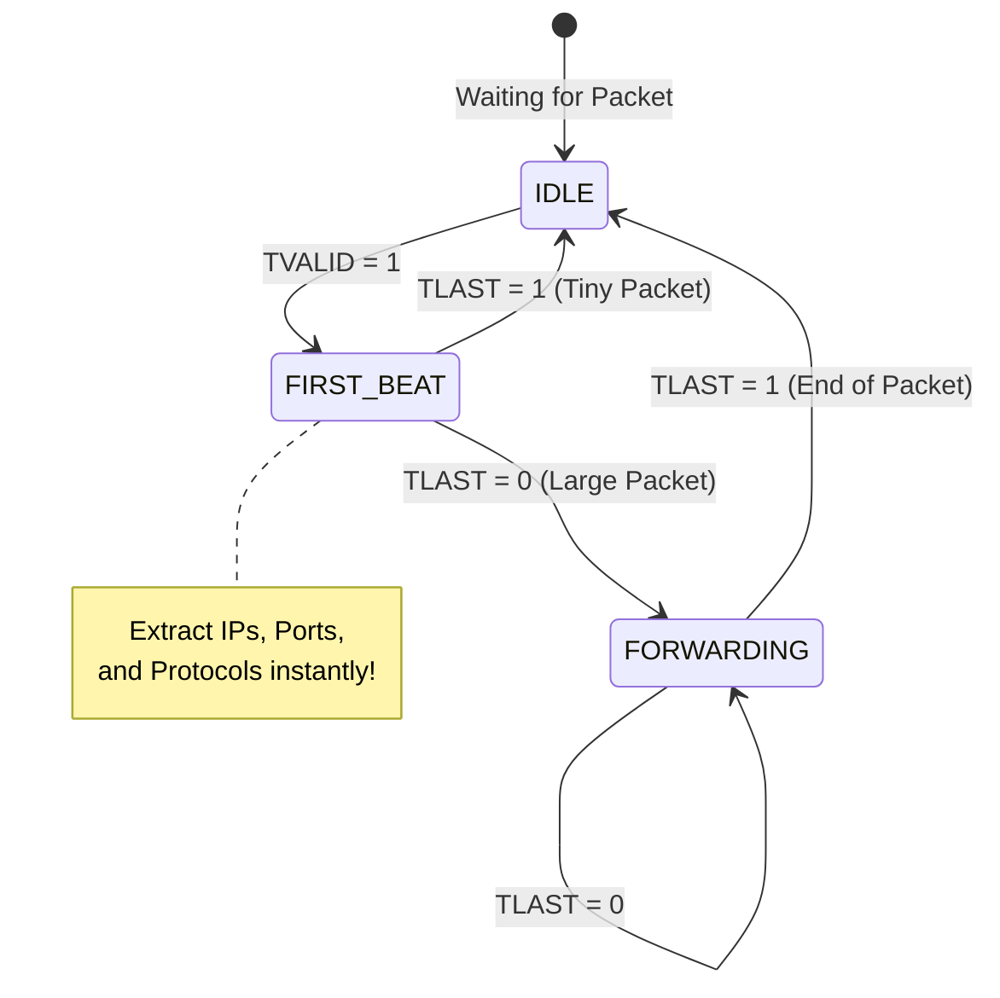

# 🚀 Chunk 2: The Fast Path — Packet Parsing

> [!NOTE]
> **What is the "Fast Path"?**
> In SmartNIC architecture, the "Fast Path" refers to the hardware Verilog pipeline. It handles the routine, repetitive task of parsing and routing 99% of network traffic. Because it is built entirely out of logic gates, it operates with zero software overhead, achieving exactly 100 Gigabits per second.

---

## 1. The Line-Rate Parsing Challenge ⏱️

Software running on a CPU parses network packets by reading them byte-by-byte into a memory struct. This takes hundreds of clock cycles per packet.

In high-speed 100 Gbps networking, packets arrive relentlessly. To keep up, our hardware must process them at **Line-Rate**.

### The 512-bit Advantage
Because our SmartNIC uses a massive **512-bit wide AXI-Stream data bus**, an incredible amount of data arrives on the very first clock cycle of a new packet. 

512 bits is equal to **64 Bytes**. Let's look at the size of standard network headers:
* **Ethernet II Header:** 14 Bytes
* **IPv4 Header:** 20 Bytes
* **UDP Header:** 8 Bytes
* **Total Network Header Size:** 42 Bytes

> [!TIP]
> **The Hardware Trick:**
> Because the entire 42-byte header is smaller than our 64-byte data bus, the **entire network header arrives simultaneously on the very first clock cycle!** We don't need a complex state machine to read the packet over multiple cycles. We can extract every single field instantly using combinatorial logic.

---

## 2. The Packet Parser State Machine 🧠

Our `packet_parser.v` module uses a very simple, highly optimized 3-state Finite State Machine (FSM) to handle packets of any size (even giant 9000-byte Jumbo Frames).

### How the states work:
1. **`IDLE`**: The parser does nothing until the 100G MAC asserts `TVALID` indicating a new packet has arrived.
2. **`FIRST_BEAT`**: The magical state! The parser physically wires the correct bits of the 512-bit bus directly to internal registers. For example, it knows that the Source IP address is always located exactly at bits `[239:208]`. It strips this data and packs it into a sideband signal called `TUSER`.
3. **`FORWARDING`**: If the packet contains a payload (like a video file), the parser stops looking at the data. It simply passes the payload through to the next module while keeping the `TUSER` metadata securely attached alongside it.

---

## 3. The `TUSER` Metadata Bus 🚌

Instead of forcing every downstream module (like the Classifier or Queue Manager) to re-read the raw binary data to figure out where the packet goes, the Parser creates a custom **Metadata Bus**.

This is passed over the AXI-Stream `TUSER` signal. It acts like a "shipping label" physically attached to the packet as it moves through the pipeline.

| TUSER Bits | Field Extracted | Purpose |
| :--- | :--- | :--- |
| `[1]` | `is_ipv4` | Tells downstream modules if this is a valid IP packet. |
| `[7:4]` | `slice_id` | Blank for now. The Classifier will fill this in next! |
| `[79:48]` | `dst_ip` | The Destination IP Address. |
| `[111:80]` | `src_ip` | The Source IP Address. |

> [!IMPORTANT]
> **Next Up: The Flow Classifier!**
> Now that the Parser has slapped a clean `TUSER` shipping label onto the packet, we will send it to the Flow Classifier. The Classifier will read that label and use a hardware TCAM to assign the packet to a specific 5G Network Slice.
