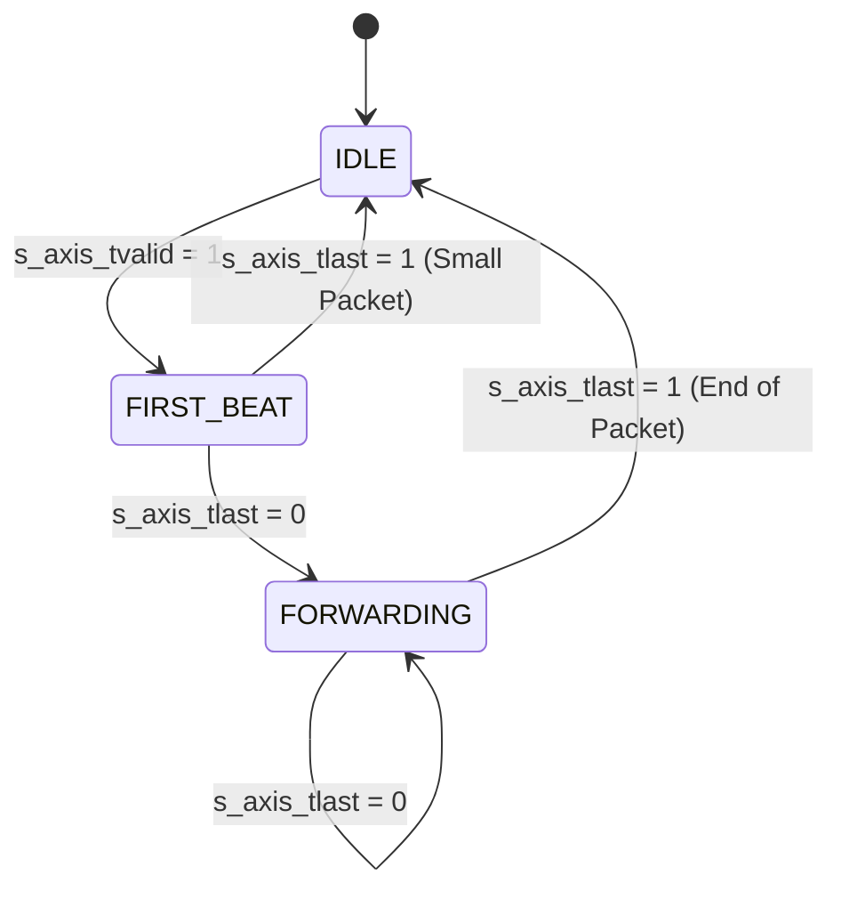

# 3. Packet Parser Deep-Dive

## Theoretical Background
In standard gigabit networking, packet parsers are often designed as state machines that slowly consume bytes over many clock cycles to build a header struct. 

However, in **100 Gbps architectures**, time is a luxury we don't have. Because our AXI-Stream data bus is 512 bits (64 bytes) wide, we have a unique advantage: **the entire network header fits into the very first beat of the packet.**

- Ethernet Header: 14 bytes
- IPv4 Header: 20 bytes
- UDP Header: 8 bytes
- **Total:** 42 bytes (easily fits in 64 bytes)

## RTL Architecture

The `packet_parser.v` module leverages a 3-state Finite State Machine (FSM) to handle packets of any length.



### Stage 1: The `FIRST_BEAT` State
When the first beat of a new packet arrives (`IDLE` → `FIRST_BEAT`), the parser combinatorially slices the 512-bit `TDATA` bus using predefined bit-offsets from `smartnic_pkg.vh`.

```verilog
// Example of how the parser extracts the Source IP
assign src_ip = s_axis_tdata[239:208];
```

The parser populates an internal register `parsed_tuser` with these extracted fields.

### Stage 2: The `FORWARDING` State
If the packet is larger than 64 bytes, `TLAST` will be `0` on the first beat. The FSM transitions to `FORWARDING`. In this state, it stops looking at the data bus (since headers are already passed) and simply passes `TDATA` through while holding the `parsed_tuser` constant on the output `m_axis_tuser` bus.

When `TLAST` is finally asserted (`1`), the FSM returns to `IDLE`, ready for the next packet.

## Backpressure Handling
The parser strictly adheres to AXI-Stream backpressure. If the downstream module (the Flow Classifier) asserts `TREADY = 0`, the parser pauses its FSM and holds its output signals stable until the downstream module is ready again.
