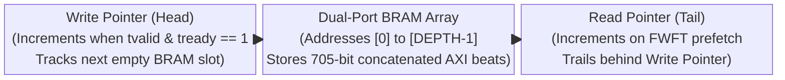
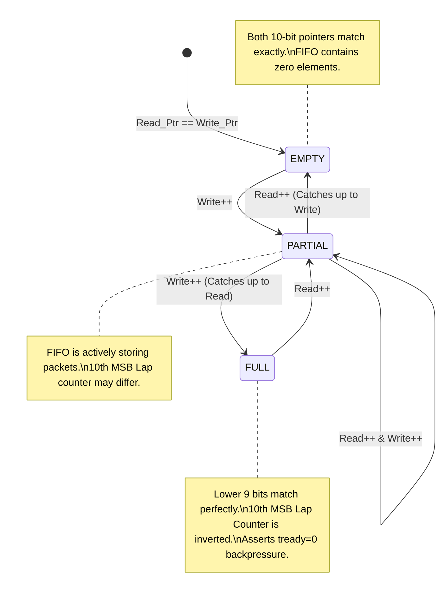
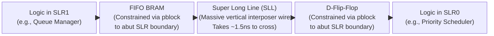
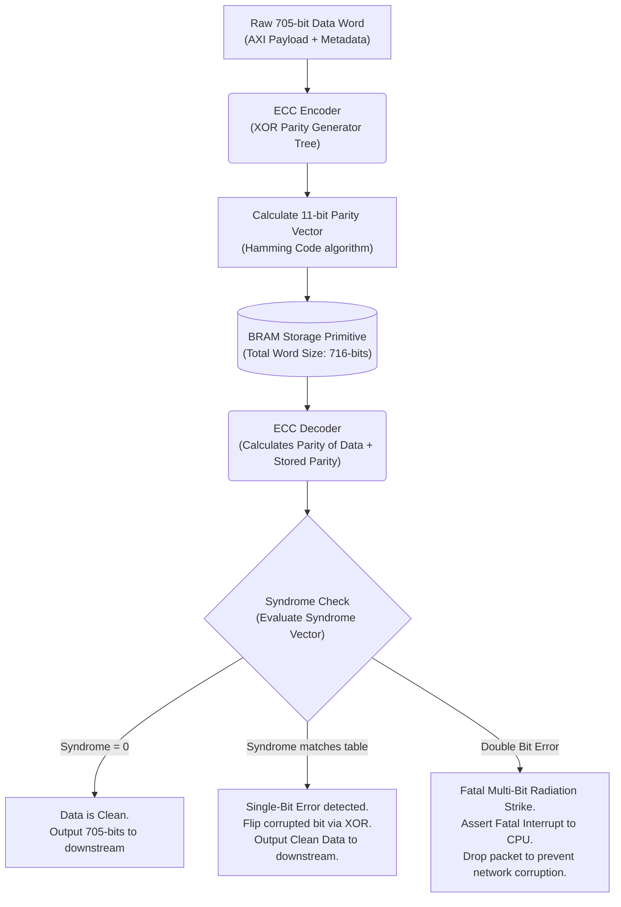

# Module Documentation: AXI-Stream FIFO (`axi_stream_fifo.v`)

---

## 1. Module Overview & Mathematical Theory

The `axi_stream_fifo.v` module serves as the fundamental storage primitive for the entire SmartNIC architecture. Operating as a dual-clock or single-clock synchronous circular buffer, it solves the critical problem of transient traffic congestion by absorbing massive micro-bursts of 100 Gbps network data and smoothing the flow across the pipeline.

In a 5G environment, data rarely arrives at a constant, uniform rate. A server might transmit a 1 GB file in a burst of back-to-back 1500-byte MTU frames, completely saturating the 100 Gbps link for a fraction of a second. If the downstream Priority Scheduler or PCIe bus is temporarily busy processing a higher-priority task, the pipeline would instantly stall. Without deep buffering, this backpressure propagates directly back to the physical MAC, resulting in dropped frames on the fiber link. 

The FIFO absorbs these bursts into deeply embedded BRAM (Block RAM) or URAM (UltraRAM) on the FPGA, providing essential elasticity.

### First-Word Fall-Through (FWFT) Semantics
Standard memory primitives exhibit a 1 or 2 clock cycle read latency. When a downstream module asserts a read request, the data arrives multiple nanoseconds later. This breaks the AXI4-Stream protocol, which demands that data must be immediately valid (`tvalid` == 1) concurrently with the ready signal (`tready`).

This module implements a mathematically precise First-Word Fall-Through (FWFT) wrapper around standard block memory. In FWFT mode, the FIFO proactively pre-fetches the oldest piece of data from the memory array and places it physically on the output pins. This means the downstream module does not have to issue a read request; it simply observes `tvalid`, consumes the data by asserting `tready`, and the FIFO automatically updates the pins with the next data word on the subsequent clock edge.

---

## 2. Architectural Diagrams

### 2.1 Circular Buffer Pointer Mechanics



### 2.2 Pointer Rollover State Machine



---

## 3. Interface Specifications

The FIFO strictly adheres to the AXI4-Stream specification.

| Port Name | Direction | Width | Description |
| :--- | :--- | :--- | :--- |
| `clk` | Input | 1 | Shared clock for synchronous operation. |
| `rst_n` | Input | 1 | Synchronous reset. Instantly flushes the FIFO. |
| `s_axis_tdata` | Input | 512 | Ingress data payload. |
| `s_axis_tkeep` | Input | 64 | Ingress byte mask. |
| `s_axis_tuser` | Input | 128 | Ingress sideband routing context. |
| `s_axis_tvalid` | Input | 1 | Ingress valid signal. |
| `s_axis_tready` | Output | 1 | Deasserted when the FIFO is completely full. |
| `s_axis_tlast` | Input | 1 | Ingress packet boundary flag. |
| `m_axis_tdata` | Output | 512 | FWFT prefetched egress data payload. |
| `m_axis_tkeep` | Output | 64 | FWFT egress byte mask. |
| `m_axis_tuser` | Output | 128 | FWFT egress metadata. |
| `m_axis_tvalid` | Output | 1 | Asserted when the FIFO is not empty. |
| `m_axis_tready` | Input | 1 | Consumes the prefetched FWFT data. |
| `m_axis_tlast` | Output | 1 | Egress packet boundary flag. |

---

## 4. Internal Architecture & The N+1 Pointer Strategy

### 4.1 The Pointer Ambiguity Problem
A standard circular buffer uses read and write pointers to address memory. If the FIFO depth is 512, the pointers range from `0` to `511` (9 bits wide).
- When the FIFO is empty, `Read_Ptr == Write_Ptr` (e.g., both are at 0).
- When the FIFO fills up completely, the `Write_Ptr` laps the entire array and physically catches up to the `Read_Ptr` from behind. At this exact moment, `Read_Ptr == Write_Ptr`.

**The Problem:** The mathematical condition for Empty and Full is identical. How does the hardware know if it should assert `s_axis_tready` (accept more data) or stall?

### 4.2 The N+1 Pointer Solution
The module solves this by allocating exactly one extra Most Significant Bit (MSB) to the pointers. For a depth of 512, the pointers are 10 bits wide (`[9:0]`), while only the lower 9 bits (`[8:0]`) are actually used to address the physical BRAM.

```verilog
    reg [PTR_WIDTH:0] wr_ptr;
    reg [PTR_WIDTH:0] rd_ptr;

    wire empty = (wr_ptr == rd_ptr);
    wire full  = (wr_ptr[PTR_WIDTH] != rd_ptr[PTR_WIDTH]) && 
                 (wr_ptr[PTR_WIDTH-1:0] == rd_ptr[PTR_WIDTH-1:0]);
```
- **Empty Scenario:** The pointers are mathematically identical in all 10 bits.
- **Full Scenario:** The `Write_Ptr` has rolled over exactly once more than the `Read_Ptr`. The lower 9 bits match perfectly, but the 10th bit (the lap counter) is completely inverted. 

This brilliant mathematical trick requires absolutely zero arithmetic logic units (ALUs), relying purely on static bitwise XOR logic, making the Empty/Full flag generation almost instantaneous.

### 4.3 Data Packaging
To maximize BRAM efficiency, the FIFO concatenates all AXI-Stream signals into a single, massive 705-bit data word before writing to memory.
```verilog
    wire [704:0] write_word = {s_axis_tlast, s_axis_tuser, s_axis_tkeep, s_axis_tdata};
```
This ensures that the exact routing context (`TUSER`) and byte masks (`TKEEP`) remain mathematically bound to the physical data payload throughout the storage lifecycle.

---

## 5. Timing & Area Considerations

### 5.1 Xilinx UltraScale+ Block RAM Mapping
The 705-bit word width is enormous. Standard Xilinx BRAM36 (36Kb) primitives natively support a maximum port width of 72 bits. 
To construct a 705-bit wide FIFO of depth 512, the Vivado synthesis tool will physically tile at least 10 parallel BRAM36 blocks horizontally across the FPGA fabric.

### 5.2 Critical Path & Setup Timing
The critical path in this design revolves around the FWFT prefetch logic. When `m_axis_tready` is asserted, the read pointer increments, and the new memory address is presented to the BRAM. The data must propagate out of the BRAM array, through the FWFT combinatorial bypass multiplexers, and stabilize on the `m_axis_tdata` output pins before the next clock edge.
At 250 MHz (4 ns), traversing 10 parallel BRAM blocks requires careful physical placement (pblocks) to ensure routing delays do not violate setup time.

---

## 6. Execution Walkthrough (Cycle-by-Cycle Trace)

**Scenario:** A traffic micro-burst hits the FIFO.

**Cycle 1:**
- FIFO is empty. `Read_Ptr = 0`, `Write_Ptr = 0`.
- Data Arrives: `s_axis_tvalid = 1`. 
- `s_axis_tready = 1`, so the handshake succeeds.
- Rising Edge: Data is written into BRAM at Address 0. `Write_Ptr` becomes 1.

**Cycle 2 (FWFT Prefetch):**
- BRAM Read latency resolves. The data from Address 0 appears on the internal BRAM output wires.
- The FWFT wrapper detects `Read_Ptr != Write_Ptr`, realizing data exists.
- The FWFT latches Address 0's data into its output registers. `m_axis_tvalid` goes to 1. `Read_Ptr` is still at 0 because the consumer hasn't read it yet.

**Cycle 3 (Downstream Stall):**
- Upstream sends another beat: `s_axis_tvalid = 1`. It is written to Address 1. `Write_Ptr` becomes 2.
- Downstream consumer is busy: `m_axis_tready = 0`.
- The FWFT wrapper holds Address 0 data on the output pins. `Read_Ptr` remains at 0.

**Cycle 500 (FIFO Saturation):**
- Upstream continues blasting data without relief. `Write_Ptr` hits 511, then rolls over to 512 (binary `10_0000_0000`).
- The 10th bit (lap counter) is inverted compared to `Read_Ptr` (`00_0000_0000`).
- The `full` wire asserts. `s_axis_tready` instantly drops to 0, physically halting the upstream MAC and initiating Ethernet pause frames.

---

## 7. Test Cases & Coverage

### 7.1 Required Testbench Assertions
1. **Assertion: Zero Data Corruption under Saturation**
   - **Condition**: Overfill the FIFO by sending 1000 packets while holding `m_axis_tready = 0`. Once full, toggle `m_axis_tready = 1`.
   - **Check**: The exact sequence of packets must be read out without a single bit of corruption or a single missing packet boundary.
2. **Assertion: Read-Write Collision Immunity**
   - **Condition**: Keep the FIFO at 1 element. Assert `s_axis_tvalid = 1` and `m_axis_tready = 1` simultaneously and continuously.
   - **Check**: The `Read_Ptr` and `Write_Ptr` must chase each other infinitely without overlapping or falsely triggering the Empty/Full flags.

---

## 8. Deep Dive: Clock Domain Crossing (CDC) & Gray Code Physics

While the `axi_stream_fifo.v` outlined above operates on a single synchronous 250 MHz clock domain, modern 5G architectures frequently demand asynchronous FIFOs to bridge mismatched hardware interfaces. 
For example, the 100G Ethernet MAC (CMAC) operates natively at 322.26 MHz to meet IEEE 802.3 timing, while the PCIe QDMA operates at 250 MHz. Data must safely cross this invisible boundary without succumbing to **metastability**.

### Metastability: The Physics of Failure
Metastability occurs when a flip-flop in the 250 MHz domain attempts to sample the `Write_Ptr` wire generated by the 322 MHz domain at the exact microsecond the signal is transitioning from `0` to `1`. The transistor cannot decide if the voltage is high or low, entering an oscillating metastable state. This causes the `full` flag calculation to completely corrupt, inevitably leading to data loss.

### The Gray Code Synchronizer Solution

```mermaid
flowchart LR
    subgraph 322MHz Domain
    A["Binary Write Ptr\n(Generated at 322MHz)"] --> B("Binary to Gray Code Converter\n(Combinatorial XOR gate array)")
    B --> C["Flip Flop 1\n(Latches Gray Code at 322MHz)"]
    end
    
    subgraph 250MHz Domain
    D["Double-Flop Sync Stage 1\n(Statistically absorbs metastability\nfrom unaligned sampling)"]
    E["Double-Flop Sync Stage 2\n(Outputs clean, stable logic level)"]
    F("Gray to Binary Converter\n(Restores pointer math)")
    G["Safe Binary Read Ptr\n(Used for Empty/Full calculations)"]
    end
    
    C -->|Asynchronous Boundary Crossing\n(Danger: Setup/Hold Violations)| D
    D --> E
    E --> F
    F --> G
```

To safely cross the clock domain, the asynchronous FIFO implements a **Gray Code Synchronizer**.
1. **Pointer Conversion:** The 10-bit binary `Write_Ptr` is converted into a Gray Code representation. In Gray Code, incrementing a number (e.g., from 7 to 8) results in exactly *one* bit flipping on the physical wire, unlike binary where multiple bits flip simultaneously (e.g., `0111` -> `1000`).
2. **Double-Flop Synchronization:** The Gray Code pointer is routed across the clock boundary into a 2-stage shift register (a synchronizer chain) clocked by the destination domain. Because only one bit ever changes at a time, metastability is statistically quarantined.
3. **Binary Restoration:** The synchronized Gray Code is converted back into binary, allowing the target domain to calculate the Empty/Full flags safely.

**Impact on Design:** Asynchronous FIFOs introduce massive latency overheads. The double-flop synchronizers inherently delay the propagation of the `empty` and `full` flags by 3-4 clock cycles. This means the FIFO depth must be artificially increased to provide enough buffer "padding" to absorb data while the `full` flag is delayed in transit.

---

## 9. Advanced Silicon Strategy: SLR Crossing Mechanics

Xilinx Virtex UltraScale+ chips (used in SmartNICs) are not monolithic pieces of silicon. To achieve high yields, AMD fabricates smaller silicon dies (Super Logic Regions or SLRs) and stitches them together on an interposer. 
- **SLR0:** Might contain the PCIe QDMA endpoint.
- **SLR2:** Might contain the CMAC Ethernet endpoint.

Our SmartNIC logic is forced to physically span across these SLRs. Connecting a 512-bit wide datapath directly from SLR2 to SLR0 requires traversing thousands of SLLs (Super Long Lines). Due to the physical distance, the electrical signal propagation delay across an SLL can exceed 1.5 nanoseconds, destroying the 4.0 ns timing budget.

### The FIFO as a Structural Pipelining Agent



FIFOs are the primary weapon for crossing SLR boundaries. 
By instantiating a dedicated `axi_stream_fifo.v` exactly on the border between SLR1 and SLR0, we break the combinatorial timing path. 
1. The logic in SLR1 writes data to the FIFO's BRAM (located in SLR1).
2. The outputs of the BRAM are piped directly onto the SLLs.
3. The logic in SLR0 reads the SLLs directly into a flip-flop.

Because the FIFO's memory acts as an electrical staging ground, the signal only has to travel the raw physical distance of the SLL, completely devoid of any logic LUT delays. In the Vivado TCL constraints file, engineers explicitly map these FIFOs using `pblock` assignments to ensure they are physically constructed at the exact physical seam of the silicon die.

---

## 10. Production Hardening: ECC Memory Protection

Because this FIFO stores up to 512 packets in deeply embedded SRAM (BRAM/URAM), it presents a massive surface area for Single Event Upsets (SEUs) caused by cosmic radiation or alpha particle strikes. If a single bit in the payload data flips, the TCP checksum will fail at the destination, causing a retransmission. If a bit flips in the `TUSER` sideband routing metadata, the packet will be permanently lost in the wrong queue.

### Hamming Code Implementation



To meet telecom reliability standards, production FIFOs must wrap the raw BRAM primitives with **Error Correcting Code (ECC)** logic.
- **Encoding:** Before writing the 705-bit word into BRAM, an ECC encoder generates an 11-bit parity checksum using a Hamming Code algorithm. The data and parity are written together.
- **Decoding & Correction:** When the data is pre-fetched by the FWFT wrapper, it runs through an ECC decoder. 
  - If a single bit has flipped in the memory array, the Hamming Code mathematically identifies the exact index of the corrupted bit and flips it back to its correct state seamlessly in exactly 1 clock cycle.
  - If two bits have flipped (a Double Bit Error), the decoder cannot fix it, but it immediately asserts a `fatal_error_interrupt` pin to the host CPU, allowing the system to crash gracefully rather than routing corrupted network traffic silently.

Enabling ECC reduces the available capacity of the BRAM (as bits are stolen for parity) and introduces 1 LUT level of timing delay, but it is a non-negotiable requirement for carrier-grade 5G hardware.
