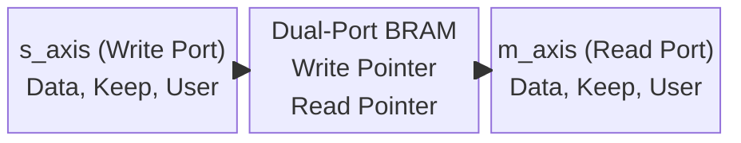
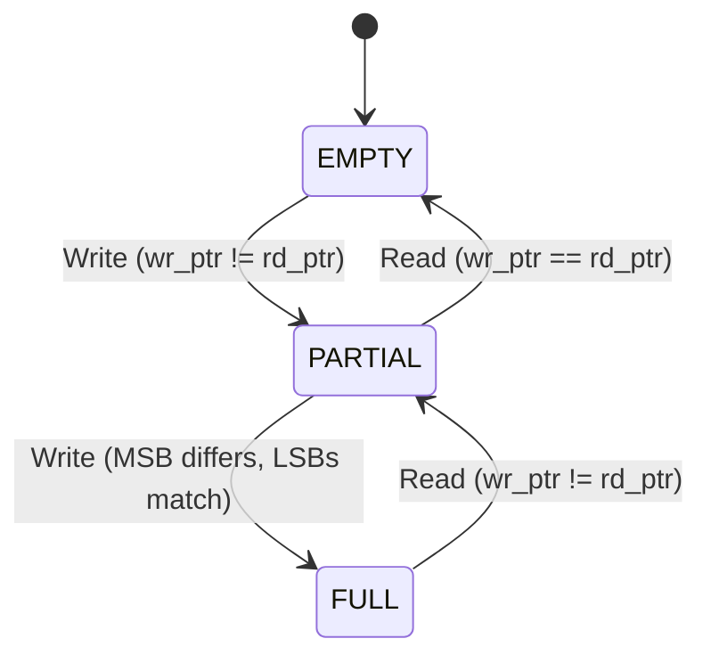

# Module Documentation: AXI-Stream FIFO (`axi_stream_fifo.v`)

---

## 1. Module Overview & Mathematical Theory

The `axi_stream_fifo.v` module implements a high-performance, synchronous First-In-First-Out (FIFO) buffer. In the context of the SmartNIC Datapath, FIFOs are fundamentally required to absorb instantaneous traffic bursts, handle clock jitter, and facilitate smooth handshaking between independent pipeline stages without dropping 100 Gbps packets.

### The Problem with Standard Memory
A standard Random Access Memory (RAM) block takes an address and returns data. However, network packet streams do not have addresses—they are a continuous river of sequential data. A module downstream (like the Priority Scheduler) simply wants to read the "oldest" piece of data available, without needing to know where it is physically stored in the silicon.

### The Circular Buffer Solution
This module solves the streaming problem by wrapping a hardware Dual-Port RAM in a "Circular Buffer" architecture. It maintains two internal registers: a Write Pointer and a Read Pointer. 
- When the upstream module asserts `s_axis_tvalid`, the data is written to the RAM at the index of the Write Pointer, and the Write Pointer increments.
- When the downstream module asserts `m_axis_tready`, data is read from the RAM at the index of the Read Pointer, and the Read Pointer increments.
- When either pointer reaches the maximum depth of the memory, it instantly rolls over to index `0`, creating an infinite loop (a circle).

### First-Word Fall-Through (FWFT)
Standard FIFOs incur a 1-clock-cycle read latency. You must request a read, and the data appears on the next clock edge. This complicates AXI-Stream handshaking. 
This module implements First-Word Fall-Through (FWFT) logic. The oldest data is continuously exposed on the `m_axis_tdata` output pins combinatorially. The downstream module does not need to "request" data; it simply asserts `tready` to consume the data already sitting on the pins, achieving zero-latency reads.

---

## 2. Architectural Diagrams

### 2.1 Block Architecture



### 2.2 The N+1 Pointer State Machine



---

## 3. Interface Specifications

| Port Name | Direction | Width | Description |
| :--- | :--- | :--- | :--- |
| `clk` | Input | 1 | 250 MHz core clock. |
| `rst_n` | Input | 1 | Active-low synchronous reset. |
| **Write Interface (s_axis)** | | | |
| `s_axis_tdata` | Input | 512 | Data to be pushed into the FIFO. |
| `s_axis_tkeep` | Input | 64 | Byte mask for the data. |
| `s_axis_tuser` | Input | 128 | Sideband metadata. |
| `s_axis_tvalid` | Input | 1 | Write Request. Data is pushed if `tready` is high. |
| `s_axis_tready` | Output | 1 | Write Acknowledge. Deasserts when FIFO is FULL. |
| `s_axis_tlast` | Input | 1 | Packet boundary marker. |
| **Read Interface (m_axis)** | | | |
| `m_axis_tdata` | Output | 512 | Oldest data in the FIFO (FWFT). |
| `m_axis_tkeep` | Output | 64 | Oldest byte mask. |
| `m_axis_tuser` | Output | 128 | Oldest metadata. |
| `m_axis_tvalid` | Output | 1 | Deasserts when FIFO is EMPTY. |
| `m_axis_tready` | Input | 1 | Read Request. Data is consumed and popped. |
| `m_axis_tlast` | Output | 1 | Oldest packet boundary marker. |

---

## 4. Internal Architecture & N+1 Pointer Math

### 4.1 Memory Instantiation
The core memory is a wide 2D register array. Because we must store the data, keep, user, and last signals perfectly synchronized, we concatenate them into a single massively wide memory word.
```verilog
    localparam WORD_WIDTH = `AXIS_DATA_WIDTH + `AXIS_KEEP_WIDTH + `AXIS_USER_WIDTH + 1;
    reg [WORD_WIDTH-1:0] mem [0:DEPTH-1];
```
For a 512-bit datapath, `WORD_WIDTH` evaluates to `705` bits.

### 4.2 The N+1 Pointer Strategy
A circular buffer has a catastrophic mathematical ambiguity. 
If the memory depth is 16, the pointers range from `0` to `15` (requiring 4 bits).
- **Empty Condition**: If we initialize both `wr_ptr` and `rd_ptr` to `0`, the buffer is EMPTY. Thus, `Empty = (wr_ptr == rd_ptr)`.
- **Full Condition**: If we write 16 times without reading, the `wr_ptr` loops around the circle and arrives back at `0`. The `rd_ptr` is also `0`. Thus, `Full = (wr_ptr == rd_ptr)`.

Because the conditions are identical, the hardware cannot determine if it is completely empty or completely full!

To solve this, the module implements **N+1 Pointer Math**. 
If depth is 16, the pointers are defined as 5 bits wide (N+1). The memory is addressed using only the lower 4 bits `[3:0]`. The 5th bit (the MSB) acts as a loop counter.
```verilog
    wire empty = (wr_ptr == rd_ptr);
    wire full  = (wr_ptr[PTR_WIDTH] != rd_ptr[PTR_WIDTH]) && 
                 (wr_ptr[PTR_WIDTH-1:0] == rd_ptr[PTR_WIDTH-1:0]);
```
- **Empty**: Both pointers are exactly identical (e.g., `0_0000 == 0_0000`).
- **Full**: The lower 4 bits are identical, but the MSB is different (e.g., `1_0000 != 0_0000`), proving the write pointer has lapped the read pointer exactly one time.

### 4.3 FWFT Read Logic
The FWFT architecture maps the read pointer directly to the combinatorial output array.
```verilog
    assign m_axis_tdata  = mem[rd_ptr[PTR_WIDTH-1:0]][511:0];
    assign m_axis_tkeep  = mem[rd_ptr[PTR_WIDTH-1:0]][575:512];
    // ...
```
This is a massive parallel multiplexer. The `rd_ptr` acts as the select line, instantaneously routing the correct 705-bit word to the output pins.

---

## 5. Timing & Area Considerations

### 5.1 RAM Mapping (LUTRAM vs. BRAM)
If the `DEPTH` parameter is set low (e.g., `16` or `32`), the FPGA synthesis tool will map the `mem` array into Distributed RAM (LUTRAM). This uses thousands of standard LUTs. This is ideal for tiny pipeline buffers.
If the `DEPTH` parameter is set high (e.g., `512` or `1024`), the synthesizer will map the `mem` array into hard Block RAM (BRAM) or UltraRAM (URAM) tiles.

### 5.2 Critical Path Analysis
The FWFT architecture introduces a severe combinatorial path.
1. `rd_ptr` updates on the clock edge.
2. `rd_ptr` routes into the address port of the RAM.
3. The RAM evaluates the address and outputs the 705-bit word.
4. The word propagates through the output pins.
5. The downstream module evaluates the word and generates a `m_axis_tready` response.
6. The `m_axis_tready` response propagates *back* to the FIFO to increment the `rd_ptr` for the *next* clock edge.

This tight combinatorial loop between the RAM output, the downstream logic, and the `rd_ptr` incrementer is the most common cause of timing failure in complex SoC designs. If timing fails at 250 MHz, the module must be wrapped in an `axi_stream_register_slice.v` to break the combinatorial loop.

---

## 6. Execution Walkthrough (Cycle-by-Cycle Trace)

**Initial State:**
- `DEPTH` = 4. Pointers are 3-bits wide (N+1).
- `wr_ptr` = `3'b000`, `rd_ptr` = `3'b000`.
- `empty` = 1, `full` = 0.
- `m_axis_tvalid` = 0.

**Clock Cycle 1 (Write A):**
- Upstream asserts `s_axis_tvalid = 1` with Data A.
- `s_axis_tready = 1` (since not full).
- Rising Edge: Data A written to `mem[0]`. `wr_ptr` becomes `3'b001`.

**Clock Cycle 2 (FWFT Exposure):**
- `wr_ptr` (`001`) != `rd_ptr` (`000`), so `empty = 0`.
- `m_axis_tvalid` goes to `1`.
- Data A is immediately visible on `m_axis_tdata` because `rd_ptr[1:0] == 00`.
- Downstream module is busy, `m_axis_tready = 0`. No read occurs.
- Upstream asserts `s_axis_tvalid = 1` with Data B.
- Rising Edge: Data B written to `mem[1]`. `wr_ptr` becomes `3'b010`.

**Clock Cycle 3 (Read & Write Simultaneously):**
- Downstream asserts `m_axis_tready = 1` to consume Data A.
- Upstream asserts `s_axis_tvalid = 1` with Data C.
- Rising Edge: Data C written to `mem[2]`. `wr_ptr` becomes `3'b011`.
- Rising Edge: Data A popped. `rd_ptr` becomes `3'b001`.

**Clock Cycle 4 (Rollover):**
- `m_axis_tdata` instantly exposes Data B because `rd_ptr` is now `01`.
- Upstream asserts `s_axis_tvalid = 1` with Data D.
- Rising Edge: Data D written to `mem[3]`. `wr_ptr` becomes `3'b100` (The MSB flipped!).

**Clock Cycle 5 (Full Condition):**
- `wr_ptr` = `100`, `rd_ptr` = `001`.
- Upstream asserts `s_axis_tvalid = 1` with Data E.
- Rising Edge: Data E written to `mem[0]`. `wr_ptr` becomes `3'b101`.
- Notice that `wr_ptr[2] != rd_ptr[2]` (`1 != 0`), but the lower bits are identical (`01 == 01`).
- The `full` signal goes to `1`. `s_axis_tready` drops to `0`. Upstream is backpressured and Data F is blocked!

---

## 7. Test Cases & Coverage

### 7.1 Required Testbench Assertions
1. **Assertion: Simultaneous Read/Write**
   - **Condition**: FIFO is partially full. Assert `s_axis_tvalid` and `m_axis_tready` simultaneously.
   - **Check**: Both `wr_ptr` and `rd_ptr` must increment on the same clock edge. The total fill level of the FIFO must remain exactly constant.
2. **Assertion: Full Protection**
   - **Condition**: Overfill the FIFO by asserting `s_axis_tvalid` while keeping `m_axis_tready` low.
   - **Check**: `s_axis_tready` must cleanly drop to 0 the moment `wr_ptr` laps `rd_ptr`. If upstream continues asserting data while `tready` is 0, the `wr_ptr` must absolutely not increment, preventing memory corruption (overwriting oldest unread data).
3. **Assertion: FWFT Validity**
   - **Condition**: Write a single packet to an empty FIFO. Keep `m_axis_tready` low.
   - **Check**: `m_axis_tvalid` must go high on cycle 2 and remain high infinitely until `m_axis_tready` is asserted.

### 7.2 Verification Methodology
The testbench uses a dual-agent structure. An AXI Master agent blasts pseudo-random payloads into the `s_axis` port at random intervals. An AXI Slave agent consumes data from the `m_axis` port at random intervals. A Scoreboard tracks every 512-bit payload injected and compares it byte-for-byte against the ejected payloads to ensure the FIFO logic never drops, duplicates, or corrupts data during pointer rollovers.

---

## 8. Implementation Notes & Design Trade-offs

### Reset Synchronization
The N+1 pointers must be initialized to exactly 0. In an FPGA, registers power up in a known state (usually 0), but applying an active-low asynchronous reset (`rst_n`) guarantees deterministic startup behavior. In this module, the reset is applied synchronously (`if (!rst_n)` inside `always @(posedge clk)`) to prevent metastable state transitions.

### Lack of Asynchronous Clock Domain Crossing (CDC)
This FIFO operates on a single clock domain (`clk`). It is a synchronous FIFO.
If the Queue Manager operated at 250 MHz but the Host Interface operated at 125 MHz, this module would violently fail. A true Asynchronous CDC FIFO requires converting the binary `wr_ptr` and `rd_ptr` into Gray Code, routing them through Dual-Flop Synchronizer chains across the clock boundary, and converting them back to binary to evaluate Full/Empty conditions. For the SmartNIC MVP, all modules operate coherently at 250 MHz, negating the need for CDC latency penalties.
