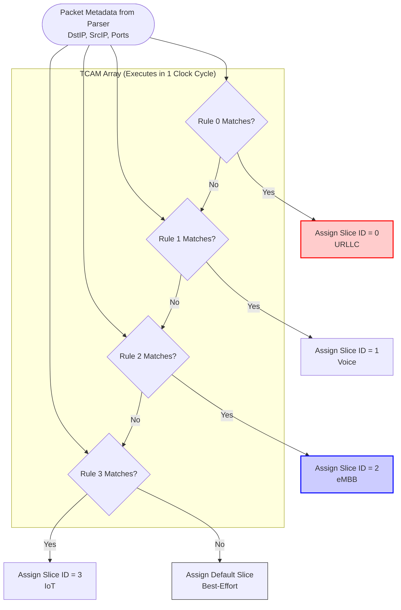

# 🎯 Chunk 2 (Cont.): The Fast Path — Flow Classification

> [!NOTE]
> **The Routing Problem**
> Now that our Packet Parser has extracted the IP addresses and ports, we need to decide *where* this packet belongs. In 5G networks, this means assigning the packet to a specific **Network Slice** (like a high-priority URLLC queue or a low-priority eMBB queue).

---

## 1. Software Routing vs. Hardware Routing 🛣️

If you were writing a software router in Python or C, you would likely use an `if/else` statement or a Tree data structure (like Longest Prefix Match) to figure out where a packet goes. Software evaluates rules **sequentially** (one by one).

If you have 1,000 routing rules, the CPU has to check Rule 1, then Rule 2, then Rule 3... This is far too slow for 100 Gbps networking.

### The Hardware Solution: TCAMs
In hardware, we use a **Ternary Content-Addressable Memory (TCAM)**. 
A TCAM is pure magic: it evaluates the packet against **all 1,000 rules simultaneously** in a single clock cycle!

It is called "Ternary" because each bit in the rule can have three states:
* `0` (Must be exactly 0)
* `1` (Must be exactly 1)
* `X` (Don't Care — matches anything!)

By using the `X` (Don't Care) state, we can easily create Subnet Masks. For example, if we only care about the IP subnet `192.168.1.xxx`, we set the last 8 bits of the rule to `X`.

---

## 2. Our Hardware TCAM Architecture ⚙️

Our `flow_classifier.v` module implements a parallel TCAM-style lookup directly in Verilog logic gates.

### The Priority Encoder
Because TCAMs use "Don't Care" bits, it is very possible that a single packet matches **multiple rules at the same time**.

To fix this, the classifier passes the match results through a **Priority Encoder**. The rules are strictly ranked. Rule 0 is the absolute highest priority. The hardware scans from top to bottom and outputs the Slice ID of the *very first* rule that matches, ignoring any lower-priority matches.

> [!TIP]
> **Dynamic Routing (Tier 2 Scope)**
> Right now in our MVP, the routing rules are "hardcoded" directly into the Verilog. In Tier 2, we will expose the TCAM arrays as AXI4-Lite registers. This will allow the RISC-V Control Plane (the CPU) to instantly update, add, or delete 5G slicing rules dynamically without ever rebooting the FPGA!

---

> [!IMPORTANT]
> **What happens to the packet now?**
> The Classifier has successfully stamped the correct `Slice ID` into the packet's `TUSER` metadata. The packet is now forwarded to the **Queue Manager**, where it will be stored in a physical BRAM buffer awaiting transmission. We will explore this in **Chunk 3**!
