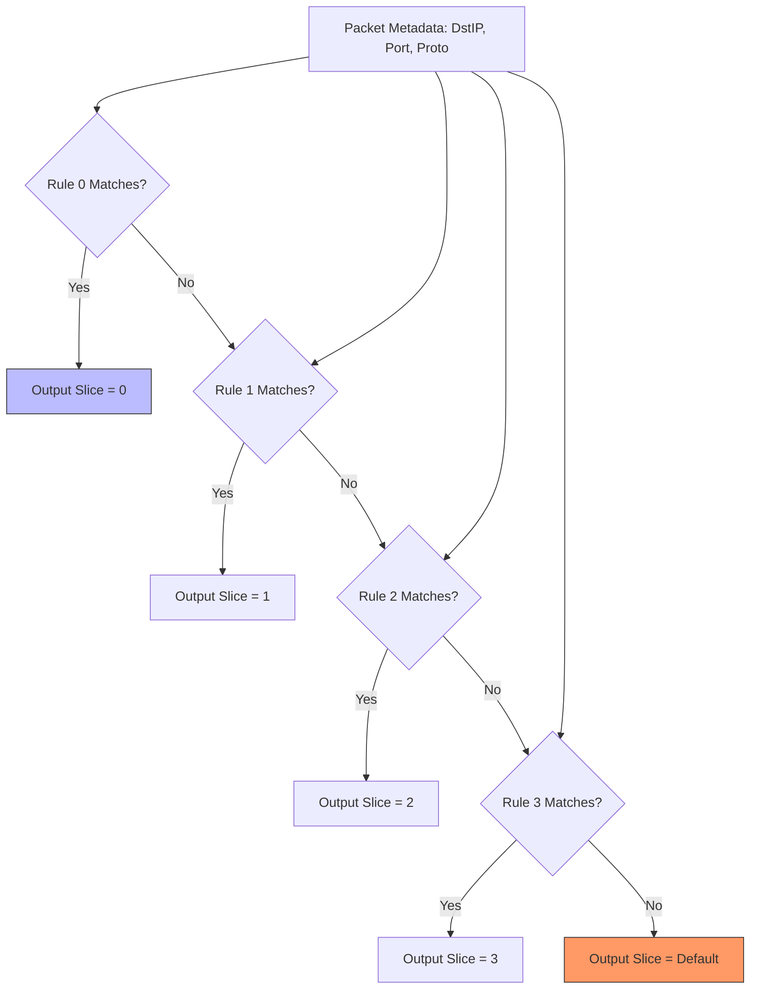

# 4. Flow Classifier Deep-Dive

## Theoretical Background

Once the Packet Parser extracts the metadata (IPs, Ports, Protocols), the SmartNIC needs to decide *what to do* with the packet. In 5G architectures, this means assigning the packet to a specific **Network Slice**.

Software routers use tree-based algorithms (like LPM - Longest Prefix Match) to route packets. In hardware, this is too slow. Instead, high-speed networking uses **TCAMs** (Ternary Content-Addressable Memory).

A TCAM allows you to search *all rules simultaneously* in a single clock cycle. It is "Ternary" because rule bits can be `0`, `1`, or `X` (Don't Care).

## RTL Architecture

The `flow_classifier.v` module implements a 16-rule TCAM-style lookup in standard Verilog logic.

### Rule Structure

Each rule consists of a Match condition and an Action:
- **Match:** `Dst IP`, `Dst IP Mask`, `Dst Port`, `Dst Port Mask`, `Protocol`, `Protocol Mask`.
- **Action:** `Slice ID` (4-bit queue assignment).

### The Match Logic

The classifier evaluates all 16 rules in parallel. A rule matches if the packet's fields, when bitwise ANDed with the rule's masks, equal the rule's programmed values.

### Priority Encoding

Because multiple rules might match a single packet (e.g., a rule for `10.0.1.0/24` and a rule for `Port 80`), the classifier uses a **Priority Encoder**. 
Rule 0 has the absolute highest priority. The hardware scans from Rule 0 down to Rule 15 and outputs the `Slice ID` of the *first* matching rule.

If no rules match, the packet is assigned a `DEFAULT_SLICE_ID` (Queue 0), effectively treating it as best-effort traffic.

### Dynamic Configuration (Tier 2 Scope)

Currently, the rules are statically programmed by the testbench. In Tier 2, the `cfg_*` ports on the flow classifier will be mapped to AXI4-Lite registers. This allows the RISC-V control plane firmware to add, remove, and modify routing rules dynamically without recompiling the FPGA.
