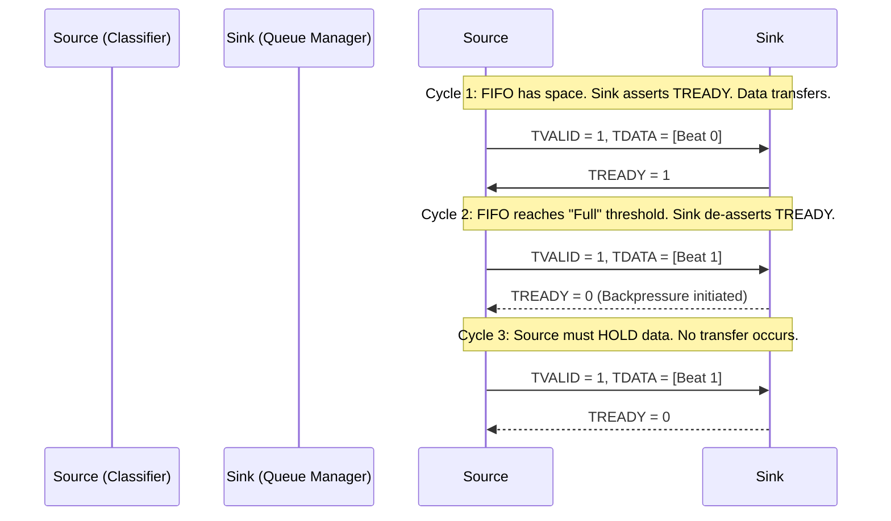

# Chapter 4: Hardware Traffic Queuing and BRAM Management

## 4.1 Introduction to FPGA Queue Management
In high-speed 5G network environments, even when operating at a sustained 100 Gbps line rate, data transmission is rarely perfectly uniform. Network traffic is inherently bursty. Packets may arrive at the SmartNIC faster than the downstream PCIe bus can ingest them into the host server, or conversely, the host server may generate bursts of eMBB traffic faster than the physical Ethernet MAC can transmit them over the fiber.

Furthermore, within the context of 5G Network Slicing, traffic belonging to the URLLC, eMBB, and mMTC slices must be strictly isolated to prevent resource starvation. As established in the *OpenNIC Technical Reference Guide*, our custom Verilog datapath resides within the 250 MHz "User Logic Box." Therefore, we require high-speed, localized hardware buffers capable of temporarily storing 512-bit packets.

This necessity mandates the use of **First In First Out (FIFO)** data structures built directly onto the FPGA silicon using Block RAM (BRAM).

---

## 4.2 Mathematical Foundation of Synchronous FIFOs

As delineated by Penta and Islam in their research *Design and Verification of a Synchronous First In First Out (FIFO)*, a FIFO memory is a critical component in digital systems for temporary data storage and seamless data transfer.

Because our entire SmartNIC datapath (Parser, Classifier, Queues, Scheduler) is driven by the single 250 MHz clock derived from the OpenNIC QDMA subsystem, we implement a **Synchronous FIFO**. In a synchronous FIFO, both the read and write operations are governed by the exact same clock domain, eliminating the complexities and metastability risks associated with Clock Domain Crossing (CDC) present in asynchronous FIFOs.

### 4.2.1 Pointer Mathematics and State Logic
A hardware FIFO operates using two independent pointers that traverse a pre-allocated array of memory addresses (a Circular Buffer):
* **Write Pointer (`wr_ptr`):** Dictates the memory address where the next incoming 512-bit word will be stored. It increments by 1 upon every valid write operation.
* **Read Pointer (`rd_ptr`):** Dictates the memory address from which the next 512-bit word will be retrieved. It increments by 1 upon every valid read operation.

The absolute depth of the FIFO (the maximum number of words it can hold) is defined as `N`, where `N = 2^k` (with `k` representing the address bus width). Because the buffer is circular, the pointers mathematically wrap around to address `0` upon reaching `N - 1`.

The FIFO must continually calculate its state to prevent catastrophic data loss (overwriting unread data or reading invalid data). This is accomplished through pointer arithmetic:

* **FIFO Empty Condition:** The FIFO is completely devoid of data when the read pointer mathematically catches up to the write pointer.
  `Empty = (wr_ptr == rd_ptr)`
* **FIFO Full Condition:** The FIFO is completely saturated when the write pointer mathematical laps the read pointer. To differentiate a "Full" state from an "Empty" state (since both involve the pointers being at the same physical memory address), hardware implementations typically append an extra Most Significant Bit (MSB) to the pointers.
  `Full = (wr_ptr[k] != rd_ptr[k]) AND (wr_ptr[k-1:0] == rd_ptr[k-1:0])`

---

## 4.3 Xilinx LogiCORE IP Integration

While it is entirely possible to write a custom Verilog synchronous FIFO, modern FPGA design strongly favors the utilization of pre-verified, highly optimized Intellectual Property (IP) blocks. For this SmartNIC architecture, we leverage the **Xilinx FIFO Generator v13.2 LogiCORE IP**, as specified in the official Xilinx Product Guide (`pg057`).

### 4.3.1 BRAM vs. Distributed RAM
The Xilinx FIFO Generator allows designers to instantiate FIFOs using either Block RAM (BRAM) or Distributed RAM (LUTRAM). 

Given the extreme demands of our 5G datapath, Distributed RAM is wholly insufficient. A single beat of our AXI4-Stream bus is 512 bits wide. To buffer even a single Jumbo Frame (9000 Bytes), the FIFO must hold at least 141 beats. Constructing such a massive array using logic slices (LUTs) would induce severe routing congestion and exponentially degrade the maximum achievable clock frequency.

Therefore, our architecture explicitly configures the FIFO Generator to utilize **BRAM36E2** primitives. These are dedicated, hardened 36-kilobit memory blocks physically etched into the Alveo FPGA fabric, offering immense density and single-cycle access times.

### 4.3.2 Slice Isolation via Partitioned Queues
To achieve the rigid isolation required for 5G Network Slicing, we do not utilize a single, shared massive memory pool. Such an architecture requires exceptionally complex linked-list logic to track packets, which inevitably introduces multi-cycle latency overhead—a fatal flaw for URLLC slices.

Instead, we instantiate **Independent BRAM FIFOs** for every single Network Slice. 
* **Queue 0 (URLLC):** Dedicated BRAM FIFO.
* **Queue 1 (eMBB):** Dedicated BRAM FIFO.
* **Queue 2 (mMTC):** Dedicated BRAM FIFO.

This partitioned architecture guarantees that if a massive 4K video stream completely saturates the eMBB queue, the URLLC queue remains entirely unaffected, preserving its sub-millisecond latency profile.

---

## 4.4 Hardware Backpressure and AXI-Stream Semantics

In the event of a sustained traffic burst, a BRAM FIFO will eventually reach its maximum capacity. If the SmartNIC continues to ingest data, the `wr_ptr` will lap the `rd_ptr`, overwriting the oldest packets in the queue (tail drop).

To prevent silent data corruption, the SmartNIC must actively signal the upstream network elements (the 100G MAC or the PCIe DMA) to halt transmission. This mechanism is known as **Hardware Backpressure**.

Because our datapath adheres to the AMBA AXI4-Stream protocol, backpressure is managed seamlessly via the `TREADY` / `TVALID` handshake mechanism.

When the Xilinx FIFO Generator's `prog_full` (Programmable Full) flag asserts (e.g., when the FIFO is 95% full), our Queue Manager module immediately drives the upstream AXI-Stream `TREADY` signal to `0`. 

This forces the upstream Flow Classifier to stall. The Classifier, in turn, de-asserts its own `TREADY` to the Packet Parser, propagating the backpressure all the way back to the OpenNIC CMAC subsystem. This cascading stall ensures that not a single bit of 5G payload is dropped within our custom logic block due to internal overflow.

Once the packets are safely secured within these isolated BRAM FIFOs, the final stage of the datapath—the Priority Scheduler—must extract them and enforce hardware rate limits, which will be exhaustively detailed in Chapter 5.
