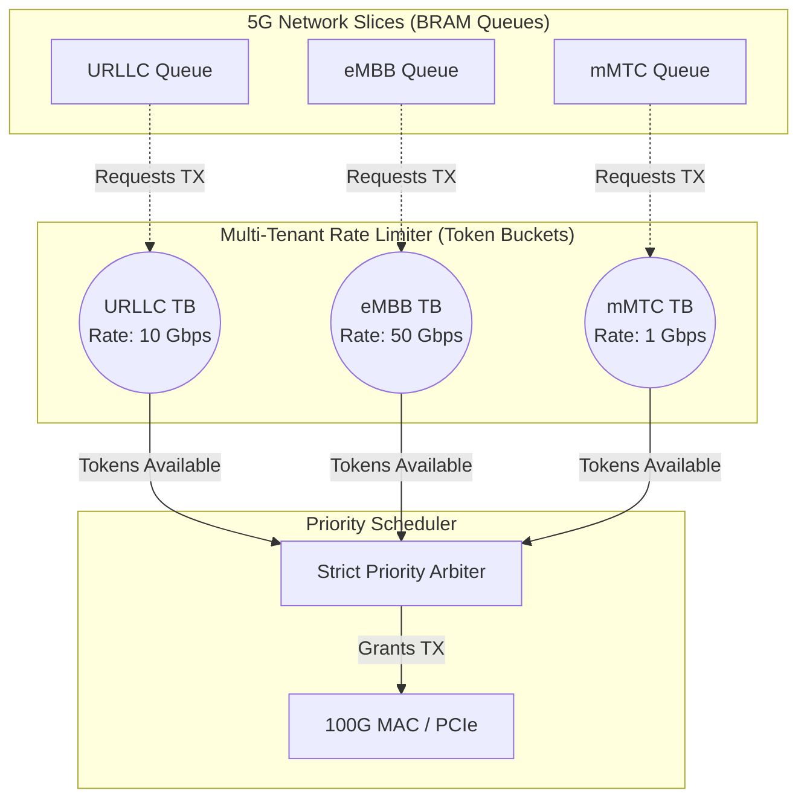

# Chapter 5: Hardware QoS and Multi-Tenant Rate Limiting

## 5.1 The Imperative for Hardware Quality of Service (QoS)
As established in the preceding chapters, the 5G SmartNIC datapath isolates traffic by classifying packets into slice-specific BRAM queues (e.g., URLLC, eMBB, mMTC). However, simply isolating the packets in memory is insufficient. The SmartNIC must ultimately multiplex these isolated queues back onto a single shared transmission medium—either the 100 Gbps fiber optic link (via the CMAC) or the host server memory (via the PCIe QDMA).

The mechanism that determines *which* queue is permitted to transmit its packet at any given clock cycle is the **Priority Scheduler**. This scheduler is the absolute heart of the 5G Hardware QoS paradigm.

---

## 5.2 The Starvation Problem and Scheduling Algorithms

In network theory, the most fundamental scheduling algorithm is **Strict Priority (SP)**. Under SP, queues are rigidly ranked. The scheduler will *always* transmit packets from the highest-priority queue (e.g., URLLC) as long as it contains data. It will only service lower-priority queues (e.g., eMBB) if the URLLC queue is completely empty.

While Strict Priority mathematically guarantees the absolute minimum latency for the URLLC slice, it introduces a catastrophic vulnerability: **Starvation**. If a malfunctioning IoT device or a malicious actor floods the URLLC slice with an infinite stream of traffic, the scheduler will perpetually service the URLLC queue. Consequently, the eMBB and mMTC queues will never be granted a transmission cycle, effectively severing their connectivity.

To mitigate starvation while preserving low latency for critical services, 5G networks employ **Rate Limiting** or **Traffic Shaping**. The 5G Core Network (specifically the Session Management Function - SMF) assigns an Aggregate Maximum Bit Rate (Session-AMBR) to non-critical slices. The SmartNIC hardware must enforce this limit.

---

## 5.3 High-Speed Token Bucket Implementation on FPGA

To enforce rate limits at 100 Gbps, software-based rate limiters are inadequate. As demonstrated by Feng et al. in *Design and Implementation of High-speed Token Bucket Based on FPGA*, the Token Bucket algorithm is the industry standard for hardware traffic shaping.

### 5.3.1 Mathematical Formulation of the Token Bucket
The Token Bucket algorithm conceptualizes a "bucket" that holds mathematical "tokens." Each token represents the permission to transmit a specific amount of data (e.g., 1 byte or 1 bit). 

The state of the bucket is governed by two parameters provided by the 5G Control Plane:
* **Capacity (`C`):** The maximum number of tokens the bucket can hold. This defines the maximum burst size permitted.
* **Rate (`R`):** The speed at which new tokens are continually added to the bucket (e.g., 10 Gigabits per second).

When a packet of size `L` (in bytes) arrives at the head of the queue, the scheduler checks the current number of tokens (`T`) in the bucket:
1. **If `T >= L` (Sufficient Tokens):** The packet is transmitted immediately. The scheduler mathematically deducts `L` tokens from the bucket (`T = T - L`).
2. **If `T < L` (Insufficient Tokens):** The packet is temporarily blocked from transmission. The scheduler must wait until the background process adds enough new tokens to the bucket.

### 5.3.2 FPGA RTL Optimization
Calculating the precise number of tokens in hardware requires time-based mathematics. In standard software, this is calculated as:
`Tokens_new = min(Capacity, Tokens_old + Rate * delta_T)`
*(where `delta_T` is the elapsed time since the last update).*

However, FPGAs lack native floating-point math processors and precise real-time system clocks. Performing complex multiplication (`Rate * delta_T`) on every single 4-nanosecond clock cycle would consume massive amounts of DSP slices and induce severe routing delays.

To achieve line-rate performance, the SmartNIC utilizes a highly optimized RTL approach: **The Periodic Token Addition Model**.
Instead of calculating the elapsed time, the FPGA utilizes a simple hardware counter that increments on every clock cycle. When the counter reaches a predetermined threshold (the update period), the FPGA simply adds a fixed integer constant (the `Token_Step`) to the bucket. 

This replaces complex multiplication with a single, single-cycle integer addition operation:
`if (Clock_Counter == Update_Period) { Tokens_new = Tokens_old + Token_Step; }`

---

## 5.4 Multi-Tenant Rate Limiting (Hierarchical Token Buckets)

In a 5G Network Slicing environment, a single monolithic Token Bucket is insufficient. As explored by Guo et al. in *A Multi-Tenant Rate Limiter on FPGA* and Bosk et al. in *HTBQueue: A Hierarchical Token Bucket Implementation*, modern infrastructure requires sophisticated, hierarchical rate limiting.

Our SmartNIC instantiates **Independent Token Buckets** for every single Network Slice queue. 

### 5.4.1 The Final Arbitration Logic
The interaction between the BRAM Queues, the Token Buckets, and the Priority Arbiter operates in a continuous, high-speed loop:
1. The Arbiter scans the queues in strict priority order (Queue 0 -> Queue 1 -> Queue 2).
2. It identifies the highest-priority queue that contains data (`Empty == 0`).
3. It queries that queue's specific Token Bucket.
4. **If the Bucket has sufficient tokens:** The Arbiter asserts the `rd_en` (Read Enable) signal to the BRAM, deducts the tokens, and streams the packet out.
5. **If the Bucket is out of tokens:** The Arbiter *skips* this queue and evaluates the next highest-priority queue.

This architecture elegantly solves the Starvation problem. By placing a hard 10 Gbps Token Bucket limit on the URLLC slice, the hardware mathematically guarantees that even if the URLLC slice is flooded with infinite traffic, it cannot consume more than 10% of the 100 Gbps link. Once it exhausts its tokens, the Arbiter will seamlessly service the eMBB and mMTC slices, ensuring comprehensive fairness and robust QoS across the entire 5G ecosystem.
