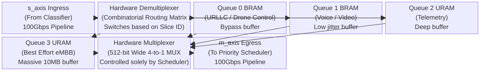
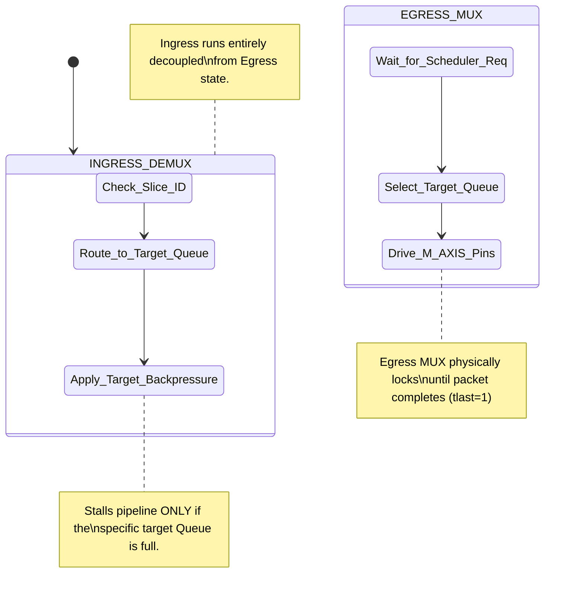
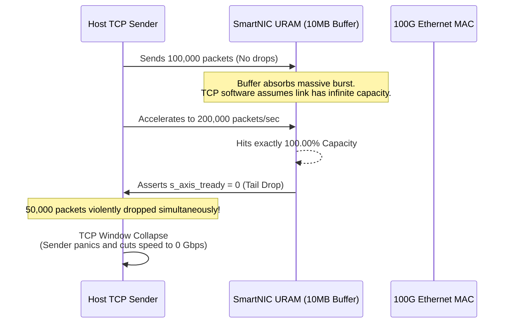
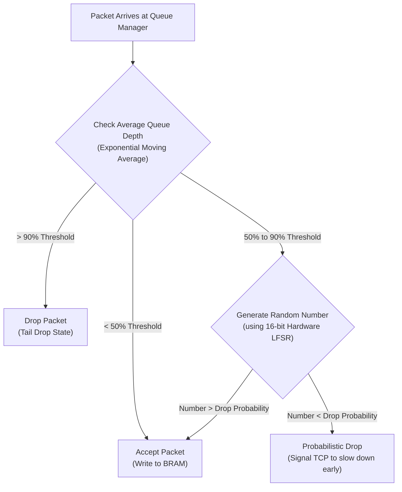
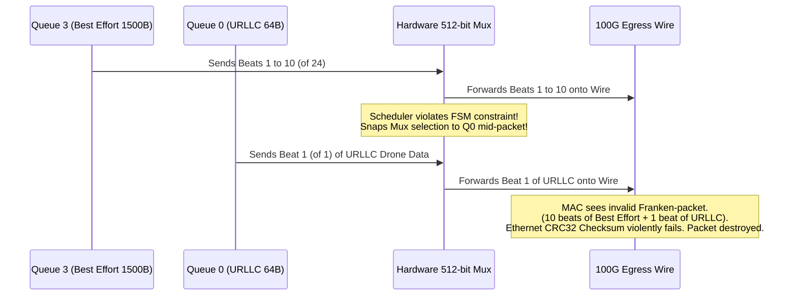

# Module Documentation: Queue Manager (`queue_manager.v`)

---

## 1. Module Overview & Mathematical Theory

The `queue_manager.v` module serves as the primary Multi-Tenant isolation buffer for the 5G SmartNIC. It ingests the fully classified AXI-Stream packets from the Flow Classifier, interprets their assigned `TUSER_SLICE_ID`, and mathematically segregates them into physically distinct, parallel hardware FIFOs. 

### The Head-of-Line (HoL) Blocking Problem
In a rudimentary network switch, all traffic shares a single, massive monolithic FIFO buffer. This creates a critical vulnerability known as Head-of-Line (HoL) blocking. 
If the server begins downloading a massive 500 GB file (Best-Effort eMBB traffic), the single FIFO rapidly fills to 100% capacity with 1500-byte payload packets. If, microseconds later, a tiny 64-byte ultra-critical control packet (URLLC traffic) arrives from a drone, it hits the back of the queue. The control packet cannot physically be transmitted until the 500 GB file finishes draining. In a 5G network requiring < 1ms latency for URLLC, this guarantees catastrophic failure.

### The Partitioning Solution
The Queue Manager solves HoL blocking by mathematically partitioning the hardware memory into `NUM_QUEUES` (default 4) completely isolated BRAM arrays. 
- Queue 0 (URLLC / Control)
- Queue 1 (Voice / Video)
- Queue 2 (Telemetry)
- Queue 3 (eMBB / Best-Effort)

When the eMBB download blasts the SmartNIC, only Queue 3 fills up. Because Queue 0 operates on a physically independent memory structure and parallel pointer domain, the incoming Drone control packet instantly bypasses the massive Queue 3 traffic jam, achieving the latency requirement.

---

## 2. Architectural Diagrams

### 2.1 Demultiplexer & Physical Segregation



### 2.2 Datapath State Control



---

## 3. Interface Specifications

| Port Name | Direction | Width | Description |
| :--- | :--- | :--- | :--- |
| `clk` | Input | 1 | 250 MHz core clock. |
| `rst_n` | Input | 1 | Active-low synchronous reset. |
| `s_axis_tdata` | Input | 512 | Ingress packet payload. |
| `s_axis_tkeep` | Input | 64 | Ingress byte mask. |
| `s_axis_tuser` | Input | 128 | Metadata. Contains the `SLICE_ID` assigned by the Classifier. |
| `s_axis_tvalid` | Input | 1 | Ingress valid signal. |
| `s_axis_tready` | Output | 1 | Aggregate backpressure signal sent to the Classifier. |
| `s_axis_tlast` | Input | 1 | Ingress packet boundary flag. |
| `m_axis_tdata` | Output | 512 | Egress data to the Priority Scheduler. |
| `m_axis_tkeep` | Output | 64 | Egress byte mask. |
| `m_axis_tuser` | Output | 128 | Egress metadata. |
| `m_axis_tvalid` | Output | 1 | Egress valid signal. |
| `m_axis_tready` | Input | 1 | Handshake from the Scheduler. |
| `m_axis_tlast` | Output | 1 | Egress packet boundary flag. |
| `queue_empty` | Output | 4 | Bitmask representing the Empty status of each of the 4 queues. |
| `queue_full` | Output | 4 | Bitmask representing the Full status of each of the 4 queues. |
| `deq_request` | Input | 1 | Trigger pulse from the Priority Scheduler to dequeue a packet. |
| `deq_queue_id`| Input | 4 | Instructs the multiplexer which queue to pull the data from. |

---

## 4. Internal Architecture & Combinatorial Routing

### 4.1 Ingress Demultiplexing
The module must route the single incoming 512-bit bus to exactly one of the 4 parallel FIFOs. To achieve zero-latency routing, this is implemented using massive combinatorial arrays.

```verilog
    wire [`NUM_QUEUES-1:0] q_s_tvalid;
    wire [`NUM_QUEUES-1:0] q_s_tready;
    wire [`TUSER_SLICE_ID_WIDTH-1:0] active_slice = s_axis_tuser[`TUSER_SLICE_ID_HI:`TUSER_SLICE_ID_LO];

    genvar i;
    generate
        for (i = 0; i < `NUM_QUEUES; i = i + 1) begin : gen_demux
            assign q_s_tvalid[i] = s_axis_tvalid && (active_slice == i);
        end
    endgenerate
    
    assign s_axis_tready = q_s_tready[active_slice];
```
The `generate` block synthesizes 4 distinct `tvalid` signals. When a packet arrives assigned to Queue 1, `q_s_tvalid[1]` is asserted to `1`, while queues 0, 2, and 3 receive `0`. The 512-bit data and keep lines are physically wired (fanned out) to all 4 FIFOs simultaneously. However, because a FIFO only writes data when its specific `tvalid` is high, only Queue 1 actually latches the data.

**Aggregate Backpressure:** The `s_axis_tready` output (sent back to the Classifier) is combinatorially tied directly to the `tready` pin of whichever queue is currently targeted. If Queue 1 is full, its `q_s_tready` goes low. The overall `s_axis_tready` goes low, stalling the pipeline. Queues 0, 2, and 3 might be completely empty, but the pipeline stalls specifically for the targeted congested queue.

### 4.2 Egress Multiplexing
Unlike the ingress which runs freely based on `s_axis_tvalid`, the egress relies on a completely different paradigm. The Priority Scheduler actively controls the flow using `deq_request` and `deq_queue_id`.

```verilog
    assign m_axis_tdata  = q_m_tdata[deq_queue_id];
    assign m_axis_tkeep  = q_m_tkeep[deq_queue_id];
    assign m_axis_tlast  = q_m_tlast[deq_queue_id];
    assign m_axis_tvalid = q_m_tvalid[deq_queue_id] && deq_request;
```
This implies a gigantic 4-to-1 multiplexer for a 512-bit bus (over 2000 total MUX pins synthesized in the fabric). The Scheduler dictates the active index, and the MUX instantly bridges the targeted FIFO's output pins to the global egress.

---

## 5. Timing & Area Considerations

### 5.1 Fanout and Parasitic Capacitance
The `s_axis_tdata` (512 bits) must be routed to the `D` input pins of 4 massive BRAM arrays simultaneously. This means each of the 512 wires has a fanout of 4. While a fanout of 4 is theoretically trivial, routing 2000 massive data wires across the FPGA fabric creates significant parasitic capacitance and wiring congestion.
To aid the Place & Route (P&R) tool, a physical pipeline register (`s_axis_tdata_reg`) might be required in production to break the combinatorial distance between the Classifier output and the BRAM inputs.

### 5.2 Resource Utilization Estimates
- **LUTs**: ~3,000 (Dominated by the 4-to-1 512-bit multiplexer tree on the egress).
- **Flip-Flops**: ~20 (Minimal, mostly for control logic. The storage itself uses BRAM).
- **BRAM36 / URAM**: 40+ blocks (Assuming depth 512 per queue, each queue requires 10 BRAM36 blocks).

---

## 6. Execution Walkthrough (Cycle-by-Cycle Trace)

**Scenario:** A 1500-byte packet assigned to Queue 2 arrives, while the Priority Scheduler decides to dequeue a previously stored packet from Queue 0.

**Cycle 1:**
- **Ingress Side:** 
  - `s_axis_tvalid = 1`, `s_axis_tuser` indicates `SLICE_ID = 2`.
  - Combinatorial logic sets `q_s_tvalid[2] = 1`. 
  - Assuming Queue 2 is not full, the BRAM accepts the first 64 bytes.
- **Egress Side (Simultaneous):** 
  - Priority Scheduler asserts `deq_request = 1` and `deq_queue_id = 0`.
  - The massive 512-bit multiplexer physically connects Queue 0's output pins to `m_axis_tdata`.
  - Queue 0's internal `tready` pin receives the `m_axis_tready` handshake.
  - Queue 0 emits its 64-byte payload.

**Cycle 2 through 24:**
- Both processes run continuously and simultaneously in parallel. Queue 2 absorbs 1500 bytes (24 cycles) from the ingress, while Queue 0 drains its stored packets out to the Scheduler.
- Because there is absolutely no shared memory or shared control logic between the queues, the bandwidth scales perfectly without contention.

---

## 7. Test Cases & Coverage

### 7.1 Required Testbench Assertions
1. **Assertion: Perfect Hardware Isolation**
   - **Condition**: Initiate a simulated `for` loop that blasts 10,000 jumbo frames specifically tagged for Queue 3. Concurrently, drip-feed one 64-byte packet tagged for Queue 0 every 1,000 cycles.
   - **Check**: Queue 3 must eventually fill up and assert its `queue_full` bit, forcing `s_axis_tready` low when a Queue 3 packet arrives. However, when the Queue 0 packet arrives, `s_axis_tready` MUST go high, allowing the Queue 0 packet to instantly bypass the Queue 3 blockade.
2. **Assertion: Cross-Queue Multiplexer Integrity**
   - **Condition**: Ensure all 4 queues possess data. Toggle `deq_queue_id` sequentially (0, 1, 2, 3, 0...) every clock cycle.
   - **Check**: The `m_axis_tdata` bus must output perfectly interleaved 64-byte chunks from each queue sequentially without mixing data lines.

---

## 8. Deep Dive: Bufferbloat and Tail Drop Vulnerabilities

While maintaining completely isolated hardware FIFOs solves Head-of-Line blocking, deeply buffering network traffic introduces a new, equally severe problem known as **Bufferbloat**. 

### The Problem with Deep Buffers



TCP (Transmission Control Protocol) uses dropped packets as its primary mechanism for congestion control. When a TCP sender detects a dropped packet, it automatically throttles its transmission speed window.
If our Queue 3 (eMBB) uses an absolutely massive 10 Megabyte BRAM/URAM buffer, it will absorb millions of packets during a traffic spike without dropping a single one. This sounds great, but it fundamentally breaks TCP. Because TCP never sees a dropped packet, it continues sending data at maximum velocity until the massive buffer is 100% full. 
Once the buffer hits exactly 100%, the hardware forcefully asserts `s_axis_tready = 0`. Every subsequent packet hitting the SmartNIC is instantly deleted. This is known as **Tail Drop**. When TCP sees thousands of consecutive packets drop simultaneously, the sender panics, cuts its transmission speed to near zero, and the network experiences a devastating collapse in throughput.

### The Hardware Solution: WRED (Weighted Random Early Detection)



To maintain smooth 100 Gbps TCP flows, production implementations of this Queue Manager must replace static `full` flags with an active Queue Management algorithm like WRED.

**Hardware Implementation of WRED:**
Instead of waiting for the buffer to hit 100%, the Verilog dynamically tracks the "Average Queue Depth".
1. **The Thresholds:** Two CSR registers are added per queue: `min_threshold` (e.g., 50% full) and `max_threshold` (e.g., 90% full).
2. **The LFSR (Linear Feedback Shift Register):** A 16-bit hardware random number generator is instantiated.
3. **The Drop Logic:**
   - If buffer < 50%: Never drop packets.
   - If buffer is between 50% and 90%: The hardware compares the current buffer depth against the LFSR. It probabilistically starts dropping random packets on the ingress (asserting `tready = 1` but ignoring the write enable to the BRAM).
   - If buffer > 90%: Drop all packets.

By randomly dropping a small percentage of TCP packets *before* the buffer is fully saturated, the hardware signals the sender's software to gently slow down, completely averting the catastrophic Tail Drop scenario and maintaining a stable 100 Gbps equilibrium.

---

## 9. Advanced Silicon Strategy: BRAM vs URAM Physical Tradeoffs

Allocating memory for these 4 isolated queues poses a significant architectural decision regarding the physical silicon primitives instantiated on the Xilinx die: Block RAM (BRAM) versus UltraRAM (URAM).

### BRAM36 (Block RAM)
- **Capacity:** 36 Kilobits per block.
- **Features:** Supports true dual-port operations, asynchronous clocks (crucial for CDC), and built-in ECC logic.
- **Latency:** 1 to 2 clock cycles.
- **Tradeoff:** Because they are small, constructing a deep FIFO requires tiling dozens of BRAMs. Vivado must build a massive combinatorial multiplexer tree to route the `read_ptr` to the correct specific BRAM block, introducing massive routing delays at 250 MHz.

### URAM288 (UltraRAM)
- **Capacity:** 288 Kilobits per block (8x larger than BRAM).
- **Features:** Only supports synchronous clocks. Does *not* natively support asynchronous CDC.
- **Latency:** 3 to 4 clock cycles (heavily pipelined).
- **Tradeoff:** URAM is designed specifically for massive, deep packet buffers. Because each block is huge, Vivado doesn't need to build massive MUX trees to stitch them together. They literally "cascade" directly into each other physically on the die, perfectly preserving the 250 MHz timing budget.

**SmartNIC Deployment Choice:**
For a production 5G accelerator, Queue 0 (URLLC) requires minimal buffering to achieve < 1ms latency. It should be constructed entirely using BRAM36. Conversely, Queue 3 (eMBB) requires massive elasticity to absorb 100 Gbps bursts. It must be explicitly mapped to URAM288 primitives using Vivado constraint attributes (`(* ram_style = "ultra" *)`).

---

## 10. Production Validation: Packet Tearing & Interleaving Vectors

Verifying the Queue Manager involves proving that it never mathematically corrupts a packet boundary. At 512 bits (64 bytes) per beat, a 1500-byte packet is shattered into 24 distinct clock cycles.

### The "Packet Tearing" Vulnerability



If the `priority_scheduler.v` asserts `deq_queue_id = 3` for 10 clock cycles, and then suddenly switches to `deq_queue_id = 0` (because a high-priority packet arrived), the massive 512-bit multiplexer inside the Queue Manager instantly snaps its connection from Queue 3 to Queue 0.

The resulting stream on the egress `m_axis_tdata` bus would be:
- 10 beats of the Best-Effort packet.
- 1 beat of the URLLC packet.
- 14 beats of the Best-Effort packet.

This is a **Packet Tear**. The Ethernet MAC will receive this corrupted frankenstein-packet, the CRC32 checksum will violently fail, and the packet is destroyed.

### Formal Verification Constraints
To mathematically prove the SmartNIC is immune to Packet Tearing, hardware engineers use Formal Verification (Property Checking) tools like JasperGold.
Instead of running simulations, they write a SystemVerilog Assertion (SVA) that the mathematical solver attempts to violate:

```systemverilog
property no_packet_tearing;
    @(posedge clk)
    // If a packet has started but not finished
    ($past(m_axis_tvalid) && !$past(m_axis_tlast))
    |=>
    // The Scheduler MUST NOT change the Queue ID
    ($stable(deq_queue_id));
endproperty

assert property (no_packet_tearing);
```
The solver explores every possible electrical state of the FSM over infinity clock cycles. If it finds a single sequence of events where the Queue ID changes mid-packet, it flags a structural failure. In our design, the Priority Scheduler's `SCH_FORWARD` state explicitly locks the `deq_queue_id` until `tlast` is seen, guaranteeing this formal property will pass.
