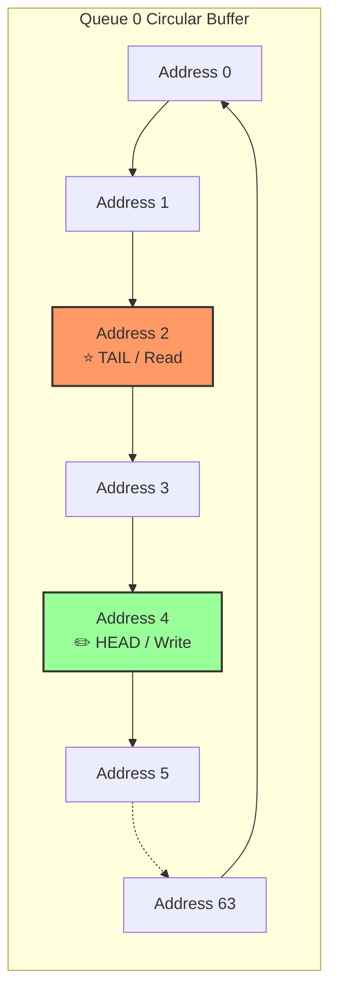

# 📦 Chunk 3: Traffic Queuing & BRAM Management

> [!NOTE]
> **Why do we need Queues?**
> Even running at 100 Gbps, traffic isn't perfectly smooth. Sometimes a burst of packets arrives faster than the PCIe bus can send them to the host server, or multiple packets want to go out of the same MAC interface at the same time. We need a place to temporarily store these packets. In hardware, we use **Queues** built out of **Block RAM (BRAM)**.

---

## 1. Hardware Memory Architectures 🧠

When designing a switch or a SmartNIC, hardware engineers must choose between two memory models:

| Memory Model | How it Works | Pros & Cons |
| :--- | :--- | :--- |
| **Shared Memory** | One massive pool of memory. A complex linked-list manager hands out addresses to whatever queue needs them. | ✅ **Pro:** Extremely efficient use of space. ❌ **Con:** Brutally complex hardware logic. |
| **Partitioned Memory** | Every queue gets its own dedicated, physically separate memory block. | ✅ **Pro:** Very simple and fast logic. ❌ **Con:** If Queue 1 is full, it drops packets even if Queue 2 is totally empty. |

> [!TIP]
> **Our Choice:**
> For this MVP, we are using **Partitioned Memory**. We instantiate four independent Block RAMs inside the FPGA—one for each 5G Network Slice.

---

## 2. The Circular Buffer (FIFO) 🔄

Each queue acts as a **FIFO** (First-In, First-Out). Because BRAM is just an array of memory addresses, we make it behave like a queue by turning it into a **Circular Buffer**.

We use two pointers:
* **Head Pointer (`head_ptr`):** Where the next incoming packet will be written.
* **Tail Pointer (`tail_ptr`):** Where the next outgoing packet will be read from.

### How the pointers move:
1. **Writing:** When a packet arrives, we save it at the `head_ptr` address. Then, `head_ptr` moves forward by 1.
2. **Reading:** When the Priority Scheduler says it's ready to transmit, we read the data at the `tail_ptr` address. Then, `tail_ptr` moves forward by 1.
3. **Wrapping Around:** When a pointer reaches Address 63, it loops instantly back to Address 0.

---

## 3. Handling Backpressure & Overflow 🛑

What happens if packets arrive much faster than they leave? The `head_ptr` will eventually lap the `tail_ptr` and crash into it! This means the queue is **Full**.

To prevent overwriting packets, the Queue Manager constantly calculates the difference between the Head and Tail. 

* If `Head == Tail`, the queue is **Empty**.
* If `Head + 1 == Tail`, the queue is **Full**.

### AXI-Stream Backpressure
If the Classifier tries to send a packet to a Full Queue, the Queue Manager will pull the AXI-Stream `TREADY` signal to `0` (Low). 

This screams **"STOP!"** to the Classifier, which then screams "STOP!" to the Parser, which screams "STOP!" to the Ethernet MAC. This domino effect is called **Hardware Backpressure**, and it guarantees we never drop a packet due to an overflow inside our chip!

> [!IMPORTANT]
> **Next Up: Quality of Service (QoS)**
> Now that we have packets safely sitting in our four queues, who gets to leave first? That is the job of the **Priority Scheduler**, the absolute heart of this project. We will explore it in **Chunk 4**!
