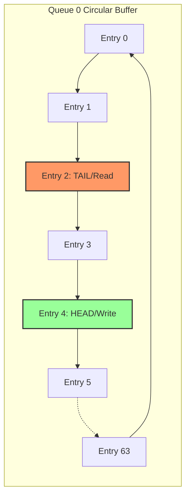

# 5. Queue Manager Deep-Dive

## Theoretical Background
In hardware networking, packets must be buffered while waiting their turn to be transmitted or while waiting for PCIe DMA resources. 

Switch architectures typically use two memory models:
1. **Partitioned Memory:** Each queue has its own dedicated SRAM block. (Simple, but wastes memory if one queue is full and others are empty).
2. **Shared Memory:** All queues share a single massive pool of memory, using linked-lists to track packets. (Highly efficient, but very complex hardware logic).

For this SmartNIC MVP, we use **Partitioned BRAMs** organized as independent **Circular Buffers**.

## RTL Architecture

The `queue_manager.v` module instantiates 4 independent queues (one for each 5G Network Slice).

### Circular Buffer Mechanics
Each queue can hold 64 memory entries. Each entry is 705 bits wide (`TDATA` 512b + `TKEEP` 64b + `TUSER` 128b + `TLAST` 1b).

The module maintains a `head_ptr` (write pointer) and a `tail_ptr` (read pointer) for each queue.

### Enqueue Operations (Input)
1. The packet arrives with a `Slice ID` encoded in `TUSER[7:4]`.
2. The Queue Manager checks if `queue_full[slice_id]` is asserted.
3. If not full, the 705-bit beat is written to BRAM at the address of the `head_ptr`.
4. The `head_ptr` is incremented.

### Dequeue Operations (Output)
1. The Priority Scheduler (downstream) asserts `deq_request` and provides a `deq_queue_id`.
2. The Queue Manager checks if the requested queue is empty.
3. If not empty, it reads the 705-bit beat from BRAM at the address of the `tail_ptr`.
4. The `tail_ptr` is incremented, and the data is placed on the output AXI-Stream.

### Backpressure
If a packet arrives for a queue that is full, the Queue Manager asserts `s_axis_tready = 0`. This backpressure propagates backwards to the Classifier and Parser, eventually pausing the incoming Ethernet MAC.
