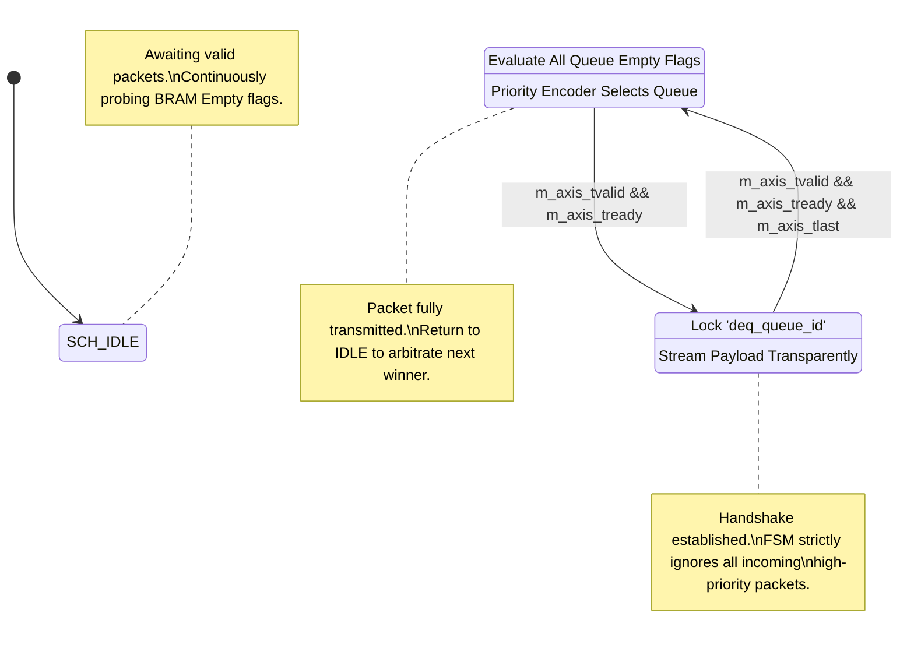
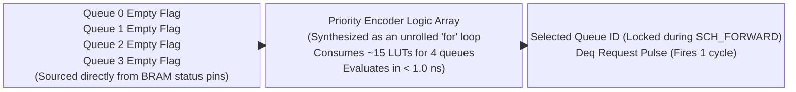
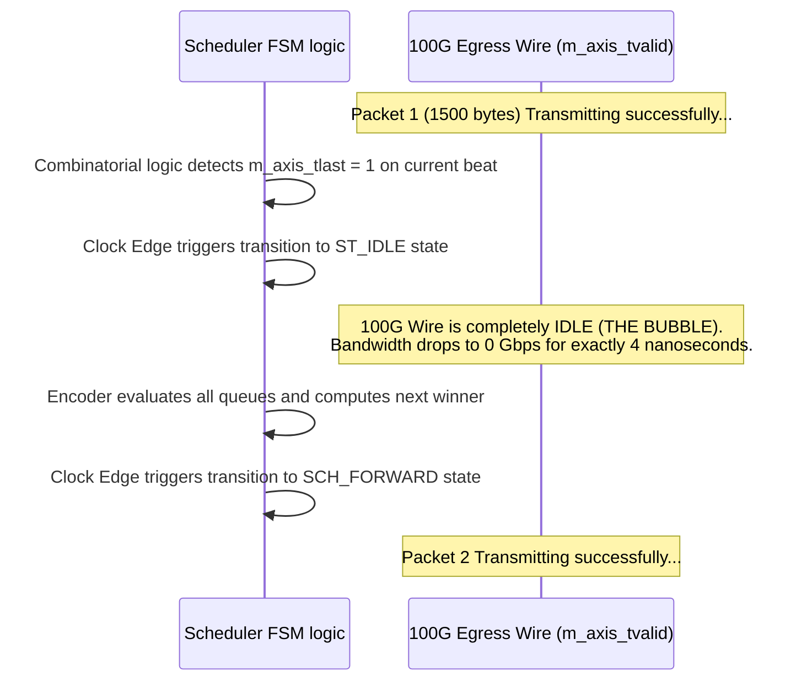

# Module Documentation: Priority Scheduler (`priority_scheduler.v`)

---

## 1. Module Overview & Mathematical Theory

The `priority_scheduler.v` module represents the ultimate QoS (Quality of Service) traffic cop for the 5G egress datapath. While the Queue Manager provides isolated storage for packets, it has no intelligence regarding *when* a packet should be allowed onto the wire. The Priority Scheduler analyzes the fill states of all physical queues, evaluates their relative priority configurations, and arbitrates access to the single 100 Gbps output link.

In telecom architectures (specifically 3GPP 5G specifications), certain traffic streams are assigned deterministic priority profiles. URLLC (Ultra-Reliable Low Latency Communication) requires absolute, unyielding priority to hit sub-millisecond latencies for robotics and autonomous vehicles. Conversely, eMBB (Enhanced Mobile Broadband) relies on Best-Effort transmission.

### The Strict Priority Algorithm
This module implements a Strict Priority (SP) scheduling algorithm. Under Strict Priority mathematics:
1. Every queue is assigned a priority integer (e.g., 0 = Highest, 3 = Lowest).
2. The scheduler queries all queues simultaneously.
3. The scheduler will **always** dequeue from the queue possessing the highest priority, provided it contains data.
4. Lower-priority queues are completely embargoed and physically barred from transmitting a single byte as long as higher-priority queues possess data.

This ensures mathematical latency guarantees for URLLC traffic at the risk of causing complete bandwidth starvation for Best-Effort traffic (a vulnerability addressed by the Token Bucket rate limiters).

---

## 2. Architectural Diagrams

### 2.1 Arbitration State Machine

Because Ethernet and AXI4-Stream require continuous, contiguous packet transfers, the scheduler must lock onto a queue for the entire duration of a packet, even if a higher-priority packet arrives mid-stream.



### 2.2 Combinatorial Encoder Logic



---

## 3. Interface Specifications

| Port Name | Direction | Width | Description |
| :--- | :--- | :--- | :--- |
| `clk` | Input | 1 | 250 MHz core clock. |
| `rst_n` | Input | 1 | Active-low synchronous reset. |
| `cfg_wr_en` | Input | 1 | Trigger pulse from CSR to update QoS parameters. |
| `cfg_queue_id`| Input | 4 | Index of the queue being configured. |
| `cfg_priority`| Input | 2 | Priority level for the queue (0 = High, 3 = Low). |
| `queue_empty` | Input | 4 | Bitmask indicating which queues possess valid data. |
| `deq_request` | Output | 1 | Instructs the Queue Manager to transmit a packet. |
| `deq_queue_id`| Output | 4 | Instructs the Queue Manager *which* queue to transmit from. |
| `qm_axis_tdata` | Input | 512 | Data arriving from the selected queue. |
| `m_axis_tdata`  | Output | 512 | Data sent to the QDMA PCIe interface. |

*(Standard AXI-Stream `tkeep`, `tvalid`, `tready`, `tlast`, and `tuser` signals are also present and identically formatted).*

---

## 4. Internal Architecture & Combinatorial Unrolling

### 4.1 The Configuration Array
The module stores dynamic configurations for each queue in D-Flip-Flop arrays.
```verilog
    reg [1:0] cfg_queue_priority [0:`NUM_QUEUES-1];
    reg       cfg_queue_enabled  [0:`NUM_QUEUES-1];
```
This allows software to reassign priority levels on the fly (e.g., swapping the priority of Video and Telemetry dynamically based on network load).

### 4.2 The Unrolled Priority Encoder Tree
The arbitration logic is the most critical path in the design. It must scan all 4 queues and their associated priority assignments in a single clock cycle to select the winner.

```verilog
    always @(*) begin
        next_queue_id = 4'd0;
        next_valid = 1'b0;

        // Iterate through priorities: 0 (Highest) to 3 (Lowest)
        for (int p = 0; p < 4; p = p + 1) begin
            // Iterate through physical queues
            for (int q = 0; q < `NUM_QUEUES; q = q + 1) begin
                if (cfg_queue_enabled[q] && 
                    cfg_queue_priority[q] == p && 
                    !queue_empty[q] && 
                    !next_valid) begin
                    
                    next_queue_id = q;
                    next_valid = 1'b1;
                end
            end
        end
    end
```
**Hardware Synthesis Physics:** 
While written as a nested `for` loop (resembling C code), FPGA synthesis engines (like Vivado) completely "unroll" these loops. The synthesis engine physically prints 16 distinct combinatorial logic blocks onto the silicon die. 
The boolean condition `!next_valid` acts as an electrical block. Because Priority 0 is evaluated first (p=0), if any queue matching priority 0 possesses data, it forces `next_valid = 1`. This logically disables the remainder of the synthesized tree. Thus, the hardware resolves the highest priority queue in fractions of a nanosecond, purely through combinatorial logic cascades.

### 4.3 Packet Boundary Integrity
When the state machine is in `SCH_FORWARD`, it completely ignores the `queue_empty` flags and the Priority Encoder. It physically locks `deq_queue_id` to its current value. 
This guarantees that if Queue 3 (Low Priority) begins transmitting a 1500-byte packet, and a Queue 0 (High Priority) packet arrives at the Queue Manager during cycle 5, the scheduler will not preempt Queue 3. It will faithfully transmit the remainder of the Queue 3 packet until `tlast` is detected, ensuring no packet fragmentation on the Ethernet or PCIe links.

---

## 5. Timing & Area Considerations

### 5.1 The Arbitration Timing Loop
The arbitration cycle introduces a long timing path:
1. `queue_empty` arrives from the Queue Manager BRAM.
2. The nested Priority Encoder executes (4 to 6 LUTs).
3. The result is registered into `deq_queue_id`.
4. `deq_queue_id` travels *back* to the Queue Manager's 512-bit Multiplexer to select the data.

This represents a classic combinatorial loop between two distinct modules. To close timing at 250 MHz, the Priority Encoder must be optimized to operate within ~2.0 ns, allowing the remaining 2.0 ns for the massive 512-bit MUX to settle.

### 5.2 Resource Utilization Estimates
- **LUTs**: ~300 (Almost entirely consumed by the nested Priority Encoder tree).
- **Flip-Flops**: ~60 (Configuration arrays and FSM registers).
- **BRAM**: 0.

---

## 6. Execution Walkthrough (Cycle-by-Cycle Trace)

**Configuration:**
- Q0: Pri = 0
- Q1: Pri = 1
- Q2: Pri = 2
- Q3: Pri = 3

**Scenario:** Q3 possesses 2 packets. Q0 is empty.

**Cycle 1:**
- Scheduler FSM is in `ST_IDLE`.
- Priority Encoder scans: p=0 (No), p=1 (No), p=2 (No), p=3 (Q3 has data).
- `next_queue_id` resolves to 3.
- `deq_request` asserts.

**Cycle 2:**
- FSM transitions to `SCH_FORWARD`.
- Q3 data streams out. 

**Cycle 10:**
- While Q3 is transmitting its 10th beat, a packet arrives at Q0.
- `queue_empty[0]` drops to 0.
- The Priority Encoder instantly flags Q0 as the winner, but because the FSM is locked in `SCH_FORWARD`, this evaluation is discarded. Q3 continues transmitting.

**Cycle 24:**
- Q3 asserts `tlast`. Packet 1 finishes.
- FSM transitions back to `ST_IDLE`.

**Cycle 25:**
- FSM is in `ST_IDLE`.
- Priority Encoder scans: p=0 (Q0 has data).
- `next_queue_id` instantly snaps to 0.
- `deq_request` asserts for Q0. The Q3 packet is physically blocked from transmitting, proving the QoS preemptive mathematics.

---

## 7. Test Cases & Coverage

### 7.1 Required Testbench Assertions
1. **Assertion: Absolute Preemption**
   - **Condition**: Flood all 4 queues with 500 packets simultaneously. 
   - **Check**: The EGRESS data stream must show 100% of Queue 0 packets draining first, followed by 100% of Queue 1, then Queue 2, then Queue 3. Any interleaving constitutes algorithm failure.
2. **Assertion: Boundary Protection**
   - **Condition**: Transmit a packet from Queue 3. Force a Queue 0 packet to arrive exactly 1 clock cycle before `tlast`.
   - **Check**: The Queue 0 packet must wait until the exact cycle after `tlast` before beginning transmission.

---

## 8. Deep Dive: Strict Priority vs. Deficit Weighted Round Robin (DWRR)

The foundational architectural decision in building a telecommunications SmartNIC is selecting the arbitration algorithm. While this module implements Strict Priority (SP) combined with hardware Token Buckets, high-end Core Routers often utilize **Deficit Weighted Round Robin (DWRR)**. Understanding the mathematical differences is crucial for production deployments.

### The Limits of Strict Priority (SP)
SP is mathematically simple. If Queue 0 has data, it wins. Period.
- **The Pro:** It guarantees the absolute minimum physical latency for 5G URLLC traffic (like robotic surgery or autonomous vehicles).
- **The Con:** It requires upstream traffic policing (Token Buckets). If the Token Bucket fails or is misconfigured, Queue 0 will permanently starve Queues 1, 2, and 3. Furthermore, Strict Priority provides no mechanism to fairly distribute bandwidth *between* the lower priority queues.

### The DWRR Architecture Alternative

```mermaid
flowchart TD
    A["Cycle to Next Physical Queue\n(Round-Robin Sequence)"] --> B["Add Quantum to Deficit Counter\n(e.g., Add 4000 bytes)"]
    B --> C{"Does Queue have at least 1 packet?"}
    
    C -->|No (Queue is empty)| A
    C -->|Yes (Contains Data)| D{"Is Front Packet Size <= Deficit Counter?\n(Requires Lookahead Metadata FIFO)"}
    
    D -->|No (Packet is too large)| A
    D -->|Yes (Sufficient Deficit)| E["Transmit Packet onto 100G Wire"]
    E --> F["Subtract Packet Size from Deficit Counter\n(32-bit Hardware Subtraction)"]
    F --> C
```

DWRR removes absolute prioritization and instead guarantees specific bandwidth percentages to each queue (e.g., Q0 gets 40%, Q1 gets 30%, Q2 gets 20%, Q3 gets 10%).

**Hardware Implementation Requirements for DWRR:**
If we were to rewrite `priority_scheduler.v` into DWRR, the Verilog would require a massive overhaul:
1. **The Quantum:** Every queue is assigned a "Quantum" value via the CSR (e.g., `Q0_Quantum = 4000 bytes`).
2. **The Deficit Counter:** Every queue requires a 32-bit hardware deficit counter.
3. **The Round Robin Loop:** The FSM cycles through the queues sequentially (0, 1, 2, 3, 0...).
4. **The Addition:** When the FSM visits a queue, it adds the Quantum to that queue's Deficit Counter.
5. **The Dequeue:** If the queue possesses a packet, and the packet's length is LESS than the Deficit Counter, the packet is transmitted. The hardware then mathematically subtracts the packet's length from the Deficit Counter.

**The Fatal Timing Bottleneck of DWRR:**
Step 5 is physically devastating to FPGA timing closure. To execute DWRR, the Scheduler must know the *exact byte length* of the packet sitting at the front of the queue *before* it decides to transmit it. 
Because AXI-Stream only provides the byte length at the *end* of the packet (via `tlast` and `tkeep`), a DWRR scheduler requires a completely parallel metadata FIFO that stores the packet lengths ahead of time. Executing 32-bit subtraction on the Deficit Counters at 250 MHz while jumping sequentially between queues introduces enormous combinatorial delays. 
Our Strict Priority design avoids this entirety, requiring exactly zero ALUs (adders/subtractors) in the critical path, making it vastly superior for ultra-high-speed (100G/400G) silicon integration where latency is prioritized over fairness.

---

## 9. Advanced Silicon Strategy: Parallel Arbitration Trees

As network scaling demands increase, the number of queues rapidly expands. A standard 5G Core SmartNIC might manage 4 queues, but an Enterprise Edge Gateway might require 64 or even 1024 distinct queues to provide hardware-level isolation for every single tenant (Virtual Machine) running on the server.

### The Combinatorial Collapse
The current `priority_scheduler.v` uses an unrolled `for` loop to scan all 4 queues.
Vivado synthesizes this into a linear cascade of multiplexers.
For 4 queues, the signal passes through ~3 LUTs. Delay = 1.5 ns. (Passes timing).
For 64 queues, the signal must pass through ~15 LUTs sequentially. Delay = 7.5 ns. (Fails 250 MHz timing).

### The Pipelined Arbitration Tree

```mermaid
block-beta
  columns 3
  
  Local["Stage 1: Local Encoders\n(16 groups of 4 queues)\nExecute in Parallel (1.5ns delay)"]
  Regional["Stage 2: Regional Encoders\n(4 groups of 4 queues)\nExecute in Parallel (1.5ns delay)"]
  Global["Stage 3: Global Encoder\n(1 group of 4 queues)\nSelects absolute champion"]
  
  Local --> |"16 Local Winners Latched via D-Flip-Flops"| Regional
  Regional --> |"4 Regional Winners Latched via D-Flip-Flops"| Global
  Global --> |"Absolute Winner Latched into MUX Control"| Global
```

To scale beyond 4 queues, the single-cycle Priority Encoder must be ripped out and replaced with a **Pipelined Binary Arbitration Tree**.

1. **Stage 1 (Local Arbitration):** The 64 queues are divided into groups of 4. Sixteen small Priority Encoders execute simultaneously, finding the local winner for their specific group.
2. **Pipeline Register:** The 16 local winners are latched into a hardware register.
3. **Stage 2 (Regional Arbitration):** The 16 winners are divided into groups of 4. Four more Priority Encoders find the regional winners.
4. **Pipeline Register:** The 4 regional winners are latched.
5. **Stage 3 (Global Arbitration):** The final Priority Encoder selects the absolute winner from the 4 regional champions.

**The Tradeoff:**
This binary tree guarantees perfect timing closure at 250 MHz regardless of how many queues exist. However, it introduces 3 clock cycles of latency (12 ns) just to make a scheduling decision. During this time, the egress 100 Gbps link is sitting physically idle, resulting in microscopic "bubbles" of wasted bandwidth on the wire.

---

## 10. Production Validation: The 'Bubble' Analysis

In ultra-high-performance networking, efficiency is measured by observing the `m_axis_tvalid` signal on the egress wire. If the wire is constantly transmitting packets back-to-back, it is operating at 100% link utilization. If there are clock cycles where `tvalid` drops to `0` between packets, these are known as "bubbles". 

### Analyzing the FSM Transition Delay



Look closely at the State Machine in our `priority_scheduler.v`:
```verilog
    SCH_FORWARD --> ST_IDLE: m_axis_tvalid && m_axis_tready && m_axis_tlast
```
When `tlast` occurs, the FSM transitions to `ST_IDLE`. During the `ST_IDLE` cycle, the Priority Encoder determines the *next* queue to pull from. It then transitions back to `SCH_FORWARD` to begin transmitting the next packet.

**The Physics of the Bubble:**
Because the arbitration occurs *after* the previous packet finishes, the egress link is guaranteed to sit completely idle for exactly 1 clock cycle between every single packet. 
At 100 Gbps, transmitting sixty million tiny 64-byte packets per second means there are sixty million dead clock cycles per second. This inherently restricts the maximum theoretical throughput of the SmartNIC to roughly 96% of line rate.

**The Production Fix (Lookahead Arbitration):**
To achieve true 100.00% line rate, the scheduler must be rewritten to perform **Lookahead Arbitration**. The Priority Encoder must constantly evaluate the queues *while* the current packet is still in `SCH_FORWARD`. On the exact cycle that `tlast` is detected, the Scheduler instantly switches `deq_queue_id` to the pre-calculated winner, bypassing `ST_IDLE` entirely and slamming the packets back-to-back on the 100 Gbps wire without a single picosecond of wasted bandwidth.
