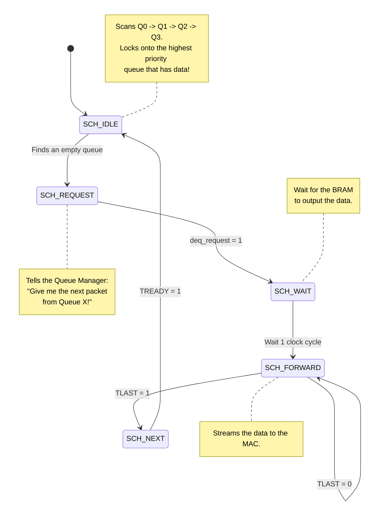

# ⚖️ Chunk 4: Hardware Quality of Service (QoS)

> [!NOTE]
> **The Heart of the SmartNIC**
> Now that we have network packets sitting inside our four Circular BRAM Queues (Chunk 3), we need to decide the order in which they leave the SmartNIC. This is the definition of **Quality of Service (QoS)**, and it is handled entirely by the **Priority Scheduler**.

---

## 1. Scheduling Algorithms 🧮

There are two dominant algorithms used in network switches to decide which queue gets to transmit next.

### Algorithm A: Weighted Fair Queuing (WFQ)
In WFQ, every queue is given a "weight" or a percentage of the total bandwidth. 
* *Example:* Video Queue gets 60%, Web Queue gets 30%, IoT Queue gets 10%.
* **Pros:** No queue is ever completely starved. Everyone gets a turn.
* **Cons:** Latency is unpredictable. A critical packet might have to wait for the Video queue to finish its 60% turn.

### Algorithm B: Strict Priority (SP)
In Strict Priority, queues are strictly ranked (Queue 0 > Queue 1 > Queue 2). 
The scheduler will **always** drain the highest priority queue completely empty before even looking at the lower queues.
* **Pros:** Absolute minimum latency for the highest priority queue.
* **Cons:** If Queue 0 is flooded with infinite traffic, Queue 1 and 2 will **Starve** (they will never get to send a single packet).

> [!IMPORTANT]
> **Why we chose Strict Priority for 5G:**
> In 5G networks, URLLC (Ultra-Reliable Low-Latency) traffic is used for life-critical applications (e.g., remote surgery, autonomous braking). This traffic **must** experience the absolute minimum latency possible. Therefore, our `priority_scheduler.v` module uses **Strict Priority**.

---

## 2. The Scheduler State Machine 🚦

Because reading data from our BRAM queues takes exactly 1 clock cycle, our Priority Scheduler uses a 5-State FSM to orchestrate the read process.

### The Starvation Solution (Tier 2 Scope)
As mentioned above, the fatal flaw of Strict Priority is **Starvation**. 
In Tier 2 of this project, we will fix this by integrating a **Token Bucket Rate Limiter** directly into the scheduler.

The Token Bucket will place a hard bandwidth cap (e.g., 10 Gbps) on the URLLC queue. If URLLC traffic exceeds 10 Gbps, the Token Bucket will flag it as "Out of Tokens." The Scheduler will then temporarily skip the URLLC queue and service the lower-priority queues, saving them from starvation!

---

> [!TIP]
> **Next Up: The RISC-V Control Plane!**
> We have completely covered the "Fast Path" (the hardware Verilog pipeline). In **Chunk 5**, we will explore the "Slow Path" by discussing how we will embed a full CPU core inside the FPGA to control our pipeline!
