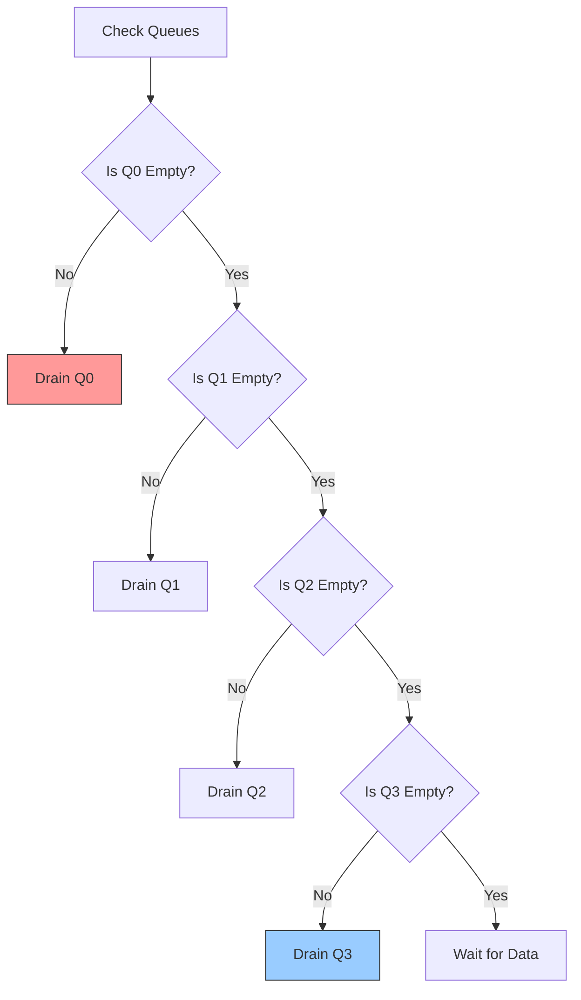

# 6. Priority Scheduler Deep-Dive

## Theoretical Background

The scheduler is the heart of hardware QoS. It decides the order in which queued packets are sent to the network or host.
- **Strict Priority (SP):** Always sends packets from the highest priority queue first. If Queue 0 has data, Queue 1-3 wait.
- **Weighted Fair Queuing (WFQ):** Assigns bandwidth percentages to each queue (e.g., 50% to Q0, 20% to Q1). Prevents starvation.

For our 5G SmartNIC, **URLLC (Ultra-Reliable Low-Latency) traffic strictly requires SP.** If an autonomous driving packet arrives, it must jump the line immediately, even if it starves a background video download. Therefore, `priority_scheduler.v` implements Strict Priority.

## RTL Architecture

The scheduler interacts with the Queue Manager via a custom request/response interface, then forwards the data to a standard AXI-Stream output.

### Scheduling Algorithm

The scheduler maintains an array of `queue_empty` flags. Every clock cycle, it scans from highest priority to lowest priority.

### The 5-State FSM

Because BRAMs in the Queue Manager take 1 clock cycle to read, the scheduler uses a 5-state FSM to orchestrate the dequeue process.

1. **`SCH_IDLE`:** Scans queues. If a non-empty queue is found, locks onto `active_queue` and moves to REQUEST.
2. **`SCH_REQUEST`:** Asserts `deq_request` and sends the `active_queue` ID to the Queue Manager.
3. **`SCH_WAIT`:** Waits 1 cycle for the BRAM data to appear on the `qm_axis` lines.
4. **`SCH_FORWARD`:** Asserts `m_axis_tvalid`. Data flows to the output. If `TLAST` is seen, the packet is finished; move to NEXT.
5. **`SCH_NEXT`:** Waits for the downstream module to accept the final beat (`TREADY=1`), then returns to IDLE to pick the next queue.

### Latency Proof
Our `tb_priority_scheduler.v` testbench proves that this exact SP logic results in URLLC packets achieving lower end-to-end latency than Best-Effort packets, fulfilling the MVP goal.
