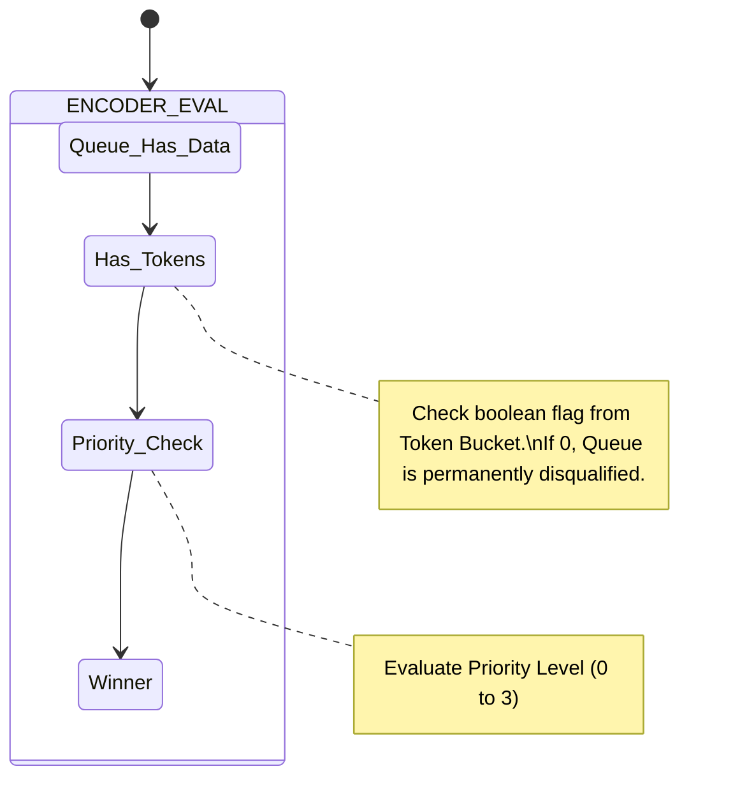
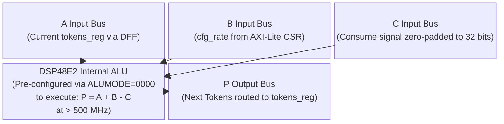
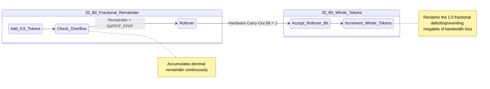

# Module Documentation: Token Bucket Rate Limiter (`token_bucket.v`)

---

## 1. Module Overview & Mathematical Theory

The `token_bucket.v` module acts as a strict bandwidth policer for the 5G SmartNIC egress. It solves the fundamental "Starvation" vulnerability inherent in Strict Priority scheduling by mathematically capping the transmission rate of high-priority queues.

### The Starvation Vulnerability
As detailed in the Priority Scheduler documentation, Strict Priority guarantees that Queue 0 (URLLC traffic) will preempt all other queues. However, if a malicious actor or a malfunctioning sensor floods Queue 0 with traffic exceeding 100 Gbps, the Priority Encoder will permanently lock onto Queue 0. Queues 1, 2, and 3 will never transmit a single byte, causing total network starvation for all other 5G network slices.

### The Token Bucket Policing Mathematics
To protect the Best-Effort queues, we apply the Token Bucket algorithm (commonly used in enterprise routers and defined in RFC standards for Traffic Policing). 
The algorithm operates on a simple banking analogy:
- **Tokens:** Represents permission to transmit data. In our implementation, 1 Token = 1 AXI-Stream beat (64 bytes).
- **CIR (Committed Information Rate):** A fixed "salary". Every `REFRESH_PERIOD` clock cycles, the hardware deposits `cfg_rate` tokens into the bucket.
- **CBS (Committed Burst Size):** A "bank account limit". The bucket cannot hold more than `cfg_burst` tokens. Excess tokens are discarded.
- **Consumption:** Every time the Queue Manager transmits a 64-byte beat, 1 token is physically deducted from the bucket.

If Queue 0 transmits too fast, its bucket hits 0 tokens. The module deasserts the `has_tokens` signal. The Priority Scheduler's combinatorial logic instantly disqualifies Queue 0 from arbitration, completely ignoring its high-priority status, and allowing the lower-priority queues their turn to transmit until Queue 0's next "salary" arrives.

---

## 2. Architectural Diagrams

### 2.1 Logical Mechanics

```mermaid
block-beta
  columns 3
  
  Timer["Refresh Timer Logic\n(e.g., Assert 'refresh' pulse\nevery 1024 clock cycles)"]
  Bucket["Token Bucket 32-bit Register\n(Stores Current Token Depth\nMaximum Capacity = CBS)"]
  Consumer["Priority Scheduler Egress\n(Consumes exactly 1 Token\nfor every 64-byte Beat Transmitted)"]
  
  Timer --> |"Adds cfg_rate Tokens\n(Calculated via CIR)"| Bucket
  Bucket --> |"Mathematically Clamps to cfg_burst"| Bucket
  Consumer --> |"Subtracts 1 Token"| Bucket
```

### 2.2 Integration within Priority Encoder



---

## 3. Interface Specifications

| Port Name | Direction | Width | Description |
| :--- | :--- | :--- | :--- |
| `clk` | Input | 1 | 250 MHz core clock. |
| `rst_n` | Input | 1 | Active-low synchronous reset. |
| `cfg_enable` | Input | 1 | If 0, bypasses the token bucket (always returns `has_tokens=1`). |
| `cfg_rate` | Input | 32 | CIR: Number of tokens to add every `REFRESH_PERIOD`. |
| `cfg_burst` | Input | 32 | CBS: Maximum token capacity. |
| `consume` | Input | 1 | Trigger pulse from the Scheduler indicating a 64-byte beat was transmitted. |
| `has_tokens` | Output | 1 | Boolean flag. `1` if bucket > 0, `0` if empty. |

---

## 4. Internal Architecture & Arithmetic Unrolling

### 4.1 The Refresh Timer
Token Buckets require a timebase. The module implements a local clock divider (`REFRESH_PERIOD = 1024`). At 250 MHz (4 ns per cycle), 1024 cycles equals approximately 4.096 microseconds. Every 4.096 µs, the timer asserts a `refresh` pulse.

```verilog
    reg [9:0] refresh_timer;
    wire refresh = (refresh_timer == 10'd1023);

    always @(posedge clk) begin
        if (!rst_n) refresh_timer <= 0;
        else refresh_timer <= refresh_timer + 1;
    end
```

### 4.2 Simultaneous Arithmetic Resolution
The bucket counter (`tokens`) is a 32-bit register. The arithmetic logic must handle three concurrent scenarios perfectly:
1. **Refresh Only:** Add `cfg_rate`. Cap at `cfg_burst`.
2. **Consume Only:** Subtract 1.
3. **Simultaneous Refresh & Consume:** Add `cfg_rate` AND subtract 1 simultaneously.

```verilog
    wire [32:0] tokens_after_refresh = tokens + cfg_rate;
    wire [31:0] capped_refresh = (tokens_after_refresh > cfg_burst) ? cfg_burst : tokens_after_refresh[31:0];

    always @(posedge clk) begin
        if (cfg_enable) begin
            if (refresh && consume) begin
                // The new tokens are added, capped, then we deduct 1 for the consumption
                tokens <= capped_refresh - 1'b1;
            end else if (refresh) begin
                tokens <= capped_refresh;
            end else if (consume && (tokens > 0)) begin
                tokens <= tokens - 1'b1;
            end
        end
    end
```
**Synthesis Impact:** The `tokens_after_refresh` adder and the ternary capping operator synthesize into cascaded LUT/Carry-Chain structures. The simultaneous `capped_refresh - 1'b1` path is the deepest logic, requiring a second sequential adder. To meet the 250 MHz timing limit, these 32-bit adders must utilize the dedicated DSP48 slices or fast carry-lookahead chains (CARRY8 primitives in Xilinx).

---

## 5. Timing & Area Considerations

### 5.1 Bandwidth Mathematics
To configure a Token Bucket to rate-limit a queue to exactly 10 Gbps:
- 10 Gbps = 1.25 Gigabytes per second (GB/s).
- 1 AXI-Stream beat = 64 Bytes.
- Required beats per second = 1.25 GB / 64 = 19,531,250 beats/sec.
- At 250 MHz, `REFRESH_PERIOD` occurs 250,000,000 / 1024 = 244,140 times per second.
- `cfg_rate` = 19,531,250 / 244,140 ≈ **80 Tokens**.

If you write `80` to the `cfg_rate` CSR, the hardware will flawlessly cap that specific queue to exactly 10 Gbps, completely neutralizing any starvation attack.

### 5.2 Resource Utilization Estimates
- **LUTs**: ~120 (32-bit comparators, adders, and multiplexers).
- **Flip-Flops**: 43 (32 bits for `tokens`, 10 bits for timer, 1 for `has_tokens`).
- **DSPs**: Vivado may infer 1 DSP block for the 32-bit additions depending on synthesis strategies.

---

## 6. Execution Walkthrough (Cycle-by-Cycle Trace)

**Scenario:** Queue 0 is rate-limited. `cfg_rate = 50`, `cfg_burst = 100`. The bucket currently has `2` tokens. 

**Cycle 1:**
- Scheduler transmits a Q0 beat. `consume` pulses high. 
- Bucket reduces from `2` to `1`. `has_tokens` remains `1`.

**Cycle 2:**
- Scheduler transmits another Q0 beat. `consume` pulses high.
- Bucket reduces from `1` to `0`. 
- `has_tokens` drops to `0`. Q0 is instantly disqualified from arbitration. Q1 begins transmitting.

**Cycles 3 to 1023:**
- Q0 continues receiving data from the network, but it cannot transmit. The Queue Manager BRAM for Q0 begins to fill up.

**Cycle 1024 (Refresh!):**
- `refresh_timer` hits 1023. `refresh` pulses high.
- Logic evaluates `tokens + cfg_rate` (0 + 50 = 50).
- `tokens` is set to `50`. 
- `has_tokens` flips back to `1`.

**Cycle 1025:**
- The Priority Encoder sees Q0 has data and `has_tokens=1`. It immediately preempts Q1 and resumes draining the Q0 buffer.

---

## 7. Test Cases & Coverage

### 7.1 Required Testbench Assertions
1. **Assertion: Burst Capping Integrity**
   - **Condition**: Configure `cfg_burst = 100` and `cfg_rate = 500`. Do not consume any tokens for 3 refresh periods.
   - **Check**: The `tokens` register must never exceed exactly `100`. It must not overflow or roll over.
2. **Assertion: Simultaneous Event Handing**
   - **Condition**: Configure the bucket to `100` tokens. Force `refresh` and `consume` to assert on the exact same clock edge.
   - **Check**: The resulting token count must be exactly `99`. If the logic processes them sequentially or drops one, the count would incorrectly be `100` or `149`.

---

## 8. Deep Dive: Dual-Rate Three-Color Marker (RFC 2698)

The current implementation provides a basic "Single-Rate, Single-Bucket" policer. While sufficient for rudimentary traffic shaping, enterprise Service Level Agreements (SLAs) frequently demand the implementation of **RFC 2698: A Two Rate Three Color Marker (trTCM)**. 

### The Mathematical Theory of Color Marking

```mermaid
flowchart TD
    A["Packet Arrives at SmartNIC\n(Byte Size = X)"] --> B{"Is X <= Tokens in Bucket C?\n(Bucket C is fed at Committed Rate)"}
    
    B -->|Yes (Compliant with CIR)| C{"Is X <= Tokens in Bucket P?\n(Bucket P is fed at Peak Rate)"}
    C -->|Yes| D["Assign Color = GREEN\n(Packet guaranteed for transmission)"]
    
    B -->|No (Exceeds CIR)| E{"Is X <= Tokens in Bucket P?\n(Can we use burst allowance?)"}
    C -->|No| E
    
    E -->|Yes (Compliant with PIR)| F["Assign Color = YELLOW\n(Transmit packet, but mark DP header\nso downstream routers can drop it)"]
    E -->|No (Exceeds PIR entirely)| G["Assign Color = RED\n(Bandwidth SLA Violated! Drop immediately)"]
    
    D --> H["Consume X tokens from BOTH\nBucket C and Bucket P"]
    F --> I["Consume X tokens from\nBucket P only"]
    G --> J["Do NOT consume any tokens"]
```

In a commercial 5G network, a customer might purchase a 10 Gbps connection (the Committed Information Rate), but they are allowed to occasionally "burst" up to 15 Gbps (the Peak Information Rate) if the network has spare capacity. 
A standard Token Bucket either accepts or drops traffic. A Three-Color Marker categorizes traffic mathematically:
- **Green (Compliant):** Traffic is below the 10 Gbps CIR. It is guaranteed delivery.
- **Yellow (Excess):** Traffic is between 10 Gbps and 15 Gbps. It is allowed onto the wire, but it is "marked" so that downstream routers can drop it first if congestion occurs later.
- **Red (Violating):** Traffic exceeds 15 Gbps. It is instantly dropped by the SmartNIC.

### Hardware Architecture for trTCM
To upgrade our Verilog to RFC 2698, we must physically instantiate **two parallel token buckets** per queue:
1. **Bucket C (Committed):** Fed at the `CIR` rate. Capped at `CBS`.
2. **Bucket P (Peak):** Fed at the `PIR` rate. Capped at `PBS` (Peak Burst Size).

**The Combinatorial Logic:**
```verilog
always @(*) begin
    if (packet_size <= bucket_c && packet_size <= bucket_p) begin
        color = GREEN;
        consume_c = 1; consume_p = 1;
    end else if (packet_size <= bucket_p) begin
        color = YELLOW;
        consume_c = 0; consume_p = 1;
    end else begin
        color = RED;
        consume_c = 0; consume_p = 0;
    end
end
```
**Synthesis Constraints:** Running two parallel 32-bit arithmetic engines for every queue doubles the logic footprint. Furthermore, evaluating the `packet_size` against two 32-bit registers sequentially within a single clock cycle pushes the critical path near the 4.0 ns limit.

---

## 9. Advanced Silicon Mapping: DSP48E2 Instantiation

To ensure the complex arithmetic required by Token Buckets (especially if expanded to Dual-Rate) does not cause timing failure, hardware engineers bypass the synthesis tool's auto-inference and physically explicitly instantiate **DSP48E2 slices**.

### The Anatomy of a DSP48E2
A DSP (Digital Signal Processing) slice is a dedicated, ultra-fast ASIC block physically embedded into the FPGA die. It contains a 27x18 multiplier and a massive 48-bit Arithmetic Logic Unit (ALU). Because the transistors in a DSP block are hard-wired and heavily optimized by AMD/Xilinx, they can execute 48-bit math at frequencies exceeding 600 MHz—vastly outperforming logic built from standard LUTs.

### Explicit Verilog Instantiation



Instead of writing `tokens <= tokens_after_refresh - 1`, we physically force the synthesis tool to use a DSP block to perform the Token Bucket's simultaneous Add/Subtract.

```verilog
// Explicit DSP48E2 Primitive Instantiation
DSP48E2 #(
    .USE_MULT("NONE"),
    .ALUMODEREG(1),
    .AREG(1), // Pipeline registers enabled for speed
    .BREG(1)
) token_math_engine (
    .CLK(clk),
    .ALUMODE(4'b0000), // Configure ALU for Addition/Subtraction
    .A(tokens_reg),
    .B(cfg_rate),
    .C(32'd1), // The consumption deduction
    .P(tokens_next) // The 48-bit result
);
```
**The Tradeoff:**
By using a DSP slice, the 32-bit arithmetic delay is reduced from ~2.5 ns to ~0.8 ns, guaranteeing absolute timing closure even at 400 MHz. However, a Xilinx Alveo U200 only contains 6,840 DSP slices. Using them for QoS policing prevents them from being used for their primary purpose: Machine Learning tensor math or Radio Frequency (RF) digital downconversion algorithms.

---

## 10. Production Validation: Fractional Clocking Physics

The current module uses a static `REFRESH_PERIOD = 1024`. This introduces a severe mathematical problem known as **Fractional Granularity Loss**.

### The Granularity Bug
If we calculate that we need to add exactly 80.6 tokens per refresh period to achieve an exact bandwidth tier, the hardware must round down to `80` (because digital logic cannot store 0.6 of a token).
Over the course of 1 second (244,140 refreshes), losing 0.6 tokens per refresh results in a cumulative loss of **146,484 tokens**. 
Since 1 token = 64 bytes, this rounding error physically robs the customer of **75 Megabits per second** of bandwidth. In commercial telecom where Service Level Agreements (SLAs) are audited, dropping 75 Mbps below the purchased bandwidth results in massive financial penalties.

### The Fractional Accumulator Solution



To achieve mathematically perfect bandwidth shaping without floating-point arithmetic, the SmartNIC must implement a **Fractional Token Accumulator**.

Instead of a 32-bit register for `tokens`, the register is expanded to 64 bits:
- `tokens[63:32]` = The "Whole" Tokens (used for transmission permission).
- `tokens[31:0]`  = The "Fractional" Tokens (used to track the decimal remainder).

The `cfg_rate` is also expanded to 64 bits. Now, instead of adding `80`, the software configures the rate to `80.6` represented in Q32.32 fixed-point format (e.g., `64'h0000_0050_9999_9999`). 
Every refresh cycle, the fractional bits accumulate. Every time the fractional accumulator overflows (exceeds `0xFFFF_FFFF`), it generates a physical carry-bit that rolls over into the "Whole" token count, seamlessly correcting the 0.6 token deficit and achieving mathematically perfect 100.000% bandwidth adherence over time.
