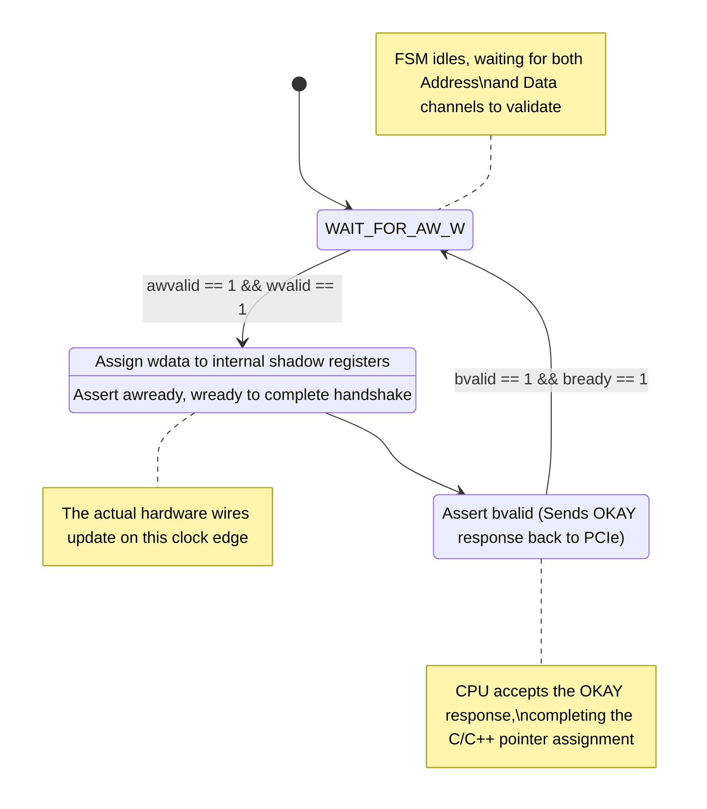
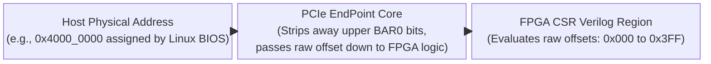
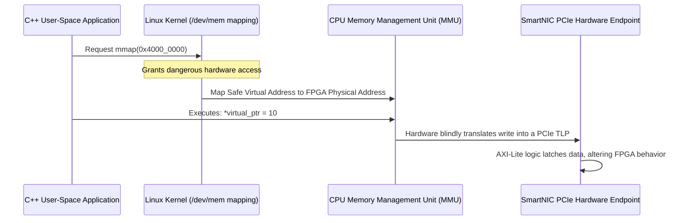

# Module Documentation: Software Control Plane (`axilite_csr.v`)

---

## 1. Module Overview & Mathematical Theory

The `axilite_csr.v` (Control and Status Registers) module functions as the vital bridge between the high-speed 250 MHz Verilog Datapath and the external Software Control Plane. 

In a production SmartNIC (like an Alveo card running the OpenNIC shell), a standard CPU running a Linux kernel or DPDK application needs a mechanism to dynamically alter the behavior of the FPGA logic without physically recompiling the bitstream. For example, if a network administrator types `ip route add 192.168.2.0/24 dev fpga0` into the server's bash terminal, that string of text must somehow be translated into electrical signals inside the Flow Classifier's TCAM rules.

### Memory-Mapped I/O (MMIO) and AXI4-Lite
This module solves this using Memory-Mapped I/O (MMIO) via the standard AXI4-Lite protocol. The FPGA's PCIe endpoint maps this module's registers to physical hexadecimal memory addresses in the Host PC's RAM space. 

When a C/C++ driver executes a simple pointer assignment:
`* (volatile uint32_t *) 0x40000104 = 0xC0A8010A;`
The PCIe bus generates an AXI4-Lite Write Transaction. This module intercepts that transaction, decodes the address offset (`0x104`), and physically latches the data (`0xC0A8010A` / `192.168.1.10`) into the routing configuration wires connected to the datapath.

---

## 2. Architectural Diagrams

### 2.1 Address Translation

```mermaid
block-beta
  columns 3
  
  Host["Linux Host CPU\nC/C++ Driver\n(Writes to PCIe MMIO physical addresses)"]
  CSR["axilite_csr.v\nAddress Decoder & State Machine\n(Translates memory writes into electrical pulses)"]
  Hardware["Datapath Modules\n(Flow Classifier, Scheduler)\n(Instantly updates functionality via config wires)"]
  
  Host --> |"AXI-Lite Writes (32-bit payloads)"| CSR
  CSR --> |"Shadow Configuration Wires (e.g., cfg_dst_ip)"| Hardware
```

### 2.2 The AXI-Lite Write State Machine

The AXI4-Lite write protocol requires synchronizing the Write Address Channel (`AW`), Write Data Channel (`W`), and Write Response Channel (`B`).



---

## 3. Interface Specifications

| Port Name | Direction | Width | Description |
| :--- | :--- | :--- | :--- |
| `clk` / `rst_n` | Input | 1 | Shared clock domain. |
| **Write Address Channel** | | |
| `s_axi_awaddr` | Input | 32 | The target 32-bit memory address. |
| `s_axi_awvalid` | Input | 1 | Indicates address is valid. |
| `s_axi_awready` | Output | 1 | Handshake acknowledgment. |
| **Write Data Channel** | | |
| `s_axi_wdata` | Input | 32 | The 32-bit payload to be written. |
| `s_axi_wstrb` | Input | 4 | Byte write strobes (usually 4'b1111). |
| `s_axi_wvalid` | Input | 1 | Indicates data is valid. |
| `s_axi_wready` | Output | 1 | Handshake acknowledgment. |
| **Write Response Channel** | | |
| `s_axi_bresp` | Output | 2 | Response code (`00` = OKAY). |
| `s_axi_bvalid` | Output | 1 | Indicates response is valid. |
| `s_axi_bready` | Input | 1 | Handshake from the CPU. |

*(The identical 5-channel AXI Read signals `AR` and `R` are also present).*

---

## 4. Internal Architecture & The Commit Trigger

### 4.1 The Configuration Problem
A single rule for the Flow Classifier is immense. It requires an IP, IP Mask, Port, Port Mask, and Queue ID. This spans multiple 32-bit AXI transactions.
If the Linux driver writes the new IP address (`0x104`), and then the CPU gets interrupted for 1 millisecond before writing the Queue ID (`0x110`), the hardware is sitting in a "half-configured" state. If a 100 Gbps stream of packets hits the Classifier during that 1 millisecond, it will route traffic based on a corrupted, hybrid rule.

### 4.2 The Atomic Commit Solution
To prevent this, `axilite_csr.v` employs a "Commit Trigger" architecture. The configuration wires connected to the datapath are driven by temporary "shadow" registers inside the CSR. 

The datapath completely ignores the `cfg_dst_ip` and `cfg_slice_id` wires until the CSR pulses the `cfg_wr_en` wire.

```verilog
    wire slv_reg_wren = s_axi_wready && s_axi_wvalid && s_axi_awready && s_axi_awvalid;
    wire [11:0] write_offset = waddr_reg[11:0];

    always @(posedge clk) begin
        fc_cfg_wr_en <= 1'b0; // Default to zero!

        if (slv_reg_wren) begin
            case (write_offset)
                12'h104: fc_cfg_dst_ip      <= s_axi_wdata;
                12'h10C: fc_cfg_dst_port    <= s_axi_wdata[15:0];
                12'h110: fc_cfg_slice_id    <= s_axi_wdata[3:0];
                
                // The Trigger Address!
                12'h100: begin
                    fc_cfg_rule_id <= s_axi_wdata[3:0];
                    fc_cfg_wr_en   <= 1'b1; // Generate exactly 1 cycle pulse!
                end
            endcase
        end
    end
```
Because `fc_cfg_wr_en` defaults to `0` at the top of the `always` block, it will only ever equal `1` for the exact clock cycle that the CPU writes to offset `0x100`. On the very next clock cycle, it instantly snaps back to `0`. 

The software driver is instructed to write all parameters first (Offsets `0x104` to `0x110`), and then perform a final write to `0x100`. This triggers the single-cycle commit pulse, transferring all 128 bits of the rule into the Datapath's TCAM perfectly simultaneously.

### 4.3 Bit-Packing Optimization
The Priority Scheduler requires parameters like `Queue ID` (4 bits) and `Priority` (2 bits). Using two separate 32-bit AXI transactions for a total of 6 bits of data wastes PCIe bandwidth. The CSR uses bit-packing to extract multiple variables from a single write:

```verilog
    12'h200: begin
        sch_cfg_queue_id     <= s_axi_wdata[3:0];
        sch_cfg_priority     <= s_axi_wdata[5:4];
        sch_cfg_queue_enable <= s_axi_wdata[31];
        sch_cfg_wr_en        <= 1'b1;
    end
```

---

## 5. Timing & Area Considerations

### 5.1 Clock Domain Crossings (CDC)
In this implementation, the AXI-Lite bus and the Datapath operate on the exact same 250 MHz clock domain. However, in heavily integrated systems (like the OpenNIC shell), the AXI-Lite bus driven by the PCIe endpoint typically operates at 125 MHz to ease timing closure, while the datapath runs at 250 MHz.
**Production Modification:** If deployed in such a shell, asynchronous FIFOs or multi-cycle path Gray-code synchronizers must be inserted on the `cfg_*` wires to safely cross the clock domain boundary.

### 5.2 Resource Utilization
- **LUTs**: ~150 (Dominated by the large `case` statement address decoder).
- **Flip-Flops**: ~200 (Shadow registers for the configuration data).

---

## 6. Execution Walkthrough (Cycle-by-Cycle Trace)

**Scenario:** Software wants to assign the `10.0.0.0/8` subnet to Queue 3.

1. **Transaction 1 (`0x104`):** CPU writes `0x0A000000`. AXI handshake completes. CSR latches `0x0A000000` into `fc_cfg_dst_ip`.
2. **Transaction 2 (`0x108`):** CPU writes `0xFF000000`. AXI handshake completes. CSR latches it into `fc_cfg_dst_ip_mask`.
3. **Transaction 3 (`0x110`):** CPU writes `0x3`. CSR latches it into `fc_cfg_slice_id`.
4. **Transaction 4 (`0x100`):** CPU writes `0x0` (Targeting Rule 0). 
   - AXI handshake completes.
   - CSR latches `0` into `fc_cfg_rule_id`.
   - CSR asserts `fc_cfg_wr_en = 1` for a single clock cycle.
5. **Execution:** The downstream Flow Classifier detects `fc_cfg_wr_en = 1`. It instantly reads all the static wires driven by the CSR and overwrites Rule 0 in its TCAM array.

---

## 7. Deep Dive: Exhaustive Register Map Specification

To write a software driver that interacts with the FPGA, the software engineer requires a flawless map of the memory offsets. A single mismatched bit will cause the Linux kernel driver to write data to the wrong Verilog flip-flop, causing catastrophic hardware failure.

### Base Address Translation



The Xilinx QDMA PCIe Endpoint allocates a "Base Address Register" (BAR) to the User Logic. For example, the PCIe bus might map the FPGA to physical RAM address `0x4000_0000`. All offsets below are relative to this Base Address.

### Flow Classifier Region (0x100 - 0x1FF)
This region controls the 16-rule TCAM array. Because of the atomic commit architecture, the Trigger Address MUST be written last.

| Offset | Register Name | Access | Bits | Description |
| :--- | :--- | :--- | :--- | :--- |
| **`0x104`** | `FC_DST_IP` | R/W | `[31:0]` | The Destination IPv4 address to match. |
| **`0x108`** | `FC_DST_IP_MASK` | R/W | `[31:0]` | Subnet mask (`0xFFFFFFFF` for exact match). |
| **`0x10C`** | `FC_DST_PORT` | R/W | `[15:0]` | The Destination UDP Port to match. |
| **`0x110`** | `FC_SLICE_ID` | R/W | `[3:0]` | The target hardware Queue ID (`0` to `3`) assigned if this rule hits. |
| **`0x100`** | `FC_COMMIT_TRIGGER` | W-Only| `[3:0]` | **TRIGGER:** Bits [3:0] define the Rule Index (`0` to `15`) to overwrite. Writing to this address physically commits the data from offsets `0x104`-`0x110` into the TCAM array in 1 clock cycle. |

### Priority Scheduler & QoS Region (0x200 - 0x2FF)
This region controls the Strict Priority logic and the Token Bucket bandwidth shapers.

| Offset | Register Name | Access | Bits | Description |
| :--- | :--- | :--- | :--- | :--- |
| **`0x204`** | `SCH_TB_RATE` | R/W | `[31:0]` | Committed Information Rate (Tokens per Refresh Period). |
| **`0x208`** | `SCH_TB_BURST`| R/W | `[31:0]` | Committed Burst Size (Max tokens allowed in the bucket). |
| **`0x200`** | `SCH_COMMIT_TRIGGER`| W-Only| `[31:0]` | **TRIGGER:** Bit `[31]` = Queue Enable. Bits `[5:4]` = Strict Priority Level (`0`=High, `3`=Low). Bits `[3:0]` = The target Queue ID. Writing commits all QoS settings to that specific queue. |

### Hardware Statistics & Telemetry Region (0x300 - 0x3FF)
While the current core implements stubbed Read channels, production SmartNICs map massive arrays of live counters into the `0x300` region. These registers are Read-Only (RO) and are updated by the datapath.

| Offset | Register Name | Access | Bits | Description |
| :--- | :--- | :--- | :--- | :--- |
| **`0x300`** | `STAT_RX_PACKETS` | RO | `[31:0]` | Total packets parsed by the `packet_parser.v`. |
| **`0x304`** | `STAT_Q0_DROPS` | RO | `[31:0]` | Packets dropped due to Queue 0 overflow. |
| **`0x308`** | `STAT_Q3_DROPS` | RO | `[31:0]` | Packets dropped due to Queue 3 overflow. |

---

## 8. Advanced Architecture: PCIe BAR Space & Linux Driver Mapping

Writing to these Verilog registers is not as simple as writing to standard computer RAM. The operating system actively protects hardware memory spaces. 

### The Linux `mmap()` Paradigm



When the Linux Host boots, the PCIe subsystem enumerates the FPGA. It assigns the FPGA's AXI-Lite bus to a physical memory address (e.g., `0x4000_0000`). This is a **Physical Address**.
Standard C/C++ applications run in **Virtual Memory Space** and cannot touch physical addresses directly. Attempting to write to `0x4000_0000` from a C program will immediately result in a Segfault (`SIGSEGV`).

To bypass this, the software engineer must use the Linux `/dev/mem` device and the `mmap()` system call. `mmap()` asks the Linux kernel to create a temporary mapping between the application's safe Virtual Memory and the FPGA's dangerous Physical Memory.

### C/C++ Driver Code Example
The following C code perfectly illustrates how a software driver triggers the Verilog `fc_cfg_wr_en` pulse via the AXI-Lite bus.

```c
#include <stdio.h>
#include <fcntl.h>
#include <sys/mman.h>
#include <stdint.h>

#define FPGA_BASE_ADDR 0x40000000 // PCIe BAR0 Assigned Address
#define MAP_SIZE 4096             // Map 4KB of AXI-Lite space

int main() {
    // 1. Open the physical memory device (Requires Root)
    int fd = open("/dev/mem", O_RDWR | O_SYNC);
    
    // 2. Map the physical FPGA memory into virtual memory
    void *map_base = mmap(0, MAP_SIZE, PROT_READ | PROT_WRITE, MAP_SHARED, fd, FPGA_BASE_ADDR);
    
    // 3. Create pointer access to the registers
    volatile uint32_t *csr_base = (volatile uint32_t *) map_base;
    
    // 4. Perform the AXI-Lite Writes (Writing to the shadow registers first)
    // Offset 0x104 (in bytes) is index 0x41 (in 32-bit words)
    csr_base[0x104 / 4] = 0x0A000001; // Write IP 10.0.0.1
    csr_base[0x108 / 4] = 0xFFFFFFFF; // Write IP Mask /32
    csr_base[0x110 / 4] = 0x00000000; // Write Queue ID 0
    
    // 5. Fire the Commit Trigger! (Writes to offset 0x100)
    // This generates the single-cycle 'fc_cfg_wr_en' pulse in Verilog
    csr_base[0x100 / 4] = 0x00000000; // Overwrite Rule 0
    
    printf("TCAM Rule 0 Successfully Committed to FPGA silicon!\n");
    return 0;
}
```

### The Endianness Trap
Notice how the Verilog expects a 32-bit IP address. In networking, IP addresses are usually represented in Big-Endian format (e.g., `10.0.0.1` = `0x0A000001`). However, x86 Intel/AMD CPUs are Little-Endian. If the C programmer uses standard socket libraries to generate the IP address, the CPU will reverse the bytes before blasting them over the PCIe bus to the FPGA. 
The AXI-Lite logic in the FPGA is fundamentally agnostic to endianness; it just blindly latches the 32 bits into the flip-flops. Therefore, the Linux driver must explicitly execute byte-swapping macros (like `htonl()` - Host to Network Long) before performing the MMIO write, ensuring the Verilog TCAM comparisons match exactly.

---

## 9. Production Validation: AXI-Lite Protocol Fuzzing

While the C code above demonstrates standard operation, malicious or poorly written software drivers can crash the entire server by violating the AXI-Lite protocol. 
If the Linux kernel attempts to read a register, it asserts `arvalid`. If the FPGA's AXI-Lite State Machine hangs and never returns an `rvalid` handshake, the PCIe bus locks up. The Linux Kernel will physically freeze (Kernel Panic) waiting for the PCIe read to complete.

### UVM Fuzzing Tactics

```mermaid
flowchart LR
    A["UVM SystemVerilog Sequence\n(Generates malicious/corrupted\nAXI-Lite transactions)"] --> B{"Fuzz Scenario Selection"}
    
    B -->|Backpressure Attack| C["Drop 'bready' to 0\n(Forces FPGA to hang)"]
    B -->|Invalid Byte Strobe| D["Set wstrb = 4'b0110\n(Illegal partial write)"]
    B -->|Out-of-Bounds Address| E["Write to 0xFFF0\n(Targets missing case statement)"]
    
    C --> F("axilite_csr.v\nDevice Under Test")
    D --> F
    E --> F
    
    F --> G{"Does FPGA Return Valid Response?"}
    G -->|Returns bvalid / rvalid (even if Error)| H["PASS\n(Host server remains stable)"]
    G -->|Fails to respond (Hangs PCIe Bus)| I["FATAL FAIL\n(Host server will Kernel Panic)"]
```

To prevent this, Verification Engineers subject the `axilite_csr.v` module to massive automated Fuzz Testing using SystemVerilog.
1. **Backpressure Fuzzing:** The testbench randomly drops `bready` to 0, forcing the FPGA to hold the `bvalid` (Response OK) state for thousands of cycles.
2. **Invalid Byte Strobes:** The testbench drives `wvalid` but sets `wstrb` to `4'b0110` (attempting to write only the middle 2 bytes of the register).
3. **Out-of-Bounds Addressing:** The testbench attempts to write to offset `0xFFF0`, which is not mapped in the `case` statement.

**The Golden Standard:** No matter how maliciously the software acts, the FPGA's AXI-Lite state machine must ALWAYS eventually return an AXI response (`bvalid` or `rvalid`), even if it returns an AXI Error Code (`SLVERR`). This guarantees the SmartNIC can never take down the host Server's operating system.
