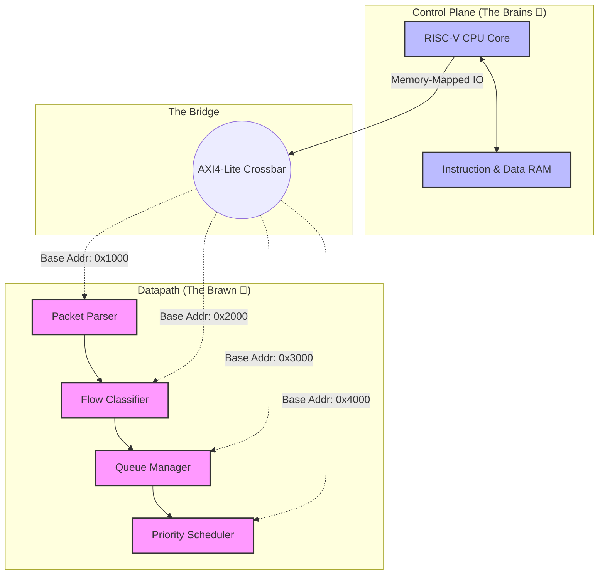

# 🧠 Chunk 5: The Slow Path — RISC-V Control Plane

> [!NOTE]
> **Why do we need a CPU inside the FPGA?**
> We just spent 4 chunks building the "Fast Path" (Parser, Classifier, Queue Manager, Scheduler) in pure Verilog logic. It runs blazingly fast at 100 Gbps, but it is **inflexible**. 
> What if the network administrator wants to add a new 5G Network Slice? You can't rewrite the Verilog code and reboot the hardware while live traffic is flowing!
> 
> The solution is to add a **"Slow Path"**: A tiny CPU core running C-code that can talk to our hardware pipeline to update its settings on the fly.

---

## 1. System-on-Chip (SoC) Architecture 🏗️

In Tier 2 of this project, we will literally synthesize a 32-bit CPU directly into the FPGA logic alongside our SmartNIC datapath. We will use the **RISC-V RocketChip** open-source core.

To make the CPU talk to our hardware, we connect them using an **AXI4-Lite Bus**.

| AXI4-Stream (The Fast Path) | AXI4-Lite (The Slow Path) |
| :--- | :--- |
| Used to move raw packets at 100 Gbps. | Used by the CPU to read/write config registers. |
| Has no addresses. Just a continuous river of data. | Has memory addresses (e.g., `0x4000_1008`). |
| Massive 512-bit width. | Standard 32-bit width. |

---

## 2. What the Firmware Does 📜

Once the RISC-V core is connected via AXI-Lite, we will write **Bare-Metal C Firmware**. 
The firmware will sit in an infinite `while(1)` loop, acting as the brain of the SmartNIC. 

Here are the 3 main jobs of the firmware:

### A. Dynamic Rule Updates
The network administrator sends a command to the SmartNIC: *"Route all traffic for IP 10.0.5.5 to the URLLC queue."*
The RISC-V firmware calculates the TCAM rule bits, writes them to memory address `0x2004`, and the **Flow Classifier instantly updates its routing table** without dropping a single packet.

### B. QoS Tuning
The firmware monitors the network load. If it notices the URLLC queue is constantly full, it writes to memory address `0x4010` to increase the **Token Bucket Rate Limit** inside the Priority Scheduler, granting it more bandwidth.

### C. Telemetry Reporting
Every module in our datapath has "Counters" (e.g., *Packets Received*, *Bytes Dropped*). The RISC-V core constantly reads these counters via AXI-Lite and sends a neat summary report up the PCIe bus to the host server so the administrator can see network health on a dashboard.

---

> [!IMPORTANT]
> **This concludes the SmartNIC Academic Documentation Suite!** 🎉
> We have successfully documented the core foundations, the Fast Path, the Queues, the QoS Scheduler, and the future RISC-V integration. You now have a complete, highly-visual research handbook for your project!
