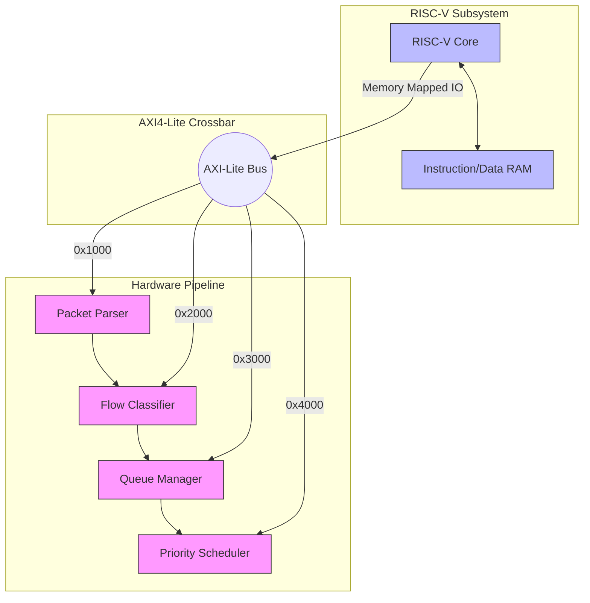

# 8. Future Scope: RISC-V Control Plane (Tier 2)

## Theoretical Background: Fast Path vs. Slow Path

Modern network architectures divide tasks into two planes:
1. **The Datapath (Fast Path):** Pure hardware logic (Verilog) that processes 99% of packets at extreme speeds (100 Gbps).
2. **The Control Plane (Slow Path):** A CPU running software that handles complex, infrequent tasks like updating routing tables, handling ARP requests, or processing ICMP (pings).

For our SmartNIC, the Fast Path is the Verilog pipeline we built in Tier 1. The Slow Path will be a **RISC-V Soft-Core** (like RocketChip or PicoRV32) synthesized directly into the FPGA alongside our pipeline.

## Planned System-on-Chip (SoC) Architecture

In Tier 2, we will wrap our RTL pipeline in an AXI-Lite memory map and attach it to the RISC-V core.

### What the Firmware Will Do

We will write C-code for the RISC-V core to perform the following:
1. **Dynamic Routing:** Update the TCAM rules inside the Flow Classifier dynamically (e.g., adding a new 5G slice for a new customer).
2. **QoS Tuning:** Adjust the priority mapping and Token Bucket rates in the Scheduler dynamically based on network load.
3. **Telemetry:** Read the packet counters from the modules and stream statistics to a central datacenter controller.
