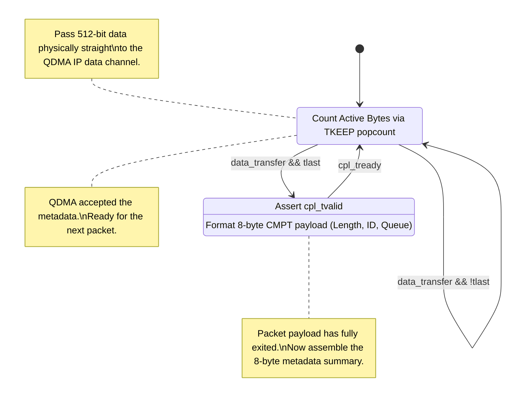
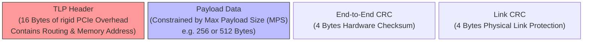
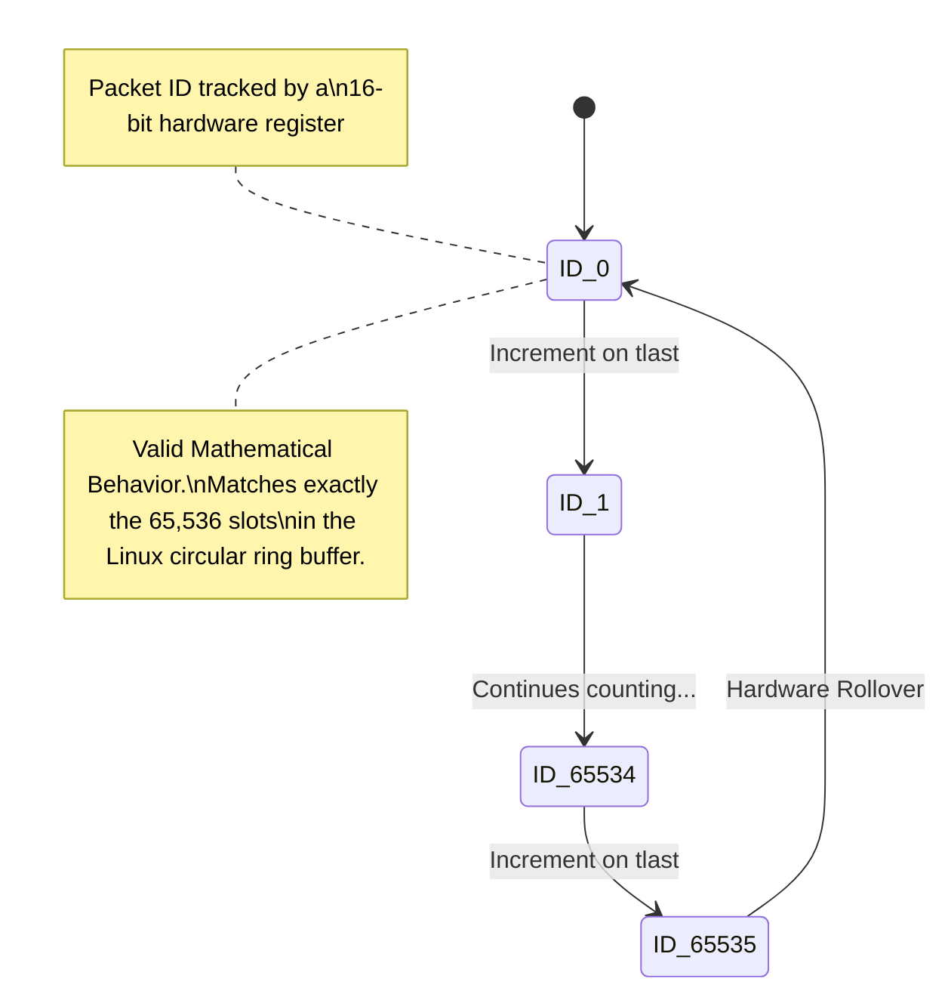

# Module Documentation: QDMA C2H Bridge (`qdma_c2h_bridge.v`)

---

## 1. Module Overview & Mathematical Theory

The `qdma_c2h_bridge.v` (Card-to-Host) module serves as the critical egress bridge between the SmartNIC's internal AXI-Stream datapath and the host server's PCIe complex. It takes perfectly sorted, QoS-guaranteed traffic leaving the Priority Scheduler and prepares it for direct memory access (DMA) into the host CPU's RAM.

In traditional NICs, the card simply blasts packets up the PCIe bus, and the CPU wastes millions of clock cycles polling memory or parsing packet headers to figure out where one packet ends and another begins.

### The OpenNIC C2H Completion Architecture
To solve this, advanced PCIe subsystems like the AMD/Xilinx QDMA (Queue DMA) use a dual-channel architecture. 
The QDMA IP requires:
1. **The Data Channel:** A standard 512-bit AXI-Stream bus transferring the actual raw packet payload.
2. **The Completion Channel (CMPT):** A dedicated, parallel sideband channel that transfers an 8-byte metadata summary *after* every packet finishes. 

The OpenNIC Linux driver relies absolutely on this Completion packet. It reads the CMPT packet to instantly know the total byte length of the transfer, the Queue ID it originated from, and a sequential Packet ID. This allows the driver to manage its ring buffers with zero CPU parsing overhead.

The primary role of the `qdma_c2h_bridge.v` is to transparently forward the payload data while dynamically computing and formatting the 8-byte CMPT metadata in real-time.

---

## 2. Architectural Diagrams

### 2.1 Dual-Channel Generation

```mermaid
block-beta
  columns 3
  
  Datapath["Egress Datapath\n(Sourced from Priority Scheduler)\nEmits standard AXI-Stream packets"]
  Bridge["qdma_c2h_bridge.v\nData Passthrough logic\nOn-the-fly Completion Metadata Generator"]
  QDMA["Xilinx QDMA PCIe IP\n(Performs separate DMA transfers\nfor payload and completion)"]
  
  Datapath --> |"512-bit Data + 128-bit TUSER"| Bridge
  Bridge --> |"512-bit Raw Payload Data stream"| QDMA
  Bridge --> |"8-byte CMPT Metadata stream"| QDMA
```

### 2.2 Completion State Logic



---

## 3. Interface Specifications

| Port Name | Direction | Width | Description |
| :--- | :--- | :--- | :--- |
| `clk` | Input | 1 | 250 MHz core clock. |
| `rst_n` | Input | 1 | Active-low synchronous reset. |
| **Datapath Ingress** | | |
| `s_axis_tdata` / `tkeep` | Input | 512/64 | Packet payload from the Scheduler. |
| `s_axis_tuser` | Input | 128 | Contains the Queue ID (`SLICE_ID`). |
| `s_axis_tvalid`/`tready`/`tlast` | In/Out | 1 | Standard AXI-Stream. |
| **QDMA Data Channel Output** | | |
| `m_axis_qdma_c2h_tdata` | Output | 512 | Direct passthrough to QDMA Data channel. |
| `m_axis_qdma_c2h_tvalid` | Output | 1 | Validates QDMA data. |
| `m_axis_qdma_c2h_tready` | Input | 1 | QDMA backpressure. |
| **QDMA CMPT Channel Output** | | |
| `m_axis_qdma_cpl_tdata` | Output | 256 | The Completion payload (Only lower 64 bits used). |
| `m_axis_qdma_cpl_size` | Output | 2 | Defined as `2'b00` (8 bytes). |
| `m_axis_qdma_cpl_tvalid` | Output | 1 | Triggered strictly on `tlast`. |

---

## 4. Internal Architecture & Arithmetic Extraction

### 4.1 Deadlock Prevention via Interlocked Backpressure
The most dangerous failure mode in dual-channel DMA involves deadlocks. If the QDMA Data channel is ready, but the QDMA CMPT channel is full/stalled, passing payload data will result in missing completion packets.

```verilog
    assign s_axis_tready = m_axis_qdma_c2h_tready && (!m_axis_qdma_cpl_tvalid || m_axis_qdma_cpl_tready);
```
This single line of combinational logic physically interlocks the channels. The bridge will *refuse* to accept data from the SmartNIC (`s_axis_tready = 0`) unless BOTH the QDMA Data channel is ready AND the Completion channel is capable of accepting the CMPT packet. This mathematically prevents desynchronization.

### 4.2 Dynamic Byte Counting
The CMPT packet demands the exact byte length of the transfer. Because 512-bit beats contain up to 64 bytes, and the final beat might only contain 12 valid bytes, the module dynamically calculates the active bits in the `tkeep` mask.

```verilog
    function [6:0] count_ones;
        input [63:0] keep_mask;
        integer i;
        begin
            count_ones = 0;
            for (i = 0; i < 64; i = i + 1) begin
                if (keep_mask[i]) count_ones = count_ones + 1;
            end
        end
    endfunction
```
The `count_ones` function is physically unrolled into a massively parallel bit-adder tree (a 64-input combinatorial popcount circuit). On every clock cycle, this popcount is added to an accumulator register (`packet_byte_count`), tracking the exact byte footprint.

### 4.3 Completion Formatting
Upon detecting `tlast`, the module assembles the 8-byte CMPT structure requested by the Linux driver.

```verilog
    // OpenNIC Format: [15:0] Packet ID, [31:16] Byte Length, [47:32] Queue ID
    m_axis_qdma_cpl_tdata[15:0]  <= packet_id_counter;
    m_axis_qdma_cpl_tdata[31:16] <= packet_byte_count + count_ones(s_axis_tkeep);
    m_axis_qdma_cpl_tdata[47:32] <= {12'd0, s_axis_tuser[`TUSER_SLICE_ID_HI:`TUSER_SLICE_ID_LO]};
```
The Queue ID is seamlessly extracted from the `TUSER` sideband, exactly as it was classified by the `flow_classifier.v` earlier in the pipeline.

---

## 5. Timing & Area Considerations

### 5.1 Combinatorial Popcount Limits
The `count_ones` popcount logic must evaluate 64 input bits and sum them into a 7-bit integer. Doing this in a single clock cycle requires a deep tree of LUTs. At 250 MHz, this popcount sits squarely on the critical timing path. 
If the AXI bus width was increased to 1024 bits (for 400 Gbps designs), the popcount would become 128-bits wide, which would definitively fail timing closure and require splitting into a two-cycle pipelined adder.

### 5.2 Resource Utilization Estimates
- **LUTs**: ~250 (The 64-bit popcount tree and 16-bit adders).
- **Flip-Flops**: ~300 (The massive 256-bit `cpl_tdata` register and byte accumulators).

---

## 6. Execution Walkthrough (Cycle-by-Cycle Trace)

**Scenario:** A 1500-byte packet arrives destined for Host RAM.

**Cycle 1 to 23:**
- `s_axis_tvalid = 1`, `s_axis_tlast = 0`.
- All 64 `tkeep` bits are high. The popcount outputs `64`.
- The accumulator adds `64` every cycle. (By Cycle 23, accumulator = `1472`).
- Payload data flows directly out `m_axis_qdma_c2h_tdata`.

**Cycle 24 (End of Packet):**
- `s_axis_tlast = 1`.
- The final 28 bytes arrive (28 `tkeep` bits high). Popcount outputs `28`.
- Total packet size = 1472 + 28 = `1500`.
- The CMPT generation block triggers.
- `m_axis_qdma_cpl_tvalid` goes high. `m_axis_qdma_cpl_tdata[31:16]` is loaded with `1500` (hex `0x05DC`). `packet_id_counter` increments.

**Cycle 25:**
- The QDMA subsystem accepts the CMPT packet (`m_axis_qdma_cpl_tready = 1`).
- `m_axis_qdma_cpl_tvalid` clears to `0`, ready for the next packet.

---

## 7. Deep Dive: PCIe Gen4 Transaction Layer Physics

To truly comprehend the significance of this `qdma_c2h_bridge.v`, one must understand how the Xilinx QDMA endpoint translates our 512-bit AXI-Stream beats into actual electrical signals on the motherboard.

### The PCIe TLP (Transaction Layer Packet)



When this module pushes 512 bits (64 bytes) of data into `m_axis_qdma_c2h_tdata`, it doesn't immediately appear in the CPU's RAM. The QDMA endpoint wraps the 64 bytes into a PCIe **Transaction Layer Packet (TLP)**. 
A TLP requires headers (usually 16 bytes for a Memory Write request). If the SmartNIC generates a 64-byte payload, and the PCIe wrapper adds a 16-byte header, 20% of the PCIe bus bandwidth is instantly wasted on overhead. 

**Max Payload Size (MPS) Tuning:**
To maximize efficiency, PCIe defines a Max Payload Size (usually 256 or 512 bytes). 
If our `qdma_c2h_bridge` passes a 1500-byte Ethernet packet, the QDMA IP must mathematically chop it into smaller chunks (e.g., three 512-byte TLPs). The bridge logic doesn't care—it just passes a continuous AXI stream. The QDMA IP handles the physical PCIe chop autonomously.

### Completion Generation vs. PCIe Interrupts
The true genius of the `m_axis_qdma_cpl_tdata` channel becomes apparent here. 
In old NIC architectures, after the NIC finished DMA-ing the 1500 bytes into RAM, it had to send a hardware **Interrupt (MSI-X)** to the CPU. 
Hardware interrupts are slow. The CPU must pause its current task, perform a context switch into kernel space, execute the Interrupt Service Routine (ISR), and then hunt through RAM to find the packet. At 100 Gbps, sending 100 million interrupts per second would physically crash the CPU.

### The DPDK Poll Mode Driver (PMD) Paradigm

```mermaid
flowchart TD
    A["DPDK User-Space Application\n(Runs entirely in CPU user space,\nzero context switching)"] --> B("Infinite 'while(1)' polling loop")
    B --> C{"Read Completion Ring RAM\n(Is the 8-byte CMPT struct present?)"}
    
    C -->|Empty (No new traffic)| B
    C -->|CMPT Packet Found!| D["Extract Byte Length & Queue ID\n(Calculated natively by qdma_c2h_bridge.v)"]
    
    D --> E["Read Exact Payload Bytes directly\nfrom the isolated RX Ring RAM"]
    E --> F["Process Packet / Route to Virtual Machine"]
    F --> B
```

Our bridge prevents this by sending the 8-byte CMPT packet via DMA instead of an interrupt. 
1. The QDMA writes the 1500 bytes of payload into a specific region of Host RAM (The RX Ring).
2. It then writes the 8-byte CMPT packet into a *separate* region of Host RAM (The Completion Ring).
3. The Linux CPU, running a high-speed DPDK application (Poll Mode Driver), never waits for interrupts. It simply spins in an infinite `while(1)` loop, constantly reading the memory address of the Completion Ring.
4. The instant the 8-byte CMPT data appears in RAM, the CPU reads the `Byte Length` and `Queue ID` fields we generated in our Verilog block. It then knows exactly how many bytes to extract from the RX Ring.

This architectural shift from "Interrupt-Driven" to "Polling-Driven" is the fundamental secret to achieving 100 Gbps line-rate networking on x86 servers, and our `qdma_c2h_bridge.v` module is the engine that provides the required metadata.

---

## 8. Advanced Architecture: The CMPT Packet ID Overflow Vulnerability



Notice the `packet_id_counter` logic in our completion generator:
```verilog
    reg [15:0] packet_id_counter;
    always @(posedge clk) begin
        if (!rst_n) packet_id_counter <= 0;
        else if (generate_cmpt) packet_id_counter <= packet_id_counter + 1;
    end
```
Because it is a 16-bit register, after transferring 65,535 packets, it physically rolls over to `0`. 

**Is this a bug?** 
No. In fact, it is a mathematical requirement for Linux Ring Buffers. 
The OpenNIC software driver allocates exactly 65,536 slots in the host RAM's Completion Ring. As the driver processes the CMPT packets, it expects the `Packet ID` to sequentially increment and eventually lap itself, perfectly mirroring the circular nature of the RAM buffer.

If our Verilog somehow skipped an ID (e.g., 5, 6, 8, 9...), the software driver would assume a PCIe TLP was dropped by the motherboard, declare a fatal hardware desynchronization error, and crash the network interface to prevent data corruption. Thus, verifying that `packet_id_counter` increments with absolute flawless continuity under all backpressure conditions is the most critical UVM assertion for this module.
