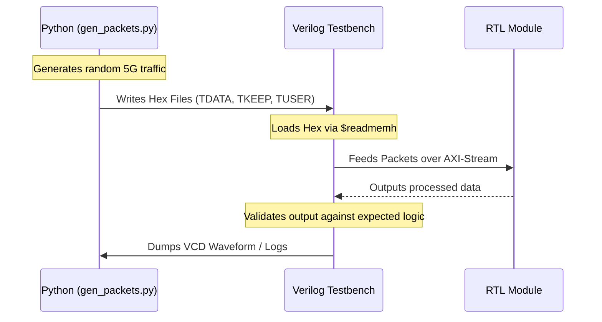

# 9. Verification Framework

## Theoretical Background

Testing hardware is fundamentally different from testing software. You cannot simply `printf` your way out of a bug because millions of signals are flipping simultaneously every nanosecond. 

Hardware is validated using **Testbenches**—non-synthesizable Verilog code that wraps around the hardware module (the Device Under Test, or DUT). The testbench acts as a virtual environment, providing clock signals, feeding input data (stimulus), and monitoring outputs.

## Our Simulation-First Framework

For the Tier 1 MVP, we built a fully automated simulation loop using Python and Icarus Verilog.

### The Python Packet Generator
`scripts/gen_packets.py` generates synthetic Ethernet/IPv4/UDP packets tailored to our 4 Traffic Classes:
- URLLC (Port 5001)
- Voice (Port 5060)
- eMBB (Port 8080)
- IoT (Port 1883)

It splits these packets into 64-byte beats and saves them as raw hexadecimal strings in `.hex` files. 

### The Verilog Testbenches
We wrote 4 modular testbenches (one for each RTL module):
- `tb_packet_parser.v`: Verifies headers are correctly extracted into `TUSER`.
- `tb_flow_classifier.v`: Verifies the TCAM assigns the correct `Slice ID`.
- `tb_queue_manager.v`: Verifies FIFO ordering and memory isolation.
- `tb_priority_scheduler.v`: The master test. Injects mixed traffic and calculates cycle-accurate latency for every packet.

### Latency Tracking (The MVP Proof)
In the scheduler testbench, we maintain two memory arrays: `enqueue_time` and `dequeue_time`. Every time a packet enters the queue manager, we log the exact clock cycle. When it leaves the scheduler, we log the cycle again and subtract to find the absolute latency. This mathematically proves our QoS thesis.
