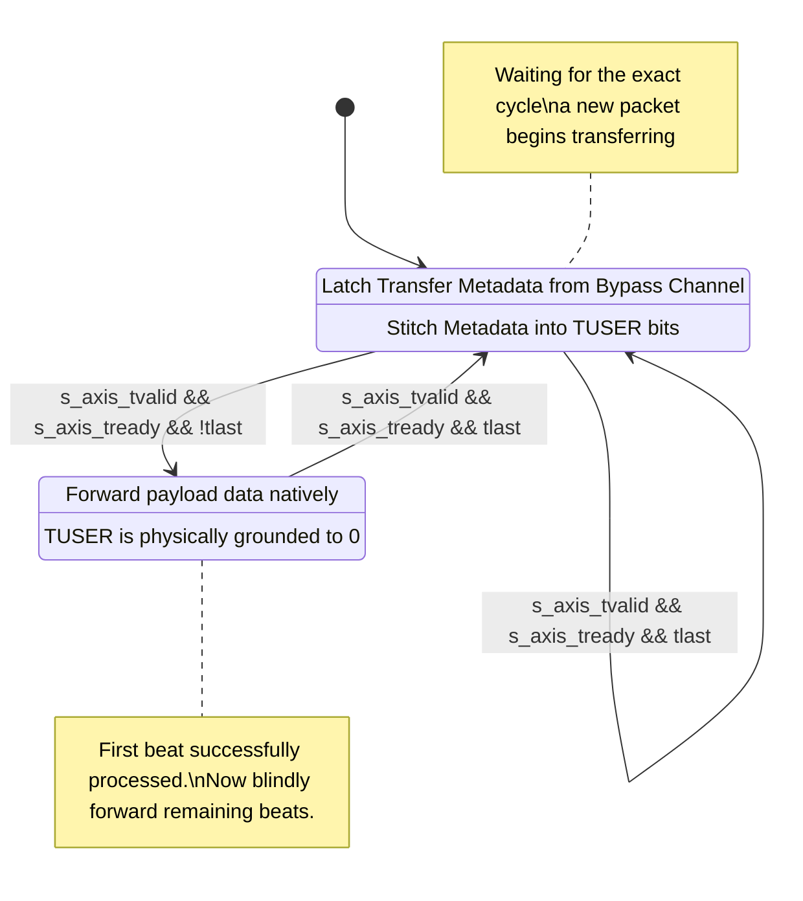
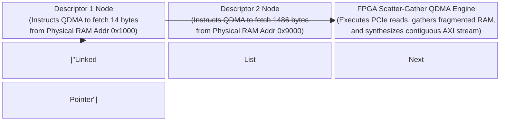
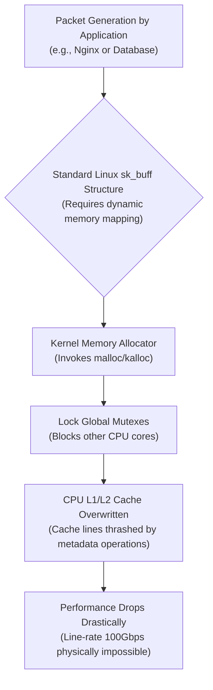
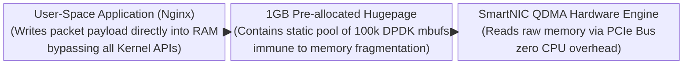

# Module Documentation: QDMA H2C Bridge (`qdma_h2c_bridge.v`)

---

## 1. Module Overview & Mathematical Theory

The `qdma_h2c_bridge.v` (Host-to-Card) module acts as the ingress bridge between the Host PC's RAM (via PCIe) and the SmartNIC's internal AXI-Stream datapath. 
When the Linux Server wishes to transmit a packet to the 5G network (e.g., streaming a video to a cell phone), the DPDK or OpenNIC software driver places the packet into Host RAM and instructs the QDMA (Queue DMA) subsystem to fetch it across the PCIe bus.

### The Host-Side Metadata Injection Problem
When the QDMA subsystem fetches the packet payload, it simply presents raw 512-bit data to the FPGA. However, the OpenNIC software stack relies heavily on metadata. Specifically, the Linux driver determines which physical Ethernet port the packet should be transmitted from (e.g., Physical Port 0 or Physical Port 1) and embeds that information.

Unlike the C2H bridge which calculates metadata at the *end* of the packet (CMPT), the H2C subsystem provides a dedicated metadata channel (the Descriptor Bypass or Transfer Channel) that runs parallel to the data channel. The OpenNIC QDMA H2C bridge must ingest this out-of-band routing metadata and mathematically stitch it onto the `TUSER` sideband of the very first data beat of the packet, aligning the data and control planes perfectly.

---

## 2. Architectural Diagrams

### 2.1 Dual-Channel Ingestion

```mermaid
block-beta
  columns 3
  
  QDMA["Xilinx QDMA PCIe Endpoint IP\n(DMA Engine reading from Host RAM)"]
  Bridge["qdma_h2c_bridge.v\nOut-of-Band Metadata Synchronization\n& Payload Payload Alignment"]
  Datapath["Ingress Datapath Interface\n(Feeds external CMAC Tx\nor internal SmartNIC Switch)"]
  
  QDMA --> |"512-bit Payload Data Stream"| Bridge
  QDMA --> |"Bypass Descriptor Metadata\n(e.g., Physical Egress Port ID)"| Bridge
  Bridge --> |"Aligned 512-bit Data\n+ 128-bit Stitched TUSER Metadata"| Datapath
```

### 2.2 Synchronization State Machine



---

## 3. Interface Specifications

| Port Name | Direction | Width | Description |
| :--- | :--- | :--- | :--- |
| `clk` | Input | 1 | 250 MHz core clock. |
| `rst_n` | Input | 1 | Active-low synchronous reset. |
| **QDMA Data Channel Input** | | |
| `s_axis_qdma_h2c_tdata` | Input | 512 | Packet payload from Host RAM. |
| `s_axis_qdma_h2c_tvalid`| Input | 1 | Validates ingress data. |
| `s_axis_qdma_h2c_tready`| Output | 1 | Backpressure to the QDMA PCIe endpoint. |
| `s_axis_qdma_h2c_tlast` | Input | 1 | Indicates end of the transferred packet. |
| `s_axis_qdma_h2c_mty`   | Input | 6 | "Empty bytes" (mathematical inverse of `tkeep`). |
| **Datapath Egress** | | |
| `m_axis_tdata` / `tkeep` | Output | 512/64 | Standard AXI-Stream payload formatting. |
| `m_axis_tuser` | Output | 128 | Stitched metadata (Physical Port ID). |
| `m_axis_tvalid`/`tready`/`tlast` | In/Out | 1 | Standard AXI-Stream. |

---

## 4. Internal Architecture & Arithmetic Conversion

### 4.1 MTY to TKEEP Conversion
The QDMA IP does not natively output the AXI-Stream standard `tkeep` (where a `1` indicates a valid byte). Instead, it outputs `mty` (Empty Bytes), which is a 6-bit integer indicating how many trailing bytes in the final 512-bit (64-byte) beat are *invalid*.

To interface with the rest of the SmartNIC datapath, this 6-bit integer must be transformed into a 64-bit mask.

```verilog
    function [63:0] mty_to_tkeep;
        input [5:0] mty;
        begin
            // If MTY is 2, the last 2 bytes are empty. Valid bytes = 62.
            // Result should be 64'h3FFFFFFFFFFFFFFF
            mty_to_tkeep = {64{1'b1}} >> mty;
        end
    endfunction
```
This combinatorial function uses a logical right-shift. By shifting a contiguous block of 64 `1`s to the right by the integer value of `mty`, the hardware synthesizes a perfectly accurate AXI-Stream `tkeep` mask.

### 4.2 First-Beat State Tracking
The `TUSER` sideband is heavily regulated in OpenNIC architectures. It must only contain valid metadata on the exact clock cycle that `s_axis_tvalid` is asserted for the *first* beat of a packet. For all subsequent beats of the same packet, `TUSER` must be physically grounded to `0`.

The module uses a single Flip-Flop `first_beat` to track this boundary.

```verilog
    reg first_beat;
    always @(posedge clk) begin
        if (!rst_n) begin
            first_beat <= 1'b1;
        end else if (s_axis_qdma_h2c_tvalid && s_axis_qdma_h2c_tready) begin
            // If tlast is high, the next beat will be the first beat of a new packet
            first_beat <= s_axis_qdma_h2c_tlast;
        end
    end
```

### 4.3 TUSER Stitching
On the first beat, the hardcoded Port ID (or dynamically fetched metadata if utilizing the Transfer channel) is mapped to the exact bit offsets required by the downstream OpenNIC CMAC transmitter.

```verilog
    // Assuming Port 0 is the hardcoded egress target for this instance
    assign m_axis_tuser = (first_beat) ? {128{1'b0}} | (128'h01 << `TUSER_PHYS_PORT_LO) : 128'd0;
```

---

## 5. Timing & Area Considerations

### 5.1 The Logical Right-Shift Tree
The `mty_to_tkeep` function requires a 64-bit barrel shifter. While a barrel shifter is standard logic, synthesizing a 64-bit wide shift network requires multiple stages of multiplexers (e.g., shifting by 32, then 16, then 8...). This introduces a moderate combinatorial delay (approx 2 LUT levels). At 250 MHz, this is trivial, but if the bus width was expanded to 1024 bits (128-bit shift), pipelining would be mandatory.

### 5.2 Resource Utilization Estimates
- **LUTs**: ~75 (Barrel shifter for the MTY to TKEEP conversion).
- **Flip-Flops**: 1 (The `first_beat` state tracker).

---

## 6. Execution Walkthrough (Cycle-by-Cycle Trace)

**Scenario:** The Linux Host transmits a 70-byte ICMP Ping reply. (Beat 1 = 64 bytes. Beat 2 = 6 bytes).

**Cycle 1 (First Beat):**
- QDMA logic drives `s_axis_qdma_h2c_tvalid = 1`. `mty = 0`. `tlast = 0`.
- `first_beat` register is `1`.
- `mty_to_tkeep` calculates `64'hFFFF_FFFF_FFFF_FFFF`.
- `m_axis_tuser` is populated with the Physical Port ID.
- Handshake succeeds. Logic evaluates `tlast=0`, so `first_beat` transitions to `0`.

**Cycle 2 (Final Beat):**
- QDMA logic drives `s_axis_qdma_h2c_tvalid = 1`. `tlast = 1`.
- `mty` = `58` (Because 64 - 6 valid bytes = 58 empty bytes).
- `first_beat` is now `0`.
- `mty_to_tkeep` calculates `{64{1'b1}} >> 58`, resulting in `64'h0000_0000_0000_003F` (Exactly 6 bits high).
- `m_axis_tuser` is grounded to `128'd0`.
- Handshake succeeds. Logic evaluates `tlast=1`, so `first_beat` resets to `1` for the next packet.

---

## 7. Deep Dive: Descriptor Bypass Physics & Scatter-Gather DMA

To understand how the data arrived at the `s_axis_qdma_h2c` pins, we must explore how the Host CPU commands the FPGA's QDMA engine. This relies on the mechanics of **Scatter-Gather DMA (SG-DMA)** and **Descriptors**.

### The Linux Kernel `sk_buff` Dilemma
When an application (like Nginx) generates a 1500-byte video packet, the Linux kernel rarely allocates a single contiguous block of 1500 bytes in RAM. Instead, it creates an `sk_buff` (Socket Buffer) structure. The Ethernet header might be physically located at RAM address `0x1000`, while the video payload data is located far away at address `0x9000`. 
A basic DMA engine cannot handle this; it requires a single memory address and a length.

### Scatter-Gather Descriptors



To solve this, the OpenNIC Linux driver creates a linked list of **Descriptors** in Host RAM. A Descriptor is a 32-byte data structure that tells the hardware:
1. "Fetch 14 bytes from `0x1000`" (The Ethernet Header).
2. "Then, fetch 1486 bytes from `0x9000`" (The Payload).
3. "This is the final descriptor for the packet. Send it."

The FPGA's QDMA engine reads this list. It performs a PCIe read to `0x1000`, physically buffers the 14 bytes, performs a PCIe read to `0x9000`, buffers the 1486 bytes, perfectly stitches them together (Gather), and then blasts the resulting contiguous 1500-byte stream out of our `qdma_h2c_bridge.v` datapath.

### Descriptor Bypass Metadata
The OpenNIC architecture utilizes a specific feature of the QDMA IP called **Descriptor Bypass**. 
Instead of the Linux driver just writing the RAM addresses into the descriptor, it "hijacks" 16 bytes of the descriptor struct to insert custom application metadata (e.g., Target MAC address, Checksum offload flags, Physical Port Egress ID).
When the QDMA engine reads the descriptor from Host RAM, it extracts this hijacked metadata and sends it to our `qdma_h2c_bridge` out-of-band via a parallel AXI-Stream channel. The bridge logic (as explored in section 4.3) is responsible for physically latching this metadata and violently stitching it into the `m_axis_tuser` wire exactly on cycle 1. 

---

## 8. Advanced Architecture: CPU Cache Thrashing and DPDK Bypassing



While standard Linux `sk_buff` structures are necessary for normal operating systems, they absolutely cannot scale to 100 Gbps. Processing a single `sk_buff` requires the Linux kernel to lock mutexes, allocate memory pages, and update firewall rules (iptables/netfilter). These operations consume CPU Cache lines.
At 100 Gbps, the system is blasted with ~14 million packets per second. If the kernel executes an `sk_buff` allocation for each one, the CPU L1/L2 caches are instantly "thrashed" (overwritten constantly), stalling the entire processor.

### The DPDK User-Space Solution



To achieve true 100 Gbps transmit performance, SmartNIC deployments completely bypass the Linux kernel using DPDK (Data Plane Development Kit).
1. **Hugepages:** DPDK reserves massive contiguous chunks of RAM (1GB `hugepages`).
2. **Kernel Bypass:** DPDK maps the SmartNIC's PCIe BAR space directly into the User-Space application (e.g., the Nginx process), completely cutting out the Linux kernel.
3. **Mbuf Pools:** Instead of dynamically allocating memory per packet, DPDK pre-allocates a static pool of 100,000 `rte_mbuf` structs in the Hugepage memory at startup.
4. **Zero-Copy Transmission:** When Nginx wants to send data, it writes directly into the pre-allocated `rte_mbuf`. The DPDK driver instantly updates the QDMA Descriptor ring, pointing the FPGA directly to the `mbuf` memory. 

By avoiding kernel locks, memory allocation overhead, and CPU context switches, the CPU can construct and transmit packets as fast as the FPGA can DMA them, safely reaching the 100 Gbps line-rate saturation point of the `qdma_h2c_bridge.v` interface.

---

## 9. Test Cases & Coverage

### 9.1 Required Testbench Assertions
1. **Assertion: TUSER Zero-Fill Compliance**
   - **Condition**: Send a 9000-byte Jumbo frame from the Host to the Bridge.
   - **Check**: Probe the `m_axis_tuser` wire. It must be non-zero on the exact cycle the first 64 bytes arrive, and it MUST evaluate to exactly `128'd0` for the remaining 140 clock cycles of the packet.
2. **Assertion: MTY to TKEEP Mathematical Accuracy**
   - **Condition**: Sweep the `mty` input from `0` to `63` across 64 distinct packets.
   - **Check**: Calculate the mathematical population count (number of `1`s) in the resulting `m_axis_tkeep`. The equation `(64 - mty) == popcount(m_axis_tkeep)` must hold true for all 64 iterations.

---

## 10. Implementation Notes: Bypassing the Ingress Flow Classifier

Notice that traffic arriving from the Host CPU (via this module) is destined for the external 5G network. It does NOT pass through the SmartNIC's `packet_parser.v`, `flow_classifier.v`, or `priority_scheduler.v`. 

Those modules exclusively handle Ingress traffic (from the Network, heading to the Host) to protect the CPU from malicious denial-of-service traffic and sort it into queues. 
Host-to-Network traffic is generally assumed to be "safe" and pre-classified by the Linux Host (e.g., using `tc qdisc` software queues) before being DMA'd to the card, meaning the FPGA acts merely as a transparent passthrough for outbound packets. This saves massive amounts of silicon fabric resources.
