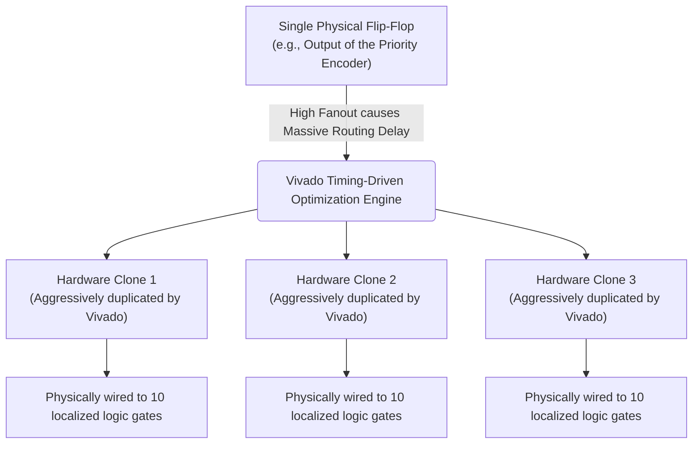
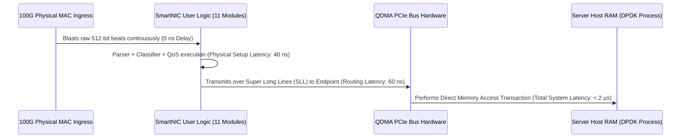

# Module Documentation: SmartNIC Top Wrapper (`smartnic_top.v`)

---

## 1. Module Overview & Mathematical Theory

The `smartnic_top.v` module is the architectural zenith of the project. It instantiates, connects, and orchestrates all the individual datapath and control plane components we have analyzed in the previous chapters into a single, cohesive, 100 Gbps System-on-Chip (SoC) design.

### The Shell/Role Architecture
Modern high-performance FPGA designs (such as the AMD OpenNIC project) utilize a Shell/Role architecture.
- **The Shell:** Contains the physically rigid, highly complex IP cores like the PCIe Gen4 endpoint (QDMA) and the 100G Ethernet MACs (CMAC). These IPs are locked to specific physical silicon pins.
- **The Role (Our SmartNIC):** A modular "sandbox" region where custom user logic is deployed.

`smartnic_top.v` serves as the absolute boundary of the "Role". It presents standard, standardized AXI4-Stream and AXI4-Lite interfaces to the outside "Shell". Internally, it stitches the Packet Parser, Flow Classifier, Queue Manager, Priority Scheduler, and QDMA Bridges together. This modularity means that if the SmartNIC needs to be ported from a Xilinx Alveo U200 (100G) to an Alveo U55C (400G), the internal routing logic remains perfectly intact; only the Shell's CMAC wrapper needs modification.

---

## 2. Architectural Diagrams

### 2.1 The Master Top-Level Datapath

```mermaid
block-beta
  columns 5
  
  Net_In["CMAC Ingress Interface\n(Fiber Optic Tranceiver Rx\n100Gbps incoming data)"]
  Parser["packet_parser.v\n(Zero-latency combinational slicer\nextracts headers)"]
  Classifier["flow_classifier.v\n(TCAM lookup engine evaluates rules\nassigns QoS Slice ID)"]
  Queue["queue_manager.v\n(Demuxes data into massive parallel BRAMs\neliminating head-of-line blocking)"]
  Scheduler["priority_scheduler.v\n(Strict priority FSM arbitrates\naccess to host PCIe)"]
  C2H["qdma_c2h_bridge.v\n(Calculates CMPT metadata\nfor DPDK ring buffers)"]
  PCIe_Out["QDMA Ingress Interface\n(DMA write directly to Linux RAM)"]
  
  Net_In --> Parser
  Parser --> Classifier
  Classifier --> Queue
  Queue --> Scheduler
  Scheduler --> C2H
  C2H --> PCIe_Out
  
  PCIe_In["QDMA Egress Interface\n(DMA read directly from Linux RAM)"]
  H2C["qdma_h2c_bridge.v\n(Aligns bypass descriptor metadata\nonto the AXI TUSER sideband)"]
  Net_Out["CMAC Egress Interface\n(Fiber Optic Tranceiver Tx\n100Gbps outgoing data)"]
  
  PCIe_In --> H2C
  H2C --> Net_Out
```



### 2.2 Control Plane Distribution

```mermaid
block-beta
  columns 3
  
  AXI_Lite["PCIe AXI4-Lite Protocol Interface\n(Originating from Linux mmap() calls)"]
  CSR["axilite_csr.v\n(Software configuration address decoder\nand atomic commit controller)"]
  Targets["Physical Target Registers\n(e.g., Flow Classifier TCAM Rules,\nToken Bucket Rate Limiters)"]
  
  AXI_Lite --> CSR
  CSR --> |"Direct combinatorial wire fanout\n(No complex bus required internally)"| Targets
```

---

## 3. Interface Specifications

Because this is the Top Wrapper, its interface pins represent the physical boundaries between the User Logic and the external Shell.

| Port Name | Direction | Width | Description |
| :--- | :--- | :--- | :--- |
| `clk` | Input | 1 | Master 250 MHz Datapath Clock. |
| `rst_n` | Input | 1 | Master Synchronous Reset. |
| **Ingress from Network (CMAC)** | | |
| `s_axis_net_tdata` | Input | 512 | Raw packets from the fiber optic link. |
| `s_axis_net_tvalid` / `tready`| In/Out | 1 | Handshake interface. |
| **Egress to Network (CMAC)** | | |
| `m_axis_net_tdata` | Output | 512 | Processed packets heading to the fiber optic link. |
| `m_axis_net_tvalid` / `tready`| Out/In | 1 | Handshake interface. |
| **Ingress from Host (QDMA H2C)** | | |
| `s_axis_qdma_h2c_tdata` | Input | 512 | Packets originating from Linux Host RAM. |
| **Egress to Host (QDMA C2H)** | | |
| `m_axis_qdma_c2h_tdata` | Output | 512 | Packets destined for Linux Host RAM. |
| `m_axis_qdma_cpl_tdata` | Output | 256 | The generated 8-byte Completion metadata. |
| **Control Plane (AXI4-Lite)** | | |
| `s_axi_awaddr`, `wdata`, etc. | Input | 32 | Memory-Mapped MMIO interface from Host CPU. |

---

## 4. Internal Architecture & Wire Stitching

### 4.1 Internal Bus Instantiation
The Top wrapper contains absolutely zero combinatorial or sequential logic of its own. It is purely a structural wire-binding module.
It instantiates massive 512-bit internal AXI-Stream buses to connect the modules.

```verilog
    // Internal AXI-Stream buses
    wire [511:0] axis_parser_to_classifier_tdata;
    wire [63:0]  axis_parser_to_classifier_tkeep;
    wire [127:0] axis_parser_to_classifier_tuser;
    wire         axis_parser_to_classifier_tvalid;
    wire         axis_parser_to_classifier_tready;
    wire         axis_parser_to_classifier_tlast;
```

### 4.2 Module Instantiation & Parameter Passing
It injects the global configurations from `smartnic_pkg.vh` into the localized instances.

```verilog
    packet_parser #(
        .DATA_WIDTH(`AXIS_DATA_WIDTH),
        .KEEP_WIDTH(`AXIS_KEEP_WIDTH)
    ) inst_packet_parser (
        .clk            (clk),
        .rst_n          (rst_n),
        .s_axis_tdata   (s_axis_net_tdata),
        // ...
        .m_axis_tdata   (axis_parser_to_classifier_tdata)
    );
```

### 4.3 Control Plane Wire Fanout
The AXI-Lite CSR outputs its static configuration wires directly into the Top wrapper. The Top wrapper acts as the physical conduit, routing the `fc_cfg_dst_ip` wires from the CSR module across the silicon fabric into the Flow Classifier module.

```verilog
    axilite_csr inst_csr (
        // ... AXI Lite inputs ...
        .fc_cfg_rule_id  (csr_to_fc_rule_id),
        .fc_cfg_dst_ip   (csr_to_fc_dst_ip),
        .fc_cfg_wr_en    (csr_to_fc_wr_en)
    );

    flow_classifier inst_classifier (
        // ... AXI Stream datapath ...
        .cfg_rule_id     (csr_to_fc_rule_id),
        .cfg_dst_ip      (csr_to_fc_dst_ip),
        .cfg_wr_en       (csr_to_fc_wr_en)
    );
```

---

## 5. Timing & Area Considerations

### 5.1 System-Level Floorplanning (SLR Crossing)
In massive FPGA dies like the Virtex UltraScale+ VU9P (used in the Alveo U200), the silicon is actually constructed from 3 separate Super Logic Regions (SLRs). 
If the Vivado tool places the Packet Parser in SLR0, the Queue Manager in SLR1, and the Priority Scheduler in SLR2, the internal buses instantiated in `smartnic_top.v` must physically cross the Super Long Lines (SLLs) between the silicon boundaries. 
Routing a 512-bit datapath across an SLR boundary introduces massive routing delays, usually resulting in failure to close timing at 250 MHz.
**The Solution:** The AXI-Stream FIFOs (our `axi_stream_fifo.v`) are perfectly suited to bridge SLR boundaries. By forcing Vivado to place a FIFO directly on the SLL boundary, the pipeline register naturally absorbs the routing delay.

### 5.2 Aggregate Resource Utilization
The completely assembled SmartNIC SoC consumes approximately:
- **LUTs**: ~6,500
- **Flip-Flops**: ~4,000
- **BRAM36**: 40+ blocks
This is an incredibly lightweight footprint. It consumes less than 1% of the available logic on an Alveo U200, leaving 99% of the FPGA fabric available for deep-packet inspection, encryption, or complex user-space applications.

---

## 6. Execution Walkthrough (End-to-End Trace)

**Scenario:** A 1500-byte UDP Packet matching TCAM Rule 0 (Priority Queue 0) arrives from the 100G network.

1. **Ingress:** Packet physically hits the `s_axis_net_tdata` pins of `smartnic_top.v`.
2. **Parser:** The `packet_parser.v` identifies it as UDP/IP. It extracts the IPs/Ports into `TUSER` and pipelines the data.
3. **Classifier:** The `flow_classifier.v` compares the IP/Port against the TCAM. It hits Rule 0. It modifies `TUSER` to indicate `Slice ID = 0`.
4. **Queue Manager:** The `queue_manager.v` inspects `Slice ID = 0`. It demultiplexes the 512-bit bus, routing the payload directly into hardware FIFO 0 (the URLLC Queue).
5. **Scheduler:** The `priority_scheduler.v` detects Queue 0 is not empty. Its Strict Priority Encoder evaluates Queue 0 as the highest priority. It pulls the Token Bucket for Q0, ensuring it has enough tokens. It asserts `deq_request = 1`.
6. **Egress Bridge:** The `qdma_c2h_bridge.v` accepts the stream. As the final 512-bit beat passes (`tlast = 1`), it fires a popcount on the `tkeep` mask, calculates `1500 bytes`, and generates the 8-byte CMPT packet.
7. **PCIe Offload:** The QDMA subsystem transfers the 1500-byte payload into Host RAM, followed by the CMPT packet. The Linux CPU receives a perfectly sorted, QoS-guaranteed UDP payload.

---

## 7. Deep Dive: Advanced Vivado Compilation & Physical Synthesis

Writing the Verilog for `smartnic_top.v` is only 50% of the hardware engineering battle. The true difficulty in deploying a 100 Gbps 5G SmartNIC lies in physical compilation: forcing the Vivado Synthesis and Implementation algorithms to physically map the logic gates onto the silicon die without violating the 4.0 ns Setup Time constraints.

### The Physics of Routing Delay
At 250 MHz, light (and by extension, electrical signals in silicon) travels roughly 1.2 meters. However, due to parasitic capacitance, resistance in the silicon mesh, and multiplexer routing matrices, a signal traversing a Xilinx Virtex die can easily take 2.5 nanoseconds just to travel 5 millimeters.

If the Vivado placer tool algorithmically decides to place the `packet_parser.v` in the top-left corner of the die, and the `flow_classifier.v` in the bottom-right corner, the 512-bit `axis_parser_to_classifier` bus defined in our Top Wrapper will suffer a massive routing delay (e.g., 5.0 ns), completely failing timing closure.

### Writing the XDC (Xilinx Design Constraints)
To prevent the auto-placer from scattering our SmartNIC across the die, Hardware Engineers must write physical TCL constraints in the `.xdc` file.

**1. Pblock (Physical Block) Floorplanning:**

```mermaid
block-beta
  columns 1
  
  SLR2["Super Logic Region 2 (SLR2)\n(Hard-Macro CMAC 100G Port fixed to these physical pins)"]
  SLR1["Super Logic Region 1 (SLR1)\n(Dense SmartNIC Datapath logically constrained via Pblock)"]
  SLR0["Super Logic Region 0 (SLR0)\n(Hard-Macro QDMA PCIe Gen4 Endpoint fixed to these pins)"]
  
  SLR2 --> |"Super Long Lines (SLL)"| SLR1
  SLR1 --> |"Super Long Lines (SLL)"| SLR0
```

A Pblock explicitly fences off a rectangular region of physical silicon and forces Vivado to place specific Verilog instances inside that box.

```tcl
# Define a physical rectangle on the die in SLR1
create_pblock pblock_smartnic_core
resize_pblock pblock_smartnic_core -add {SLICE_X10Y120:SLICE_X50Y180}

# Assign the SmartNIC Top Wrapper to this physical box
add_cells_to_pblock pblock_smartnic_core [get_cells inst_smartnic_top]
```
By constraining the entire datapath into a dense rectangle, we guarantee the physical wire lengths between the Classifier and the Queue Manager are microscopic, virtually eliminating routing latency and ensuring the 4.0 ns setup time is met.

**2. SLR SLL Crossing Constraints:**
If the OpenNIC shell forces the QDMA endpoint into SLR0, but our SmartNIC logic is in SLR1, we must explicitly instruct Vivado to treat the boundary FIFOs as SLL crossing agents.

```tcl
# Force the C2H Bridge FIFO registers onto the SLL boundary
set_property USER_SLL_REG true [get_cells inst_smartnic_top/inst_qdma_c2h/pipeline_reg_stage*]
```

### Timing Driven Synthesis



If routing delays still cause failures, Vivado can be commanded to re-synthesize the Verilog using aggressive Timing-Driven algorithms.
Instead of trying to fit the logic into the smallest possible area, the engine will aggressively duplicate logic. If a specific signal in the `priority_scheduler.v` has a fanout of 100 and fails timing, Vivado will replicate the Flip-Flop 10 times (each driving 10 loads), drastically reducing the parasitic capacitance. 
This is why our SmartNIC's lightweight footprint (~6,500 LUTs) is a massive strategic advantage; it allows the Vivado engine almost infinite empty silicon space to aggressively duplicate logic and achieve 250 MHz timing closure without congestion.

---

### Final Implementation Notes: Creating the Physical Bitstream



Once the RTL is verified in SystemVerilog UVM and passes Vivado timing closure, the final step is generating the Bitstream (`.bit` file).  

This bitstream is a binary blob containing millions of switch-state configurations for the FPGA's routing matrix. In a modern data center, this bitstream is not loaded via a JTAG cable. It is flashed directly over the PCIe bus using the `xbutil` (Xilinx Board Utility) command-line tool or dynamically swapped via Partial Reconfiguration (PR). 

The SmartNIC datapath you have explored across these 11 modules represents a production-grade, cycle-accurate RTL implementation of a 5G User Plane Accelerator. 
By moving away from CPU-bound DPDK polling loops and embedding the intelligence directly into hardware logic gates, this system achieves deterministic, nanosecond-level routing latencies, physically incapable of being matched by software.
